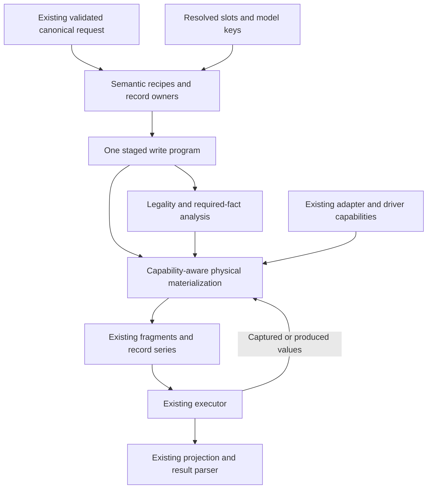

# Raptor 3 — a language of record and membership transitions

Date: 2026-09-07. Status: proposed architecture and build plan, not an implemented or performance-validated engine. Evidence: working checkout `pattern-engine`, `3a291a59764e`, including its existing uncommitted documents and test changes.

**Scope update:** the [clean-sheet investigation](./raptor3-clean-sheet-language.md) supersedes this document's reuse-first premise. No current engine component, including the executor or read/projection implementation, is now presumed to survive. This document remains the conservative replacement alternative; its retained-owner constraints are not bounds on the clean-sheet design.

**Historical plan:** [the central implementation plan](./raptor3-implementation-plan.md)
is the sole current owner of execution order and gates. Its composed classes
and shared operation context supersede the function-first preference here.

## 1. Decision and scope

Build Raptor 3 around **record changes and membership changes, composed with observations, requirements, alternatives, and ordered record series**. A record change owns its assignments, selected-row continuity, and demanded field publications. A relation write consumes those facts through the existing resolved topology. A physical lowerer selects a valid execution strategy; it does not recover the public mutation verb to discover its meaning.

This is an internal language, not a public DSL, a parser, a plugin system, or a state-machine dependency. Its first implementation should be ordinary functions constructing a small inspectable program. That program replaces the existing per-family plans and Part construction for migrated work; it must not wrap them permanently.

The claim is specific: **several algorithms currently differ because they independently reconstruct target selection, record values, root assignments, and premise enforcement. Describe those facts once, then compose their consequences.** We have source evidence for those repeated interpretations. We do not yet have an executable proof of the complete replacement or its compression ratio.

The proposed language below is concrete enough to implement and falsify. It is not a claim to a mathematically minimal or unique primitive set. A primitive survives only when removing it either loses a required distinction or makes the complete implementation more complicated.

### Goal

Preserve the working engine's required behaviour while materially reducing independent decision owners, invalid states, repeated interpretations, source size, and runtime bundle size. Maintainability and expressiveness must improve along with LOC; shifting complexity into a giant lowerer does not count.

### Constraints

- Preserve the aggregate `s` API, query syntax, type inference, zero user code generation, all current providers, and all currently supported write capabilities.
- Preserve validation transforms, defaults, failures and their timing, target selection, ordering, transaction/batch semantics, retry policy, and committed-progress reporting.
- Preserve scalar and bulk fast paths, destination codecs, extension lifecycle, safe SQL parameterization, and result parsing/ownership.
- Reuse `ResolvedRelationIndex`, bound membership, model-key catalogs, `TargetConstraint`, `Sql`, adapter capabilities, and existing physical builders. Do not create another schema universe or query language.
- Keep the existing executor for the first semantic cutovers. A new executor is not a prerequisite for a new compiler language.
- Keep reads/projections and dependency/reachability bundle work outside this rewrite. They have their own owners and can be assessed independently.
- Change no production source as part of this planning task.

### Plan authority

This records the earlier reuse-first proposal for the next write-engine iteration. The [clean-sheet investigation](./raptor3-clean-sheet-language.md) owns the broader design derivation, and [the central implementation plan](./raptor3-implementation-plan.md) owns implementation, validation, and stop gates. The earlier [shape comparison](./raptor3-engine-shapes-review.md), [Pattern experiment](./pattern-engine-ideal-state.md), and [restructuring audit](./raptor3-restructuring-plan.md) remain comparative or historical evidence; their size forecasts are not current budgets. This document does not amend their uncommitted contents.

## 2. Derivation: what cannot be erased

Start with pairs of behaviours that would become incorrectly identical if a distinction disappeared.

| Attempted simplification | Counterexample from the working contract | Necessary distinction |
|---|---|---|
| Everything is a cell assignment | Removing an association must not delete its target record | Record lifetime versus membership |
| A selector is the record | A unique value moves to a decoy after capture | Selection versus the exact selected record |
| A key is just a value | Equal row-key and reference-key values can diverge after an update | Field role and provenance, derived from the existing schema owners |
| There is one value of a field | Descendants read old membership while later writes need the new referenced value | Before/after record views |
| Knowing the intended value is enough | A skipped or failed INSERT must not publish a successful record | Assignment versus successful publication |
| A captured fact stays true | A concurrent writer changes membership before an atomic batch | Observation versus a requirement valid at use |
| All composition is concatenation | An upsert selects one arm; a later series member sees earlier effects | Alternatives and visibility boundaries |
| A transaction flag describes execution | Sequential visibility, all-or-nothing commit, and retry scope vary independently | Visibility, atomicity, and replay boundary |
| Equal final rows mean equal behaviour | UPDATE differs from DELETE/INSERT; clear/refill can differ from a set difference | Effect kind, statement boundaries, and failure order |
| An absent row and NULL are interchangeable | A present row may contain nullable reference fields | Unknown, no row, NULL, and known value |

These distinctions lead to the language. They do not prescribe one class per row of the table.

The working engine is the starting behavioural reference, not the required architecture. `Part`, two-method compilation, a `parentHeld` arm union, a parallel OwnWrite interpreter, and string-addressed planning values are representations to challenge. Complete keys, exact membership, branch outcomes, and commit boundaries are facts to preserve.

## 3. The candidate language

### 3.1 Subjects and values

There are two subjects of change:

1. **A record occurrence:** a particular record selected or produced by this request, together with its model and complete row-key role. Two occurrences are not merged just because their keys happen to be equal.
2. **A membership:** an association addressed through an existing resolved relation slot, with a source and target. Storage, orientation, cardinality, clearability, and fixed variant qualifiers come from the existing topology owner.

A record occurrence has a captured or produced origin. An UPDATE establishes a transition from its selected occurrence to the occurrence after that change. INSERT has no selected before-row; DELETE has no surviving after-row. These must be closed variants, not a record with independent `fresh`, `located`, `deleted`, and `updated` flags.

Value expressions distinguish:

- a validated literal or existing opaque `Sql` expression;
- a field of one exact capture;
- an assignment source for one physical column;
- a field published by one successful record change;
- the selected result of an alternative.

The record owner relates these values; it does not equate them indiscriminately. An intended pre-cast assignment is not automatically a stored database value. A known input key still does not prove that its INSERT succeeded. Database-produced and opaque values use the current exact publication routes.

Conceptual notation such as `before(parent).code` and `after(parentChange).code` names this relationship. It does not imply that every field is captured or that every after-value can be calculated in JavaScript. Fields are demanded by consumers, and the record owner selects the exact capture, expression, RETURNING, consumed-value, insert-ID, or focused-read route already permitted by the contract.

This is where `PlanningReferenceSource`, `FinalReferenceSource`, transitioned callbacks, and selected-row continuity may compress into references to a common record owner. The distinction between planning-available and statement-produced values remains mandatory; the representation should derive availability from the producer and region rather than maintain another independent flag.

### 3.2 Operations and composition

The following is design notation, not proposed public API or finished TypeScript:

```text
capture(selection)                         -> captured rows
require(fact, failure)                     -> success or the specified failure

insert(model, assignments)                 -> produced record
update(capturedRecord, assignments)        -> changed record
delete(capturedRecord or selectedSet)      -> completion

attach(slot, source, targetOrSet)          -> membership change
detach(slot, source, targetOrSet)          -> membership change

choose(observation, alternatives)          -> selected body and its bindings
series(inputs or capturedSet, memberBody)  -> ordered member outcomes
```

An ordered body supplies sequencing. A **decision region** supplies the boundary between observations and selected effects. A region is not a transaction: several regions can share one transaction, or execution can cross permitted committed segments.

`insert`, `update`, and `delete` can be variants of one record-change union. `attach` and `detach` can be variants of one membership-change union. A requirement can be an annotation on its exact owner rather than a standalone instruction when that loses no timing or failure meaning. There is no target number of runtime node kinds.

The existing scalar bulk builders remain set-oriented record-change leaves. They must not be expanded into one instruction per row merely to fit the notation. A nested relation-bearing bulk payload uses `series`, because its members need sequential observation. That distinction already exists in the product.

`set` is a recipe over membership sets: resolve the requested targets, apply the current departure rule, perform the required clear/remove work, and attach the requested targets at the specified barrier. It is not erased to a desired final set. The recipe preserves the current clear/refill or departure behaviour of its storage path. `set: []` remains meaningful.

### 3.3 A requirement is a fact with a use and a failure

A requirement describes what must hold, the exact captured or produced values it concerns, the region/effect where it is needed, and its existing `Failure`/constraint attribution. Examples:

- the selector and captured complete row key still identify the same record;
- that record still has the correlated membership;
- the captured singular slot is still empty, exact, or held by the captured other owner;
- the departing membership set is empty where removal would orphan required storage;
- the parent is alive and still owns the referenced tuple a later segment will store.

Do not build one universal `exists` guard and expect it to express these automatically. Reuse the current predicate and target-constraint owners to describe the exact fact.

One physical enforcement owner chooses the valid mapping: the existing locked read, in-batch guard, exact unique constraint, or supported postcondition. It chooses from capabilities and the requirement, not from the public verb. A requirement cannot silently disappear because an enforcer is unavailable.

Branch failure and retry are not interchangeable. A found-row replacement retains its non-retryable failure. A missing exact unique target can attach the current race pin to that same target's INSERT. An extended selector does not prove unique-key absence; its real conflict remains a failure. A same-operation producer does not need a pre-existing-row guard.

### 3.4 What a record change owns

A record change is the main consolidation point, not a new wrapper around `CreateOperation` and `RecordUpdateCompiler`.

It owns:

- the exact selected or fresh record and its model;
- the single ledger of scalar and membership contributions to physical columns;
- the relationship between captured, assigned, and published field values;
- one root INSERT/UPDATE/DELETE effect where the current contract has one;
- the complete before/after row-key views;
- output demand and publication;
- the dependency constraints around that root effect.

A parent-held membership contributes columns to that record change. A child-held membership contributes columns to the target's change or to a standalone target update. A junction membership contributes a junction-row change. These are physical consequences of the same relational intent, with real differences retained.

This permits a relation recipe to return both required work and an assignment contribution. It no longer has to live inside a giant record compiler merely because its result must enter the root SET. Reuse `FinalRootAssignmentTruth` to reconcile contributions before materializing the root statement. Do not implement INSERT as UPDATE-with-missing-fields or UPDATE as DELETE/INSERT.

There is no ambient mutable identity map. Parent/child re-entry consumes an explicitly related captured occurrence and the existing continuity guarantee. Unrelated same-key occurrences remain distinct; current refusals for unsupported re-entry remain until deliberately reconsidered.

### 3.5 Staging remains explicit

The language must preserve the current observation discipline, including its less attractive compatibility rules:

- Construction and validation are I/O-free and retain their current ordering. Normalization does not eagerly resolve all topology or validate all deferred branches.
- A decision region exposes the planning observations required by the current recipe, including the existing untaken-arm planning superset where applicable. Their dependencies and postconditions retain their stage.
- Selected effects are materialized after those observations. Arm-specific legality belongs to the selected arm at its existing boundary.
- An ordinary ordered list does not create read-your-earlier-write behaviour. A series/member boundary does.
- Planning is not synonymous with reading: the existing skip-capture preparation writes remain explicitly effectful. They cannot be duplicated, reordered, or run speculatively by a generic observation collector.

Consequently, a recipe is a small staged program, not an opaque async callback. Its observations, alternatives, logical effects, and deferred requirements are inspectable before the applicable I/O. The program's structural placement supplies stage; do not scatter independent eager/lazy booleans throughout every operation.

During migration, a single bridge exposes this program through the current `planning()`/`compile()` interface. Per-relation Parts do not each get their own new bridge. The bridge is a physical compatibility boundary, not permission to retain two semantic implementations.

The difficult untaken-arm and error-precedence witnesses must validate this staging before any claim that `Part`, `conditionalArmPlanning`, or `PlanningKnown` has become deletable. Replacing their names while retaining per-verb phase reconstruction is failure.

### 3.6 Challenge the proposed primitives too

| Candidate | Why keep its meaning | What does not need a separate primitive |
|---|---|---|
| Capture | Later writes must name the exact selected record, not re-run the selector | A separate locate class per verb; several copies of the selected row's key |
| Record change | One root statement must reconcile contributions and own its field publications | Independent created/updated identity bags or separate root-assignment assemblers for every relation storage |
| Membership change | Its cardinality, scope, and ownership affect both legality and physical writes | A new storage representation; topology already supplies it |
| Requirement | The same observation can require different failure and concurrency contracts | A guard object when a lock or exact constraint already enforces that fact |
| Alternative | Both arms must be inspectable while only selected effects execute | A handler registry, branch class hierarchy, or separate executable publication node for the joined binding |
| Series | A later member's observations intentionally follow earlier effects | Another record compiler or an automatically separate transaction per member |
| Ordered body/region | Order and observation scope are required | A global graph solver or a Sequence object for every pair of statements |

Membership changes are not claimed to be mathematically irreducible: they eventually become row/column changes. Keeping them until their semantic consumers have finished is a compression choice, because lowering them earlier would force those consumers to recover relation meaning from physical columns. M1 must show that this choice actually costs less.

Several useful-looking concepts are deliberately derived or absent: `set` is a recipe, physical guards are selected enforcement, publication references belong to their producer, no-op status follows retained obligations, and fresh/selected placement follows the record origin and existing referential rules. None earns a second registry or parallel truth table.

The laws of composition are restricted. Assignment contributions combine only under the existing equality rule; arbitrary updates do not commute. A branch joins only its selected bindings; it does not publish values from the untaken arm. A series may not be flattened into its parent decision region. A clear invalidates a prior membership observation it actually removes. A successful producer permits value consumption, but crossing a commit can require a new liveness/membership check. These rules prohibit transformations that a generic expression optimizer might otherwise consider harmless.

Use the existing runtime model/scalar contracts in these descriptors. Do not thread the complete user-schema generic through every program node or recreate validation's inference system in the compiler. Public inference stays at its current owner.

## 4. Public features become recipes

Only the semantic expansion owner interprets a canonical public relation entry. Later physical lowering may inspect storage and capabilities; it may carry the original name for diagnostics but cannot use it to recover an algorithm.

| Public meaning | Expansion in the candidate language | Behaviour that must survive |
|---|---|---|
| `connect` | Resolve required target(s), then attach membership | Global adoption versus correlated access; all-target checks; first-create coverage where currently proven |
| `create` | Insert a record tree and establish its membership | Root FK fold, complete publication, and existing inline/delegated junction attachment order |
| `connectOrCreate` | Capture the unique target, choose reuse or insert, attach the chosen record | Exact unique-race policy; local first-create-wins; no execution of the other arm |
| `update` | Capture the required current/selected member, update that occurrence | Complete captured row key, optional filter, no redundant membership SET for correlation |
| `upsert` | Capture the decision target; choose update/reuse or insert | Found-but-foreign differs from absent on correlated paths; root conditional skip and native folds remain exact |
| `disconnect` | Resolve the specified/current memberships, detach them | Required target/cardinality policy; no deletion of target records |
| `delete` | Resolve the required record, remove it with the required membership effects | Existing foreign-key/cascade behaviour, target attribution, and no accidental adoption |
| `set` | Resolve requested targets; enforce departure rule; remove/clear and refill in the required region | Empty set, all configured variants, singular transfers, and no split inside required clear/refill scope |
| scalar `createMany` | Existing grouped insert leaf with per-row conflict disposition | Contiguous shape grouping, bind limits, duplicates, count/returning semantics |
| relation-bearing `createMany` | Ordered series of ordinary record trees | Later observation, source transforms, subtree suppression and committed prefix |
| scalar `updateMany` / `deleteMany` | Existing set-oriented change | One predicate/limit decision and provider count semantics; no repeated rematching |
| relation-bearing `updateMany` | Capture roots once, then an ordered series | Complete deterministic root keys, per-root transition, N-root membership restriction, captured-root count |

The recipes cover ordinary, variant, and member-junction relations by consuming the resolved slot. They do not invent a separate polymorphic mutation language. A direct variant selection and a schema-fixed inverse retain their different origins; both feed the appropriate existing membership storage.

Some public names share most of a recipe but not their failure semantics. Share the decision and attach the specific failure contract at expansion. Do not either duplicate the whole algorithm or erase the distinction.

## 5. Worked reductions and adversarial checks

### A. Parent-held connectOrCreate with a shared root column

```text
parent := capture(public target)
candidate := capture(global unique target)
chosen := choose(candidate)
  found   -> require the captured target premise; use candidate
  absent  -> insert target tree with the applicable exact unique-race policy

contribute parent.ownerId <- chosen.id
reconcile with the parent's scalar assignments
materialize one parent UPDATE
```

The target's INSERT, if selected, precedes the parent UPDATE. Its chosen field may be a captured value or a produced value; the root assignment does not re-decide connectOrCreate. On a child-held edge, the same chosen target receives the source reference instead. On a junction, attachment writes the junction. Target selection and race policy do not acquire three implementations.

If scalar data also assigns `ownerId`, equal proven contributions agree and incompatible or opaque ones fail through the existing assignment owner. There is no last-writer merge and no transient null assignment.

For upsert, the found arm adds an ordinary record update. For selected-parent correlated upsert, a globally found but unrelated target fails; it must not be mistaken for an absent target or silently adopted. This difference belongs to the selection/requirement, not to a late SQL branch.

### B. A referenced unique changes from `a` to `b`

The captured parent's complete row key identifies the record. Its referenced `code` field is a separate value: `before.code = a`, and the selected update supplies `b`.

- Existing membership predicates use `a`.
- Where a real cascade is responsible for moving an existing edge, the lowerer preserves the required pre-transition edge work and root transition order.
- New/adopted work that must store `b` follows the transition that makes that value usable.
- A non-cascading occupied old membership retains the current refusal; NULL reference tuples keep their current addressability semantics.
- Later results and progressive liveness checks consume the complete row key valid at their placement, not the original unique selector.

One record owner supplies these temporal views. One relation placement rule derives both ordering and which view the effect consumes. A caller does not separately pass booleans and independently computed old/new values that can disagree.

The source is not required to be a primary key or a literal. Compound, mapped, relation-supplied, and supported calculated transitions exercise the same owner. Opaque expressions do not become provably equal merely because the new language gives them a node.

### C. Singular junction replacement after a collection clear

The slot capture has three outcomes: empty, already held by the desired owner, or held by another owner. A reconnect can preserve an exact existing membership. A collection `set` may clear that same membership before refill.

The new body explicitly contains the clear and the subsequent attach. Therefore an earlier exact observation cannot justify deleting that later attach: an intervening effect invalidated it. This replaces the need to carry the same meaning through an independent `reinsertAfterOwnerClear` mode, if the local dependency interpretation proves the equivalent behaviour.

This is a local rule about explicit effects, not a simulator of arbitrary database state. Clearing this owner's memberships does not clear another owner's slot. The existing occupant capture, compare-and-swap/lock contract, exact membership conflict pin, and target-side uniqueness failure remain with the physical transfer owner.

### D. Supplier followed by a modifier

For `connect + update`, the supplier's unique selector already names a target at construction. Preserve the existing selected update in the same decision region.

For a producing supplier, preserve the existing boundary: execute supply, then capture the singular membership with the modifier's optional filter, then update the exact captured record. The series is a change of visibility, not merely a convenient way to obtain an ID. Do not replace the membership capture with an invented supplier publication that changes which record or filter is observed.

Parent-held vacate/supply still folds into the final root assignment where the contract does so. The common recipe describes the dependency; physical placement determines the legal statement form.

### E. A progressive series crosses a commit

After an acknowledged segment, materialized field values are known; the parent/member facts they describe may nevertheless change before the next segment.

The next segment therefore requires both complete parent liveness and the exact non-row-key reference tuple it will store. If the reference value moves to another row while the original parent survives, liveness alone must not let the write proceed.

An interactive transaction can keep the series inside one commit boundary. A permitted batch-only path uses guarded segments and reports the committed prefix. An explicit array transaction cannot be split to make the program executable. An unavailable exact lowering is a pre-effect refusal at the current required boundary.

The same state machine can describe these routes, but the atomicity contract is not inferred from which route is convenient.

### F. No-ops and repeated inputs

An empty nested update can disappear with its capture and guard. An empty public update retains its public target/result obligation. An empty found upsert update retains the decision because the absent arm can create. Incoming membership assignments can make an otherwise empty update effectful.

False disconnect/delete are already erased by the canonical parser. Empty set is not erased. Repeated connectOrCreate inputs are not globally deduplicated: only the existing exact same-operation first-producer proof allows reuse, within its current relation/collection and visibility scope. Series members re-observe after predecessors. Repeated child attempts and failure order remain visible even when a redundant final membership effect can be coalesced.

These cases prevent a generic dead-code eliminator or global value interning from silently changing the product.

## 6. Architecture that follows from the language



The program replaces current Part-internal unions, record-specific relation dispatch copies, and repeated descriptions of branch effects. It is not an additional canonical form kept alongside them. The public normalized request and the physical `Sql` fragment remain different boundaries for real reasons.

### Ownership after the rewrite

| Owner | Owns | Must not own |
|---|---|---|
| Existing parse/operation boundary | Transforms, provenance, public target/result requirements, exact construction timing | A second runtime interpretation of each relation verb |
| Semantic recipe functions | One expansion of each normalized mutation meaning, logical selections/effects, failure provenance | Driver mode or storage-specific SQL algorithms |
| Record-change owner | Assignments, captured/produced record views, output demand, root effect | Global transaction policy or another topology index |
| Existing membership owner, extended where necessary | Exact storage mapping, membership predicates/contributions, referential placement and slot/set protocol | Re-deciding create/connect/upsert intent |
| Program analysis | OwnWrite and other required judgments over the same logical facts, with explicit scopes | Re-reading raw payloads or inferring logical effects from rendered SQL |
| Physical materialization | Legal folds, capture projections, guards, publications, statement grouping and capacity | Public-verb recovery, SQL parsing, arbitrary graph optimization |
| Existing executor | Driver dispatch, retries, transaction/segment progress and result transport | Relation meaning or invented row identity |

These are responsibilities, not a requirement to create seven classes or seven directories. Keep the existing `write-engine` location. Introduce only files that own a concrete responsibility as its old owner is removed.

### OwnWrite stops being a second verb interpreter

The program exposes logical selection and membership effects before physical optimizations elide probes. OwnWrite reads those facts, not SQL statements. Alternative arms remain available; each is analyzed with the existing fork/merge semantics. A series changes the applicable visibility scope.

Retain `TargetConstraint`, overlap reasoning, and the ledger's real legality rule. Replace `OwnWriteSteps`'s per-verb reconstruction only after the new facts reproduce both its verdicts and their stage. A shared structural traversal is useful; forcing every analysis into one pass is not.

A membership replacement can carry a logical read even if its physical implementation needs no SELECT. Such logical requirements must be expressed by the semantic recipe, not fabricated by a separate effect table after the fact.

### Execution is an extended state machine

For one attempt, the conceptual lifecycle is:

```text
admit region → obtain required observations → select and materialize work
             → check executable capacity → execute atomic unit
             → bind successful outputs → continue / finish
```

Failure either aborts the current scope, retries within the existing allowed boundary, skips exactly the documented root subtree, or reports prior committed progress. It does not become a catch-all transition that resumes after uncertain effects.

Stable parsed input, schema, and program structure belong to the operation. Captures and branch selections belong to an attempt/region. Acknowledged progressive outcomes belong to the outer execution and must not be reset on a retry. Transaction handles belong to the actual executor scope.

Use normal functions and a small execution frame if it removes repeated per-run parameter transport. Do not put schema, compiler state, provider results, policy switches, and public arguments into one god context. Do not add a statechart per verb or storage.

An execution frame cannot turn validation/default generation into replayable work. Preserve the existing intentional once-per-captured-member source transform for relation-bearing updateMany, while never feeding transformed data through the schema again or regenerating stable inputs on a retry.

## 7. Deletion map and current size

The following are current evidence points and intended ownership changes, not predictions that every line in each file disappears.

| Current responsibility | Source evidence | Proposed replacement/deletion |
|---|---|---|
| Fresh/selected/inline-target copies of relation interpretation | `CreateOperation.interpretRelation`, `RecordUpdateCompiler.interpretChildHeldEntry`, `nested-target-parts.ts` | One recipe over a record occurrence; remove copied dispatch bodies after all their cases route through it |
| Parent-held per-verb arms and selected final assembly | `CreateOperation.ParentHeldArm`, `RecordUpdateCompiler.compileParentHeldTargets`, `compileLocatedRecord` | Branch result plus root-column contributions; retain one record reconciliation/materialization owner |
| Repeated target lookup and branch contracts | `RelationUpsertPart`, parent-held branches, junction upsert/connectOrCreate | One explicit target decision and its requirements; retain storage-specific attachment and failure differences |
| Junction input → allocated plan → planning/compile redispatch | `RelationJunctionPart.allocatePlan`, `planning`, `compile`, `membershipAddSites` | Program structure supplies observations, selected actions, and logical effects without recovering the verb repeatedly |
| Shadow semantic walk | `OwnWriteSteps` and portions of `OwnWriteRelation`/`OwnWriteAnalyzer` | Analyze facts emitted by the same recipes; preserve overlap/constraint and stage rules |
| Temporal source callbacks and compile-reset fields | `relation-membership.ts`; `RecordUpdateCompiler.compileLocatedRecord` | Demand record views from one owner; attempt bindings replace mutable compiled answers |
| Repeated transaction/batch pin decisions | Relation Parts and record compilers | One requirement-to-enforcement mapping, with exact predicate builders reused |
| Many-function execution parameter transport | `OperationExecutor.executeProgressiveFragment`, `runProgressiveRecordSeriesAt` | Optional execution-owned frame after semantic cutovers, only if whole-owner cost falls |
| Useful already-consolidated facts | Model-key catalog, bound membership, `FinalRootAssignmentTruth`, `JunctionStatements`, record-series contract | Retain and extend, do not count them as new discoveries or blanket deletion targets |

Decisive source anchors: [record assembly](../../src/query-engine/write-engine/RecordUpdateCompiler.ts), [fresh record plans](../../src/query-engine/write-engine/CreateOperation.ts), [branch protocol](../../src/query-engine/write-engine/RelationUpsertPart.ts), [membership sources](../../src/query-engine/write-engine/relation-membership.ts), [assignment agreement](../../src/query-engine/write-engine/final-root-assignment.ts), [singular transfer](../../src/query-engine/write-engine/junction-singular-transfer.ts), [OwnWrite interpretation](../../src/query-engine/OwnWriteSteps.ts), and [current execution staging](../../src/query-engine/write-engine/OperationExecutor.ts).

Fresh static census, using the existing `scripts/query-engine-structure.mjs`:

| Scope | Files | Physical LOC | Parser-token LOC |
|---|---:|---:|---:|
| `src/query-engine/write-engine` | 43 | 34,084 | 25,911 |
| Whole `src/query-engine`, including the non-routed Pattern experiment | 166 | 74,861 | 58,121 |
| Whole query-engine tree excluding `pattern/` | 147 | 62,149 | 47,625 |

The last row is a directory census, not an import-reachability or pure-production-runtime measurement; some other experimental code remains outside `pattern/`. Physical LOC includes comments and blank lines. Parser-token LOC counts lines where parser-owned TypeScript tokens start; type-only code remains included. Neither is bundle size.

The write directory has 90 measured functions with at least five parameters and no internal runtime-import cycle. These are diagnostic review signals, not 90 proven semantic defects. `CreateOperation.ts` and `RecordUpdateCompiler.ts` account for 10,118 physical lines together; deleting their file names while retaining their bodies does not reduce that cost.

### Compression contract

- Count the entire replacement: language declarations, recipes, analysis, lowerer, retained old helpers, runtime tables, and any bridge. Do not report interpreter-only LOC.
- Charge new shared infrastructure fully to the first slice using it. Do not amortize its cost over hypothetical future migrations.
- Record deleted physical and parser-token LOC, not just net new files. Keep formatting density comparable.
- Measure the same full-capability `s` + `viborm/pg` consumer fixture, all emitted chunks, with and without `pg` external. A read-only client or new import requirement is not an acceptable shortcut.
- Deleting the unused Pattern prototype is cleanup, reported separately—not savings attributed to this language.
- Record semantic-rule owners before/after. One generic lowerer with the same per-verb decision table is not a compression result.

The ambition is a large reduction in semantic compilation, not a handful of wrappers. A whole-engine percentage or kB forecast is not yet supported. The first retained cross-storage slice must show a material net reduction in both code and repeated rules. Its measured result establishes the numerical budget for wider implementation before that wider work begins. If only argument lists and file boundaries shrink, revise the language instead of widening the rewrite.

## 8. Build sequence

### M0 — Lock the behavioural and measurement reference

Deliverables:

- An explicit frozen source snapshot, including the intended dirty changes, for the old-engine oracle. Never reset or clean the shared worktree to manufacture it.
- A capability/contract matrix spanning the recipes in §4, storage and cardinality, fresh/selected parents, actual provider capabilities, and failure timing.
- Existing strict trace comparison plus actual result/state evidence; audit the Pattern harness before reusing it. Inject a deliberate mismatch into an isolated oracle witness and prove the gate fails.
- A replacement manifest listing the old owners of the first slice and every new/retained dependency counted against it.
- The source census, public bundle fixture, and relevant performance baseline at the same snapshot.

Separate required behaviour from suspected historical artifacts. Preserve current SQL/parameter/step pins initially. Record any proposed relaxation and its observable effects; do not assume statement transforms, locks, triggers, or error precedence are unobservable. Resolve a necessary compatibility change before implementation depends on it.

Exit: the reference can detect wrong-row writes, stale premises, wrong selected arms, and committed-prefix changes. No broad production rewrite has started.

### M1 — Implement one complete cross-storage branch protocol

Implement the language only far enough for connectOrCreate and the shared upsert decision family, including selected and fresh source records. Cover parent-held, child-held, junction, and direct variant storage through existing bindings. Reuse existing SQL builders and executor.

The branch has an inspectable capture, alternatives, failure requirements, a chosen record binding, and membership contributions. It must cover found, absent, correlated-but-foreign, exact unique race, extended-selector conflict, and same-operation first-producer reuse.

Compare this implementation with a direct functional composition over the current physical interface on the same protocol. This is a bounded comparison, not two full engine rewrites. If ordinary composition exposes the same facts to analysis and execution with less total machinery, it becomes the language's implementation. There is no obligation to retain a runtime AST.

Do not use arbitrary callbacks that hide mutation semantics from analysis as an escape hatch. Existing leaf expression evaluation and SQL builders are legitimate opaque leaves with known contracts; a callback that secretly branches, queries, or mutates is not.

Exit: all first-slice behaviours and stage-sensitive traces match; the old decision implementation is removed for the adopted slice; net cost is reported. If the implementation only forwards to the old branch compiler, M1 is not complete.

### M2 — Prove record transitions and root folding

Extend the same record owner to selected updates and fresh records with scalar and membership assignments. Integrate the existing final-assignment truth. Add demand-driven complete keys and arbitrary supported field publications, with exact producer provenance.

Run the examples in §5A–B plus compound and mapped keys, alternate unique selectors, relative/opaque assignments, shared-primary-key suppliers, and selected incoming-parent continuity. Preserve one-statement root folds and current cascade/refusal behaviour.

Make parent-held branch logic return record contributions rather than live inside parallel fresh/selected arm interpreters. Remove the corresponding per-arm records and mutable compiled-output reconstruction once all their consumers use the new record owner.

Exit: no independent old/new-value derivation for the migrated transition; one column-contribution rule; correct before/after dependency placement; no extra transient statement; a second net compression result. Fix the final numerical rewrite budget from M1/M2 evidence before expanding further.

### M3 — Complete membership protocols and relation recipes

Add disconnect, delete, set, singular transfer, to-one vacate/supply/modify, and polymorphic collection coordination. Keep the public recipe expansion separate from storage materialization.

Reuse `JunctionStatements` and the existing source-bound membership mapping. Preserve collection-wide clear/refill ordering over every configured member table, exact slot occupancy, required departures, duplicate attempt order, and both current junction attachment placements.

Remove migrated `RelationLinkPart`, `RelationWritePart`, `RelationUpsertPart`, `RelationJunctionPart`, singular-dispatch and nested-target dispatch responsibilities only as their last live consumers move. SQL bodies and the singular transfer's real invariants may remain as existing lowerer functions; moving them is not a deletion claim.

Exit: every non-bulk relation recipe has one semantic expansion; physical lowering no longer branches on public mutation names to select those algorithms; ordinary and variant paths share the same proven owners.

### M4 — Make analyses consume the language

During M1–M3, the new program's effect view is compared against the existing OwnWrite verdicts. At this milestone it becomes authoritative for the migrated engine.

Replace the separate per-verb OwnWrite reconstruction while retaining target-overlap and membership-ledger rules. Preserve pre-I/O failures, branch-deferred legality, logical reads whose SQL is elided, same-operation reuse scope, and series fork/merge behaviour.

Delete the superseded shadow walk and old Part shape after the last consumer moves. Remove transitional effect comparison from production; retain behavioural witnesses and an isolated oracle as needed for subsequent work.

Exit: one semantic program supplies both execution and required analyses. There is no second verb-to-effect interpreter under another name.

### M5 — Integrate ordered series and protected continuation

Route relation-bearing bulk members and producing-supplier modifiers through the same record program. Keep scalar bulk leaves specialized. Preserve capture-once root selection, deterministic member order, intentional per-member source transformation, count contracts, root-subtree skip ownership, and bounded returning reads.

Reuse the existing transaction and progressive runners. Derive their exact continuation requirements from record and membership references. Preserve atomic array refusal, generated-output transport, no replay of acknowledged prefixes, and possibly-committed attribution.

An execution-owned frame may now replace proven repeated parameter forwarding. Keep bindings, progress, transaction ownership, and stable input lifetimes distinct. Do not implement a second executor merely to give the new language new file names.

Exit: all existing series capabilities work through the new semantic owners; no duplicate compiler for bulk members; no changed transaction scope or round-trip pattern in retained fast paths.

### M6 — Complete cutover and count the remaining engine

Move the remaining public write shells to the adopted owners, keeping their public validation/result obligations and native scalar/bulk folds. Remove the old semantic engine, transitional bridges that no longer serve a boundary, unused source kinds, unreachable guards, and obsolete architecture assertions.

Port tests that construct retired private classes to the new seam or public API without dropping their behavioural assertions. Preserve an old implementation only outside the production import graph when still needed as a test oracle. A successful slice must already have no legacy runtime dependency for its replaced responsibility.

Run final provider, package, type, performance, and bundle gates. Update the applicable project architecture guides and ATOM doctrine to describe the actual retained owners, removing prohibitions/claims the verified design supersedes. The current doctrine permits reconsidering rejected abstractions only with evidence; the measured cutovers provide it, not the proposal alone.

Exit: the complete replacement beats the measured M2 budget, preserves required behaviour and fast paths, and has fewer semantic decision owners. Read-engine redesign and unrelated dependency work do not delay or inflate this result.

## 9. Validation matrix

These are existing evidence anchors to reuse, not claims that their suites were run during planning. Additional witnesses should enter through the real public contract wherever possible.

| Concern | Existing anchors | New-language falsifier |
|---|---|---|
| Branches, eager/deferred work | `parity-b-upsert-arm.core.test.ts`, `upsert-untaken-arm-legality.test.ts`, `record-compiler-contract.core.test.ts` | An untaken branch acquires effects or its required existing construction/planning behaviour disappears |
| Parse/default provenance | `parse-boundary-gate.core.test.ts`, `upsert-envelope-parse-boundary.test.ts` | A transform receives its own output or runs again on retry |
| Assignment and record transition | `final-root-assignment.core.test.ts`, `parity-d-transition.core.test.ts`, `compiled-key-transition.test.ts` | Scalar and membership contributions disagree silently, or root order changes |
| Wrong-row protection | `staleness-injection-upsert-capture.test.ts`, `staleness-injection-batch-root-address.test.ts`, `captured-row-key-decode.test.ts` | A decoy sharing a selector or one compound-key member receives the write |
| To-one composition | `parity-h-to-one-lattice.core.test.ts`, `child-held-to-one-multi-kind.test.ts` | Modifier addresses the outgoing member or observes before supply |
| Membership and collection replacement | `polymorphic-collection-write-family.test.ts`, `compound-junction.test.ts` | Clear/refill loses an exact member, misses an unnamed variant, or steals a slot without the required protection |
| OwnWrite | `own-write-linearization.core.test.ts`, `own-write-linearization.test.ts` | Verdict/failure precedence changes, or logical reads vanish when SQL is optimized away |
| Publication and progress | `generated-output-boundary.core.test.ts`, `generated-output-continuation-race.test.ts`, `progressive-parent-rowkey.test.ts` | Known values replace liveness/membership proof, or an indivisible batch is split |
| Skip and series semantics | `junction-skip-adoption.test.ts`, `create-many-skip-depth.test.ts`, `create-many-relation-series.test.ts`, `update-many-relation-series.test.ts` | Descendants run after a skipped root, input occurrences disappear, or retry replays a committed prefix |
| Bulk/returning efficiency | `parity-j-create-many.core.test.ts`, `create-many-bind-budget.test.ts`, `series-result-read.core.test.ts`, `upsert-on-conflict-fold.test.ts` | Native/set-oriented work becomes row-at-a-time, or counts/order change |

The full matrix must also retain public failure metadata, affected-model attribution, statement/operation extension ordering, malformed provider data, cleanup failures, and result container ownership. A matching final database state alone does not establish those behaviours.

Run deterministic checks, local providers, and external providers in their existing lanes. A simulator is useful for controlled schedules but does not prove database referential actions or isolation. Provider-specific claims need executed provider evidence; skipped suites are reported as skipped.

Commands verified in the current repository:

```text
node scripts/query-engine-structure.mjs
pnpm test:types
pnpm test:layer:write-engine
pnpm test:layer:query-engine
pnpm test:all
pnpm test:providers
pnpm test:package
pnpm bench:operation-pipeline:describe
pnpm bench:operation-pipeline
```

Select narrow witnesses through the existing bounded runner first. Register new core witnesses in `scripts/query-engine-test-manifest.mjs`; do not assume a filename suffix admits them. Tests, type checks, and benchmarks run serially with the repository's process and memory limits. Use the established clean-snapshot, alternating-sample performance protocol. Source census and documentation checks do not require running the full test estate in this planning turn.

## 10. Keep/revise rules

Keep the language only when migrated features become compositions of shared semantic rules and old owners can be deleted. Revise it before widening if any of these occurs:

- A lowerer needs to recover the original verb to distinguish two required behaviours.
- A second hand-written effect summary is needed to make OwnWrite agree.
- A record's key/assignment answer is stored independently in multiple owners.
- A universal context, opaque mutation callback, or mode-product union hides the distinctions the language was meant to expose.
- The smaller program requires a larger collection of per-case exceptions to materialize it.
- Coverage grows by weakening compatibility, dropping edge cases, or replacing bulk work with per-row execution.
- Net source/runtime cost does not improve after obsolete code is actually removed.

Rejecting one node layout does not reject semantic compression. Prefer a cheaper function representation when it expresses the same language. Conversely, do not preserve a smaller-looking function interface if it requires parallel analyses to guess what the function will do.

The decisive question at every milestone is: **which independently maintained truth disappeared, and which behaviour proves its new owner is sufficient?**

## 11. What this planning task established

- Derived a candidate language and its non-erasure rules from the working engine's contracts.
- Worked through root assignment, key transitions, slot invalidation, supplied-member modification, progressive continuation, and no-op/duplicate cases against their current owners.
- Re-ran the existing read-only structural census at the recorded checkout.
- Defined the replacement units, deletion accounting, staged build sequence, and falsifying evidence required for adoption.

No production engine, prototype interpreter, benchmark, or test suite was implemented or run for this proposal. The examples are design traces checked against source, not executed parity proofs. The remaining uncertainty is whether this language's complete implementation is sufficiently smaller; M1 and M2 answer that before the broad rewrite.
