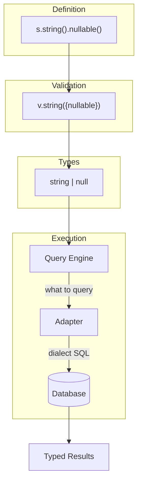

# VibORM

VibORM started as an experiment: **how far can we push vibe coding?** Can we build something as complex as an ORM with AI assistance?

The answer, so far, is yes - and the result gives you **Prisma's query API** without the code generation step or WASM deployment headaches.

## The Origin

This project was born from two things: frustration with Prisma's developer experience friction, and the opportunity presented by new AI models like Claude Opus and agents like Cursor.

The name says it: **Vib**e coding + **ORM** = **VibORM**.

Unlike Prisma's codebase (which can be intimidating), VibORM is designed to be **accessible to mid-level TypeScript engineers**. The architecture is organized into clean layers, each documented by `AGENTS.md` files that explain what each layer does, why it exists, and how to modify it. This makes it easy for contributors - and their AI assistants - to understand the codebase and make quality pull requests.

Check out the [Internals](/docs/internals) section to see how it's structured.

## Feature Goals

We want the same features that make Prisma great:

- **Implicit many-to-many** - Define relations without manual join tables
- **Rich filtering** - `contains`, `startsWith`, `in`, `not`, and more
- **Deep relation filtering** - Filter by nested relation fields (`where: { posts: { some: { published: true } } }`)
- **Single query execution** - No N+1 problem, relations loaded in one roundtrip
- **Nested writes** - Create/update related records in a single operation

And we want to explore features that don't exist yet but should be possible:

- **Polymorphic relations** - A comment that can belong to either a Post or a Video
- **Recursive queries** - Query self-referencing relationships (org hierarchies, threaded comments)

## Why We Built This

We loved Prisma's developer experience - the intuitive query API, the nested includes, the type safety, and especially the **schema definition** where relations are declared within the model itself. But two things kept causing friction:

### Code Generation

Every schema change requires `prisma generate`. Forget to run it and you're debugging phantom type errors. We wanted **types that update instantly on save**.

### WASM Deployment Issues

Prisma's query engine is compiled to WASM, which creates deployment problems - bundle size concerns, cold start latency, and compatibility issues with edge runtimes like Cloudflare Workers. We wanted a **pure TypeScript solution**.

## Built From First Principles

We tried to reproduce Prisma's schema DDL in pure TypeScript - not like Drizzle where models and relations are defined in separate places, but where **relations live inside the model definition**:

```typescript
// What we wanted - relations declared within the model
const user = s.model("user", {
  id: s.string().id(),
  posts: s.oneToMany(() => post),  // Relation here, not in a separate file
});
```

This immediately confronted us with **circular reference issues** - User references Post, Post references User. TypeScript and JavaScript don't handle this well out of the box.

Solving this led us to build our own validation engine using **thunks** (`() => model`) for lazy evaluation. To have types inferred without code generation, we needed a way to **declare the type surface that also validates at runtime** - and handle circular references correctly.

This is what "from first principles" means for us: starting with the schema definition we wanted, hitting real problems, and building solutions as we went.

## What It Looks Like

```typescript
import { s, createClient } from "viborm";

// Define schema - types are inferred from this
const user = s.model("user", {
  id: s.string().id().ulid(),
  email: s.string().unique(),
  name: s.string().nullable(),
  posts: s.oneToMany(() => post),
});

const post = s.model("post", {
  id: s.string().id().ulid(),
  title: s.string(),
  authorId: s.string(),
  author: s.manyToOne(() => user).fields("authorId").references("id"),
});

// Create client
const orm = createClient({
  schema: { user, post },
  adapter: new PostgresAdapter({ connectionString: "..." }),
});

// Prisma-like queries, fully typed
const users = await orm.user.findMany({
  where: { email: { contains: "@company.com" } },
  include: { posts: { where: { published: true } } },
});
```

## What to Expect

<Callout type="warn" title="Early Alpha">
VibORM is in early alpha and **not ready for production use**. APIs may change, features are incomplete, and there will be bugs. Use it for experimentation and side projects, not critical systems.
</Callout>

### Familiar API

If you know Prisma, you know VibORM. Same patterns: `findMany`, `findFirst`, `create`, `update`, `delete`, nested `include`, `where` filters, etc.

### Database Support

PostgreSQL, MySQL, and SQLite supported through adapters.

### Still Evolving

Some features are in progress:
- Transactions (partial)
- Raw SQL escape hatches
- Migration edge cases

If you need stability today, Prisma is battle-tested. If code generation and WASM deployment are pain points and you want to explore an alternative approach, VibORM might be interesting to follow.

## How It Works



The schema you write generates validation schemas. TypeScript infers types from those schemas. Query engine builds database-agnostic queries. Adapters handle the dialect-specific SQL.

## Benefits of Our Own Validation Engine

Building our own [validation layer](/docs/internals/validation) turned out to unlock some nice features:

### Standard Schema Access

Every operation schema (where, create, update, args) is accessible and [Standard Schema V1](https://standardschema.dev/) compliant. You can reuse them in your server routes:

```typescript
import { getSchemas } from "viborm";

const schemas = getSchemas(mySchema);

// Use in your API routes
app.post("/users", async (req) => {
  const result = schemas.user.create["~standard"].validate(req.body);
  if (result.issues) return { error: result.issues };
  // ...
});
```

### JSON Schema Export

Schemas can export to JSON Schema format, making them usable with AI tools, OpenAPI generation, or any JSON Schema consumer:

```typescript
const jsonSchema = schemas.user.create["~standard"].jsonSchema.output({
  target: "openapi-3.0",
});

// Use with AI tool calling, API docs, etc.
```

## Next Steps

<Cards>
  <Card
    title="Quick Start"
    description="Set up VibORM in 5 minutes"
    href="/docs/getting-started/quick-start"
  />
  <Card
    title="Schema Definition"
    description="Define models, fields, and relations"
    href="/docs/schema"
  />
  <Card
    title="Internals"
    description="Understand the architecture"
    href="/docs/internals"
  />
</Cards>
