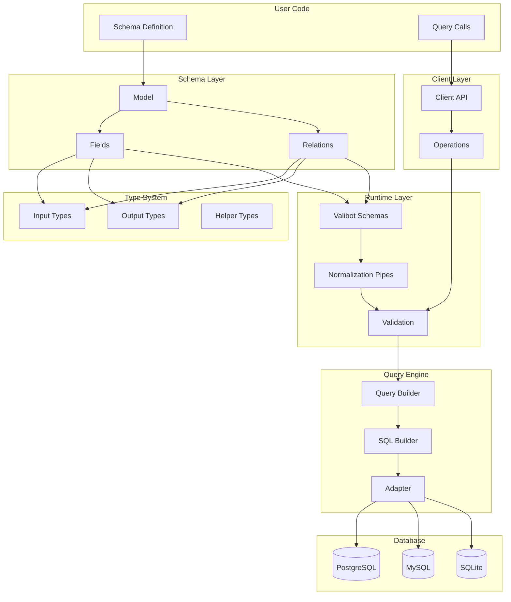
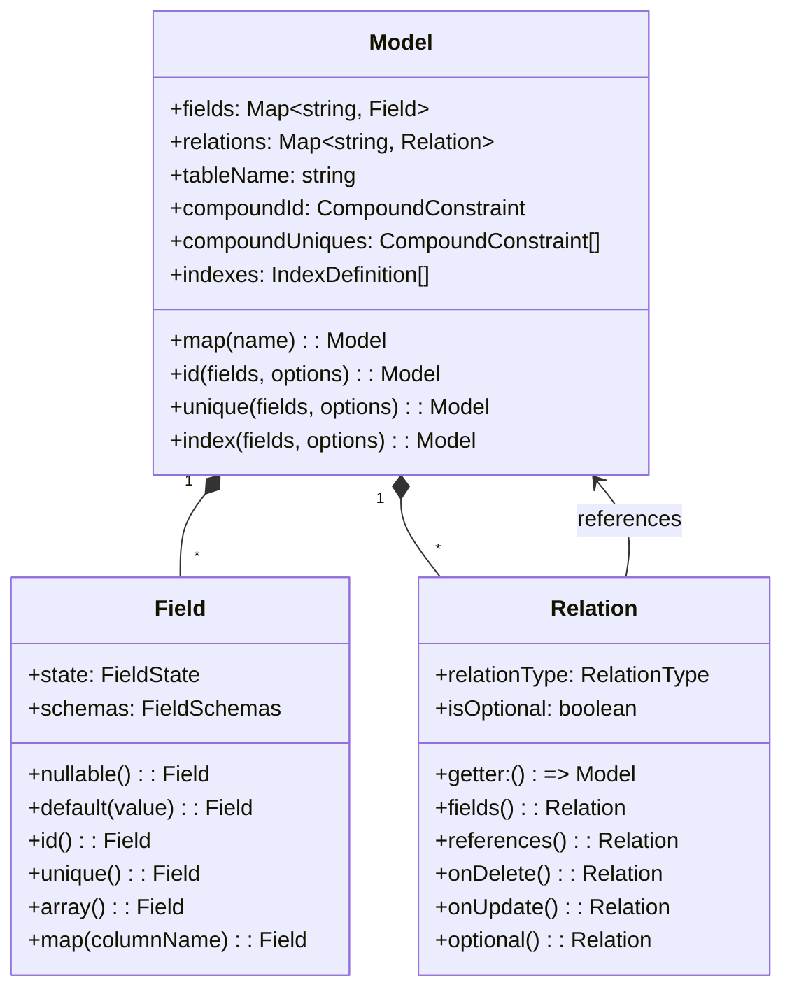
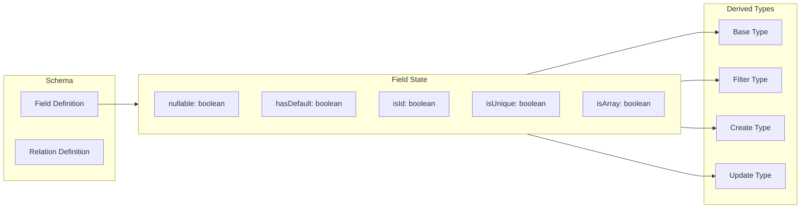
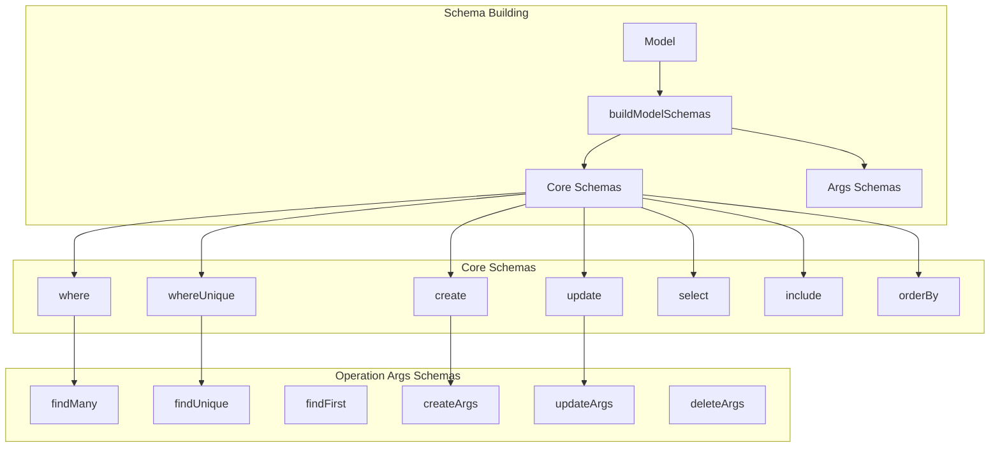
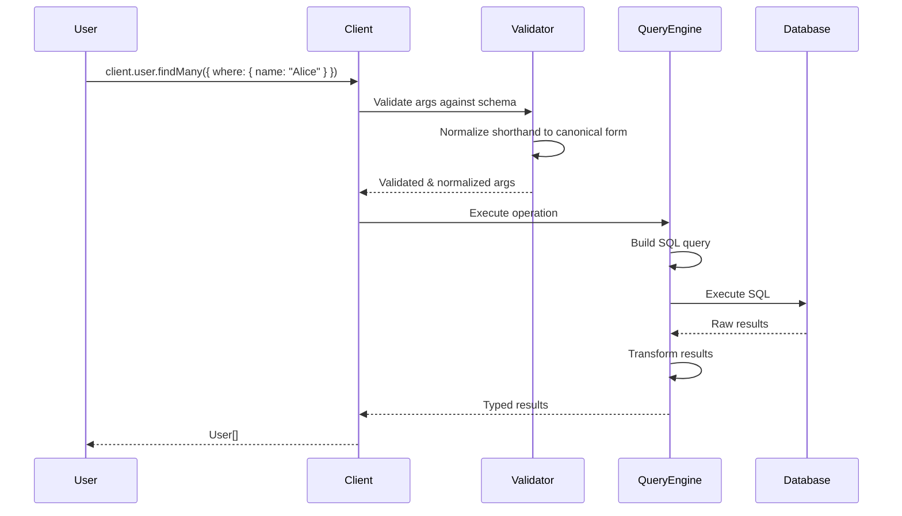
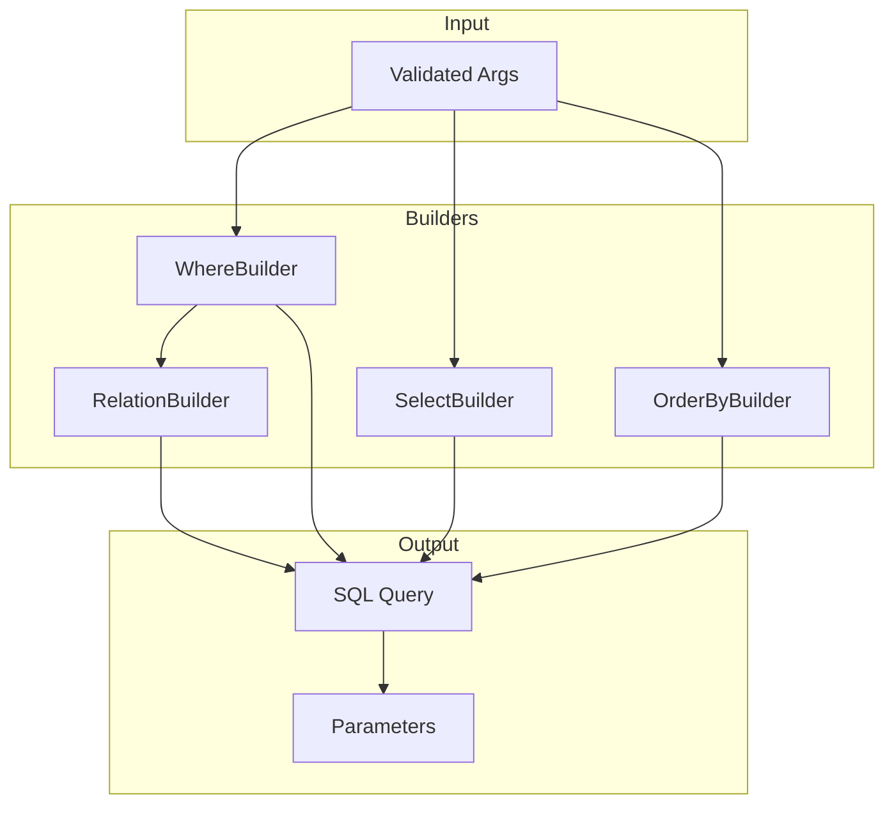
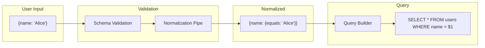
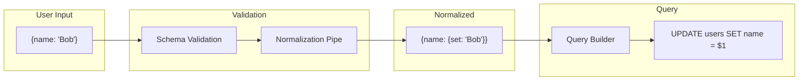

# System Architecture

VibORM is built as a layered system where each layer has clear responsibilities and well-defined interfaces.

## High-Level Architecture



## Layer Responsibilities

### 1. Schema Layer

The schema layer is where users define their data model. It's the foundation of everything.



### 2. Type System Layer

Types are **inferred** from schema definitions, not generated. This happens at compile time.



**Key insight**: The same field state produces different types for different operations:

| Operation | nullable=false      | nullable=true              | hasDefault=true      |
| --------- | ------------------- | -------------------------- | -------------------- |
| Base      | `string`            | `string \| null`           | `string`             |
| Create    | `string` (required) | `string \| null`           | `string?` (optional) |
| Update    | `{ set?: string }`  | `{ set?: string \| null }` | `{ set?: string }`   |
| Filter    | `StringFilter`      | `StringNullableFilter`     | `StringFilter`       |

### 3. Runtime Schema Layer

Valibot schemas provide runtime validation with the same guarantees as the type system.



### 4. Client Layer

The client provides a type-safe API for executing operations.



### 5. Query Engine Layer

The query engine translates validated operations into SQL.



## Data Flow

### Query Flow



### Mutation Flow



## File Structure

```
src/
├── schema/
│   ├── model/
│   │   ├── model.ts           # Model class
│   │   ├── types/             # TypeScript types
│   │   │   ├── helpers.ts     # Type utilities
│   │   │   ├── input-types.ts # Create/Update/Where types
│   │   │   ├── result-types.ts# Query result types
│   │   │   └── relation-types.ts
│   │   └── runtime/           # Valibot schemas
│   │       ├── core-schemas.ts
│   │       ├── args-schemas.ts
│   │       ├── mutation-schemas.ts
│   │       └── nested-schemas.ts
│   ├── fields/
│   │   ├── string/
│   │   │   ├── field.ts       # StringField class
│   │   │   └── schemas.ts     # Valibot schemas
│   │   ├── number/
│   │   ├── boolean/
│   │   └── ...
│   ├── relation/
│   │   └── relation.ts        # Relation classes
│   └── validation/
│       └── rules/             # Schema validation rules
├── client/
│   ├── client.ts              # Client factory
│   └── types.ts               # Client types
└── query-engine/
    ├── query-engine.ts        # Main engine
    ├── builders/              # SQL builders
    └── operations/            # Operation handlers
```

## Design Decisions

### Why Inference Over Generation?

1. **No build step** - Types update instantly as you edit
2. **Single source of truth** - Schema IS the type definition
3. **Better IDE support** - Full autocomplete and refactoring
4. **Simpler tooling** - No codegen to maintain

### Why Valibot?

1. **Runtime + Types** - Single definition for both
2. **Pipes/Transforms** - Built-in transformation support
3. **Performance** - Faster than Zod for validation with smaller bundle size
4. **Type inference** - Excellent TypeScript integration

### Why Two-Phase Schema Building?

Core schemas (where, create, update) are built first, then reused by operation-specific schemas. This:

1. Prevents duplicate schema building
2. Enables lazy evaluation for circular references
3. Improves performance via caching
