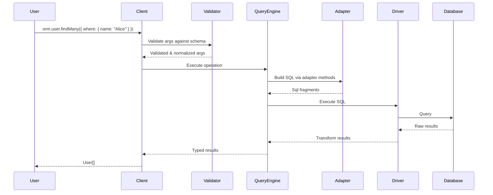

# System Architecture

VibORM is built as a layered system where each layer has clear responsibilities and well-defined interfaces.

## Design Principles

### 1. Types From Runtime Validation

VibORM infers TypeScript types **from runtime validation schemas** - a single source of truth for both compile-time types AND runtime validation.

```typescript
const user = s.model("user", {
  id: s.string().id().ulid(),
  name: s.string(),
  email: s.string().unique(),
});

// Types are inferred from the schema definition
// No code generation needed
const users = await orm.user.findMany({
  where: { name: "Alice" }  // ← Fully typed!
});
```

### 2. Dual Validation

Every operation is validated twice:

1. **Compile-time** - TypeScript catches type errors
2. **Runtime** - VibORM's validation engine validates actual data

### 3. Separation of Concerns

The architecture separates **what** to query from **how** to express it:

```
┌─────────────────┐     ┌─────────────────┐     ┌─────────────────┐
│  Schema Layer   │────▶│  Client Layer   │────▶│  Query Engine   │
│  (Definition)   │     │  (Operations)   │     │  (WHAT)         │
└─────────────────┘     └─────────────────┘     └─────────────────┘
                                                        │
                                                        ▼
                               ┌─────────────────┐     ┌─────────────┐
                               │    Database     │◀────│  Adapters   │
                               │    (Execute)    │     │  (HOW)      │
                               └─────────────────┘     └─────────────┘
```

## Critical Architectural Rules

### Rule 1: Query Engine / Adapter Separation

**The Golden Rule:** Query engine decides WHAT to query. Adapters decide HOW to express it.

This enables VibORM to support PostgreSQL, MySQL, and SQLite with a single codebase. The query engine builds query structure; adapters translate to database-specific syntax.

### Rule 2: Immutable State for Type Tracking

Every field modifier returns a NEW instance:

```typescript
s.string()           // StringField<{type: "string"}>
  .nullable()        // StringField<{type: "string", nullable: true}>  ← NEW instance
  .default("hello")  // StringField<{..., default: "hello"}>           ← NEW instance
```

TypeScript tracks the State generic through each transformation. If we mutated the field instead, the type system couldn't track changes.

### Rule 3: Lazy Evaluation for Circular References

Relations use thunks `() => Model` to break circular dependencies:

```typescript
const user = s.model("user", {
  posts: s.oneToMany(() => post),  // Thunk defers evaluation
});
const post = s.model("post", {
  author: s.manyToOne(() => user),
});
```

JavaScript can't reference a variable before it's declared. Thunks defer resolution until the model is actually used.

## Data Flow

### Query Execution



## Layer Boundaries

### Schema Layers (L1-L5)

These layers handle **definition and validation** - no SQL generation.

| Layer | Purpose |
|-------|---------|
| L1: Validation | Standard Schema V1 primitives (`v.*`) |
| L2: Fields | Field type definitions with State generic |
| L3: Query Schemas | Validation schemas for where/create/update |
| L4: Relations | Relationship definitions between models |
| L5: Schema Validation | Definition-time correctness checking |

### Execution Layers (L6-L8)

These layers handle **query building and execution**.

| Layer | Purpose |
|-------|---------|
| L6: Query Engine | Database-agnostic query structure (WHAT) |
| L7: Adapters | Database-specific SQL syntax (HOW) |
| L8: Drivers | Connection management and execution |

### Interface Layer (L9)

The client layer provides the **public API** and type inference.

### Management Layer (L10)

Migrations handle **schema evolution** independently.

## File Structure

```
src/
├── validation/           # L1: Validation primitives
├── schema/               # L2-L5: Schema system
│   ├── fields/           # L2: Field types
│   ├── model/schemas/    # L3: Query schemas
│   ├── relation/         # L4: Relations
│   └── validation/       # L5: Schema validation
├── query-engine/         # L6: Query engine
├── adapters/             # L7: Database adapters
├── drivers/              # L8: Database drivers
├── client/               # L9: ORM client
└── migrations/           # L10: Schema migrations
```
