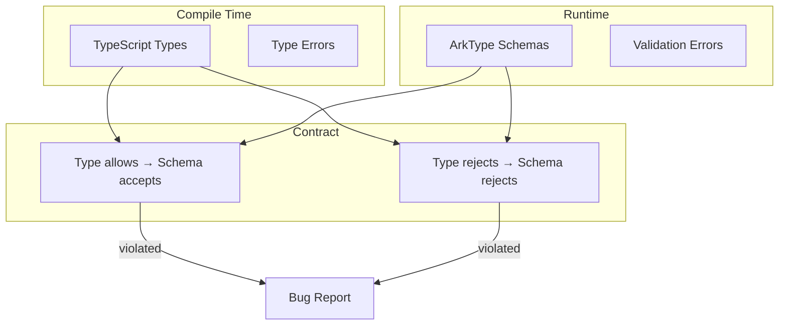
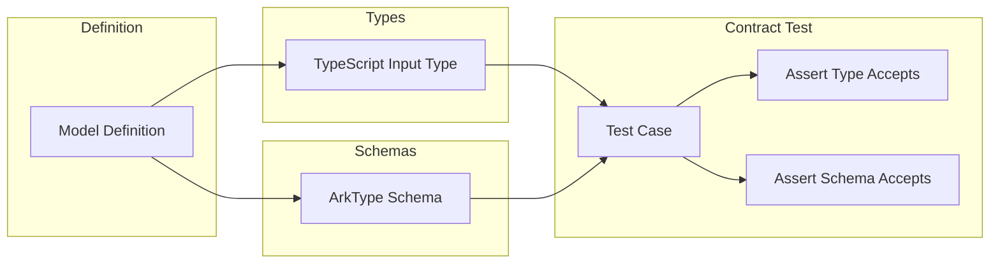

# Type-Runtime Contract

VibORM maintains a **contract** between its TypeScript type system and ArkType runtime schemas. This ensures that what compiles is what validates, and vice versa.

## The Contract



## Contract Principles

### 1. Type-Valid = Runtime-Valid

If TypeScript accepts an input, the ArkType schema MUST also accept it.

```typescript
// TypeScript allows this
const input: ModelWhereInput<UserFields> = {
  name: "Alice",
  age: { gt: 18 }
};

// Schema MUST accept
userWhereSchema.assert(input); // Must not throw
```

### 2. Type-Invalid = Runtime-Invalid

If TypeScript rejects an input, the ArkType schema MUST also reject it.

```typescript
// TypeScript rejects this
const input: ModelWhereInput<UserFields> = {
  name: 123,  // Error: number not assignable to string
};

// Schema MUST reject
userWhereSchema.assert({ name: 123 }); // Must throw
```

### 3. Shorthand Equivalence

Shorthand and explicit forms produce the same normalized output.

```typescript
// These MUST produce identical results
schema.assert({ name: "Alice" });
schema.assert({ name: { equals: "Alice" } });
// Both → { name: { equals: "Alice" } }
```

## Contract Testing

We use contract tests to verify these guarantees:



### Example Contract Test

```typescript
describe("StringField Contract", () => {
  describe("filter", () => {
    it("accepts direct value", () => {
      // Type check (compile time)
      const input: ModelWhereInput<StringModelFields> = {
        value: "test"
      };
      
      // Runtime check
      expect(() => whereSchema.assert(input)).not.toThrow();
    });

    it("accepts equals filter", () => {
      const input: ModelWhereInput<StringModelFields> = {
        value: { equals: "test" }
      };
      
      expect(() => whereSchema.assert(input)).not.toThrow();
    });

    it("rejects invalid type", () => {
      // @ts-expect-error - number not assignable to string filter
      const input: ModelWhereInput<StringModelFields> = {
        value: 123
      };
      
      expect(() => whereSchema.assert({ value: 123 })).toThrow();
    });
  });
});
```

## Contract Violations

### Type Allows, Schema Rejects

This is a **critical bug**. User code compiles but fails at runtime.

```typescript
// If this happens, it's a bug
const input: ModelWhereInput<UserFields> = { name: "Alice" }; // ✅ Compiles
userWhereSchema.assert(input); // ❌ Throws

// Fix: Update ArkType schema to match type definition
```

### Type Rejects, Schema Allows

This is **less critical** but still a bug. Invalid data could reach the database.

```typescript
// If schema accepts invalid data, it's a bug
// @ts-expect-error
userWhereSchema.assert({ name: 123 }); // Should throw but doesn't

// Fix: Update ArkType schema to be more restrictive
```

## Contract Areas

### 1. Scalar Field Filters

| Operation | Type | Schema | Status |
|-----------|------|--------|--------|
| Direct value | `string` | `stringBase.pipe()` | ✅ |
| equals | `{ equals: string }` | `{ equals: stringBase }` | ✅ |
| contains | `{ contains: string }` | `{ contains: stringBase }` | ✅ |
| in | `{ in: string[] }` | `{ in: stringBase.array() }` | ✅ |
| null (nullable) | `null` | `"null".pipe()` | ✅ |
| nested not | `{ not: StringFilter }` | `{ not: filterObj.or(nullable) }` | ✅ |

### 2. Scalar Field Updates

| Operation | Type | Schema | Status |
|-----------|------|--------|--------|
| Direct value | `string` | `stringBase.pipe()` | ✅ |
| set | `{ set: string }` | `{ set: stringBase }` | ✅ |
| increment (number) | `{ increment: number }` | `{ increment: intBase }` | ✅ |
| null (nullable) | `null` | `"null"` | ✅ |

### 3. Relation Filters

| Relation | Operation | Type | Schema | Status |
|----------|-----------|------|--------|--------|
| To-one | shorthand | `{ field: value }` | `pipe → { is: ... }` | ✅ |
| To-one | is | `{ is: Where }` | `{ is: whereSchema }` | ✅ |
| To-one | isNot | `{ isNot: Where }` | `{ isNot: whereSchema }` | ✅ |
| To-one | null | `null` | `pipe → { is: null }` | ✅ |
| To-many | some | `{ some: Where }` | `{ some: () => whereSchema }` | ✅ |
| To-many | every | `{ every: Where }` | `{ every: () => whereSchema }` | ✅ |
| To-many | none | `{ none: Where }` | `{ none: () => whereSchema }` | ✅ |

### 4. Relation Mutations

| Relation | Operation | Type | Schema | Status |
|----------|-----------|------|--------|--------|
| To-one | create | `{ create: Data }` | `{ create: createSchema }` | ✅ |
| To-one | connect | `{ connect: Unique }` | `{ connect: uniqueSchema }` | ✅ |
| To-many | create (array) | `Data[]` | `createSchema.array().pipe()` | ✅ |
| To-many | create (single) | `Data` | `createSchema.pipe()` | ✅ |
| To-many | updateMany | `Update[]` | `updateManySchema.array()` | ⚠️ Array-only |
| To-many | deleteMany | `Where[]` | `whereSchema.array()` | ⚠️ Array-only |

### 5. Compound Keys

| Feature | Type | Schema | Status |
|---------|------|--------|--------|
| Generated name | `email_username` | `generateCompoundKeyName()` | ✅ |
| Custom name | `{ name: "custom" }` | Use custom name | ✅ |
| Key object | `{ email, username }` | `type({ email, username })` | ✅ |

## Known Limitations

### 1. Array-Only Operations

Due to ArkType's union/morph limitations, some to-many operations only accept arrays:

```typescript
// Type allows single value
type UpdateMany = { updateMany?: UpdateInput | UpdateInput[] };

// Schema only accepts array
updateMany: updateManySchema.array()

// Workaround: Always use arrays for these operations
data: {
  posts: {
    updateMany: [{ where: {...}, data: {...} }]  // Use array
  }
}
```

### 2. JSON Filter Limitation

Untyped JSON only accepts objects/arrays, not primitives:

```typescript
// Type might allow
where: { metadata: "string-value" }

// Schema rejects (by design)
// JSON shorthand only for { equals: object } | object
```

## Maintaining the Contract

### When Adding Field Types

1. Create TypeScript types in `input-types.ts`
2. Create ArkType schemas in `field/schemas.ts`
3. Write contract tests covering:
   - All filter operations
   - All update operations
   - Nullable variants
   - Array variants

### When Adding Operations

1. Update operation types in `types/operations/`
2. Update args schemas in `runtime/args-schemas.ts`
3. Verify types and schemas align
4. Write contract tests

### Contract Test Structure

```
tests/contracts/
├── fields/
│   ├── string.test.ts
│   ├── number.test.ts
│   ├── boolean.test.ts
│   ├── datetime.test.ts
│   ├── bigint.test.ts
│   ├── blob.test.ts
│   ├── json.test.ts
│   └── enum.test.ts
├── relations/
│   ├── one-to-one.test.ts
│   ├── one-to-many.test.ts
│   ├── many-to-one.test.ts
│   └── many-to-many.test.ts
└── models.ts  # Shared test models
```

