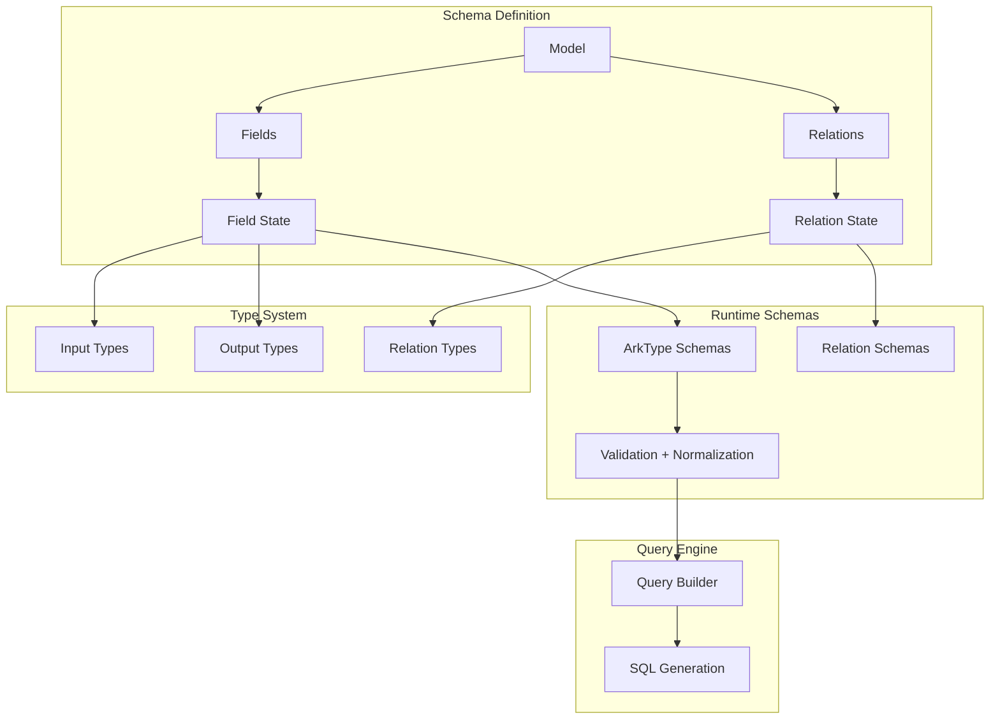

# VibORM Internals

This section documents VibORM's internal architecture for contributors and advanced users who want to understand how the ORM works under the hood.

## What You'll Learn

- **[Architecture](/docs/internals/architecture)** - High-level system design and component relationships
- **[Schema System](/docs/internals/schema-system)** - How models, fields, and relations are defined
- **[Type System](/docs/internals/type-system)** - TypeScript type inference and derivation
- **[Runtime Schemas](/docs/internals/runtime-schemas)** - ArkType schema builders for validation
- **[Normalization](/docs/internals/normalization)** - Input transformation pipeline
- **[Contract](/docs/internals/contract)** - Guarantees between types and runtime

## Design Principles

### 1. Type-First Design

VibORM is built with TypeScript types as the source of truth. Rather than generating types from a schema file (like Prisma), types are **inferred** directly from the schema definition at compile time.

```typescript
// Types are inferred, not generated
const user = s.model({
  id: s.string().id().ulid(),
  name: s.string(),
  email: s.string().unique(),
});

// TypeScript knows the exact shape
type UserFields = (typeof user)["~"]["fields"];
// { id: StringField<...>, name: StringField<...>, email: StringField<...> }
```

### 2. Dual Validation

Every operation is validated twice:

1. **Compile-time** - TypeScript catches type errors
2. **Runtime** - ArkType schemas validate actual data

### 3. Normalization Pipeline

User-friendly shorthand syntax is normalized to canonical forms before reaching the query engine, simplifying SQL generation.

### 4. Separation of Concerns

```
┌─────────────────┐     ┌─────────────────┐     ┌─────────────────┐
│  Schema Layer   │────▶│  Client Layer   │────▶│  Query Engine   │
│  (Definition)   │     │  (Operations)   │     │  (Execution)    │
└─────────────────┘     └─────────────────┘     └─────────────────┘
        │                       │                       │
        ▼                       ▼                       ▼
   Type System            Type Guards           SQL Generation
   ArkType Schemas        Validation            Database Adapters
```

## Quick Architecture Overview



## Key Components

| Component        | Location                          | Purpose                       |
| ---------------- | --------------------------------- | ----------------------------- |
| Model class      | `src/schema/model/model.ts`       | Schema definition entry point |
| Field classes    | `src/schema/fields/*/field.ts`    | Field type definitions        |
| Relation classes | `src/schema/relation/relation.ts` | Relationship definitions      |
| Type helpers     | `src/schema/model/types/`         | TypeScript type derivation    |
| Runtime schemas  | `src/schema/model/runtime/`       | ArkType schema builders       |
| Client           | `src/client/`                     | Operation execution           |
| Query Engine     | `src/query-engine/`               | SQL generation                |

## Next Steps

Start with [Architecture](/docs/internals/architecture) for a comprehensive system overview, or jump directly to the component you're interested in.
