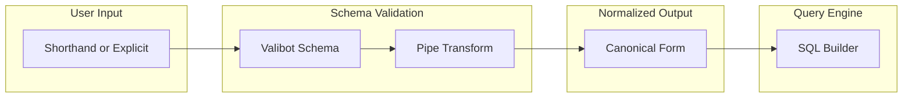
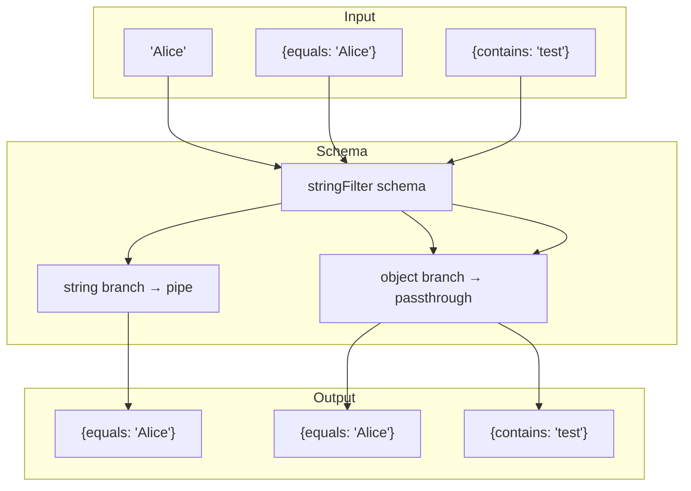
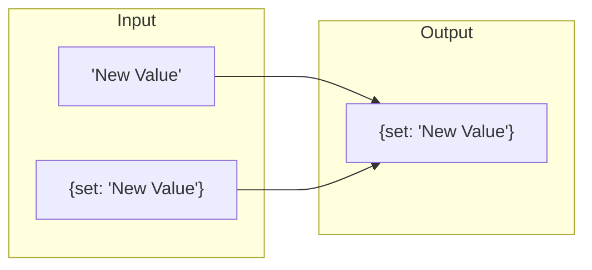
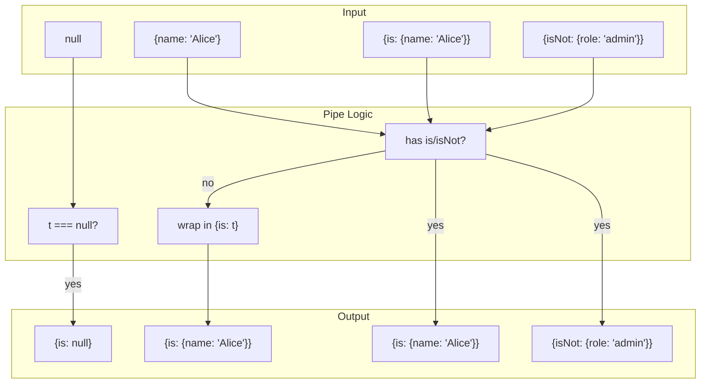

# Normalization Pipeline

VibORM uses Valibot's `pipe()` and `transform()` to normalize user-friendly shorthand syntax into canonical forms. This simplifies the query engine by ensuring it always receives predictable data structures.

## Pipeline Overview



## Scalar Filter Normalization

### The Pattern

```typescript
// Schema definition with pipe
import { union, object, partial, pipe, transform } from "valibot";

export const stringFilter = union([
  shorthandFilter(stringBase), // Shorthand: string -> { equals: string }
  extend(
    partial(
      object({
        equals: stringBase,
        contains: stringBase,
        // ... other operators
      })
    ),
    {
      not: optional(union([shorthandFilter(stringBase), stringFilterBase])),
    }
  ),
]);
```

### How It Works



### All Scalar Normalizations

| Field Type | User Writes  | Query Engine Receives    |
| ---------- | ------------ | ------------------------ |
| String     | `"Alice"`    | `{ equals: "Alice" }`    |
| Number     | `42`         | `{ equals: 42 }`         |
| Boolean    | `true`       | `{ equals: true }`       |
| DateTime   | `new Date()` | `{ equals: Date }`       |
| BigInt     | `BigInt(1)`  | `{ equals: BigInt(1) }`  |
| Enum       | `"A"`        | `{ equals: "A" }`        |
| Blob       | `Uint8Array` | `{ equals: Uint8Array }` |
| Nullable   | `null`       | `{ equals: null }`       |

## Scalar Update Normalization

### The Pattern

```typescript
import { union, object, partial } from "valibot";

export const stringUpdate = union([
  shorthandUpdate(stringBase), // Shorthand: string -> { set: string }
  partial(object({ set: stringBase })),
]);
```

### Normalization Flow



### All Update Normalizations

| Field Type | User Writes  | Query Engine Receives |
| ---------- | ------------ | --------------------- |
| String     | `"value"`    | `{ set: "value" }`    |
| Number     | `42`         | `{ set: 42 }`         |
| Boolean    | `false`      | `{ set: false }`      |
| Blob       | `Uint8Array` | `{ set: Uint8Array }` |
| JSON       | `{ a: 1 }`   | `{ set: { a: 1 } }`   |

### Numeric Operations (No Normalization)

These are already in canonical form:

```typescript
// Already canonical - no normalization needed
{
  increment: 5;
}
{
  decrement: 3;
}
{
  multiply: 2;
}
{
  divide: 4;
}
```

## To-One Relation Filter Normalization

### The Most Important Normalization

```typescript
import { union, nullable, object, pipe, transform } from "valibot";

shape[name] = optional(
  pipe(
    union([
      nullable(getTargetModel()["~"].schemas.whereUnique),
      object({ is: nullable(getTargetModel()["~"].schemas.whereUnique) }),
    ]),
    transform((t) => {
      if (t === null) return { is: null };
      if (isToOneShorthand(t)) return t; // Already has is/isNot
      return { is: t }; // Wrap shorthand
    })
  )
);
```

### Detection Logic

```typescript
const isToOneShorthand = (
  t?: unknown
): t is { is: unknown } | { isNot: unknown } => {
  return (
    t !== undefined &&
    typeof t === "object" &&
    t !== null &&
    ("is" in t || "isNot" in t)
  );
};
```

### Normalization Cases



### Complete Examples

```typescript
// User writes (shorthand)
where: {
  author: {
    name: "Alice";
  }
}

// Query engine receives (canonical)
where: {
  author: {
    is: {
      name: "Alice";
    }
  }
}
```

```typescript
// User writes (null shorthand for optional relation)
where: {
  profile: null;
}

// Query engine receives
where: {
  profile: {
    is: null;
  }
}
```

```typescript
// User writes (explicit - no change)
where: { author: { is: { name: "Alice" }, isNot: { role: "admin" } } }

// Query engine receives (same)
where: { author: { is: { name: "Alice" }, isNot: { role: "admin" } } }
```

## To-Many Relation Operations

### Array Normalization

```typescript
import { union, array, pipe, transform } from "valibot";

const ensureArray = <T>(v: T | T[]): T[] => (Array.isArray(v) ? v : [v]);

// Single-or-array operations
shape["create"] = optional(
  pipe(union([createSchema, array(createSchema)]), transform(ensureArray))
);
shape["connect"] = optional(
  pipe(union([connectSchema, array(connectSchema)]), transform(ensureArray))
);
```

### Array-Only Operations

Some operations don't support single-value shorthand (Valibot limitation):

```typescript
import { optional, array } from "valibot";

// These always require arrays
shape["deleteMany"] = optional(array(whereSchema));
shape["updateMany"] = optional(array(updateManySchema));
shape["upsert"] = optional(array(upsertSchema));
```

### Normalization Summary

| Operation  | User Can Write                     | Query Engine Receives              |
| ---------- | ---------------------------------- | ---------------------------------- |
| create     | `{ title: "Post" }`                | `[{ title: "Post" }]`              |
| create     | `[{ title: "A" }, { title: "B" }]` | `[{ title: "A" }, { title: "B" }]` |
| connect    | `{ id: "123" }`                    | `[{ id: "123" }]`                  |
| deleteMany | `[{ published: false }]`           | `[{ published: false }]`           |
| updateMany | `[{ where: {...}, data: {...} }]`  | `[{ where: {...}, data: {...} }]`  |

## Nested `not` Filter

The `not` operator accepts both direct values and nested filter objects:

```typescript
import { union, object, partial, optional, extend } from "valibot";

const stringFilterBase = partial(
  object({
    equals: stringBase,
    contains: stringBase,
    // ...
  })
);

export const stringFilter = union([
  shorthandFilter(stringBase),
  extend(stringFilterBase, {
    not: optional(union([shorthandFilter(stringBase), stringFilterBase])),
  }),
]);
```

### Examples

```typescript
// Direct value
{ name: { not: "Alice" } }
// SQL: name != 'Alice'

// Nested filter
{ name: { not: { contains: "test", startsWith: "A" } } }
// SQL: NOT (name LIKE '%test%' AND name LIKE 'A%')
```

## Query Engine Guarantees

After normalization, the query engine can rely on:

### Filter Guarantees

1. **Scalar filters are always objects** - Never raw values
2. **To-one relations have `is`/`isNot`** - Never shorthand
3. **Null is wrapped** - `{ equals: null }` or `{ is: null }`
4. **`not` can contain objects** - Must handle nested filters

### Update Guarantees

1. **Scalar updates have `set`** - Direct values wrapped
2. **Numeric ops are explicit** - `increment`, `decrement`, etc.
3. **Array ops are explicit** - `set`, `push`, `unshift`

### Relation Guarantees

1. **To-many operations use arrays** - Even single items
2. **Some operations are array-only** - `deleteMany`, `updateMany`, `upsert`

## Debugging Normalization

To see normalized output:

```typescript
const whereSchema = model["~"].schemas.where;

// Validate and get normalized result
const result = whereSchema({ name: "Alice" });
console.log(result); // { name: { equals: "Alice" } }

// Or with relations
const result2 = whereSchema({ author: { name: "Alice" } });
console.log(result2); // { author: { is: { name: "Alice" } } }
```
