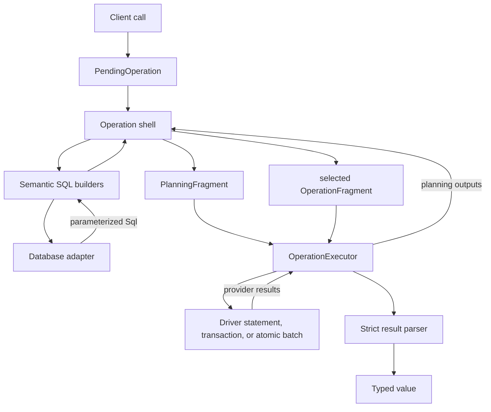
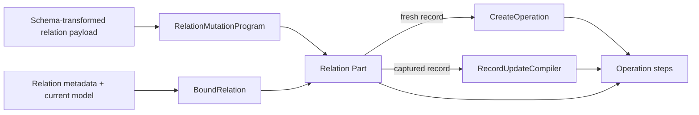

**Location:** `src/query-engine/`

## Purpose

The query engine owns database-agnostic query meaning. It validates a client
operation, compiles adapter-built SQL into a small fragment vocabulary, executes
that fragment through a driver, and parses the declared result.

PostgreSQL, MySQL, SQLite, LibSQL, and PGlite use different syntax and execution
capabilities, but portable operations keep the same accepted inputs, atomic
effects, results, and failures.

## Compilation and execution



The shell decides operation meaning. Builders ask the adapter to express each
SQL concern. The executor knows how to run fragments, but it does not know what
a relation mutation means.

| Owner | Responsibility |
| --- | --- |
| `QueryEngine` | Driver, schema registry, instrumentation, client identity, and transaction scope |
| `PendingOperation` | Lazy and Promise-like public operation lifecycle |
| operation shells | Validation, public target behavior, direct folds, and result declaration |
| `CreateOperation` | One non-bulk fresh record subtree |
| `RecordUpdateCompiler` | One already-selected non-bulk record update |
| relation Parts | Child-held/junction selection, membership, guards, pins, and edge effects |
| `ManyToManyStatements` | Adapter-backed junction SQL materialization |
| `OperationExecutor` | Generic statement, transaction, and atomic-batch execution |
| `QueryScope` | Adapter, model, aliases, root alias, and SQL-construction target |
| `builders/` | Pure adapter-backed SQL construction by semantic concern |
| `result/` | Strict row, relation, aggregate, count, scalar, and shape parsing |

`QueryEngine` is a real owner. A transaction-bound engine preserves its client
identity and receives a new transaction scope identity.

## Fragment vocabulary

The runtime vocabulary has three step kinds:

- `read` executes an adapter-built read statement;
- `write` executes an adapter-built write statement and can carry a race pin or
  conflict-skip effect;
- `guard` checks a database premise of the selected final fragment.

Produced values reference declared outputs from earlier steps. This is an
execution fragment, not a second SQL AST. It contains no relation strategy,
payload walker, driver, or arbitrary context bag.

Planning uses a guard-free `PlanningFragment`. Planning is not always read-only:
skip-duplicate capture can perform preparation writes. Final compilation emits
one `OperationFragment` for the selected effects.

## Execution substrate

Transaction and batch modes use the same semantic fragment. The executor lowers
references, checks postconditions, attributes guards, and fails closed when the
available substrate cannot represent a required effect.

Planning reads can be grouped into one round trip on atomic-batch drivers. The
final selected fragment can then run as one atomic batch. Transaction drivers
execute the same steps linearly inside a transaction.

Simple operations keep a structural fast path. A candidate is direct only when
planning is empty, final compilation produces exactly one statement, and that
statement has no unresolved executor-only effect. A direct `SELECT` or
`... RETURNING` therefore runs without a transaction or batch envelope.

The three single-statement consumers apply different policies:

| Consumer | Additional rule |
| --- | --- |
| direct execution | Allows a postcondition; rejects conflict recovery, unresolved references, and `insertId` scratch |
| prepared single statement | Also rejects postconditions because no executor will check them |
| `QueryEngine.build()` | Returns SQL only when it can be represented without executor-only behavior |

## Relation writes

Nested writes are a public feature, not a second runtime. Their compiler has
three independent inputs:

- `RelationMutationProgram` records the schema-transformed payload meaning;
- `BoundRelation` records whether the edge is parent-held, child-held, or a
  junction;
- a record compiler mutates one fresh or already-selected record.

`CreateOperation` compiles non-bulk fresh record subtrees except the explicit
inline junction-target insert.
`RecordUpdateCompiler` compiles non-bulk updates for a record selected by its
caller. A parent-held to-one branch stays in the record compiler because it
chooses FK columns in that record's root statement. Child-held and junction
Parts own target reads, parent correlation, membership, found/missing decisions,
guards, race pins, and standalone edge effects.

The two compilers recurse through a type-only dependency seam with exactly two
functions, `createFresh` and `updateSelected`. The write engine has no runtime
import cycle and the seam carries no strategy or lifecycle policy.

Generated identity capture is demand-driven. A fresh-record consumer requests
`rootReferenced(field)` only when a descendant, incoming edge, junction, or
terminal result needs the value. An unused database-generated identity does not
force `RETURNING` or `insertId` handling onto an otherwise plain nested insert.



These facts stay separate:

- the mutation program preserves requested meaning and input order;
- the bound relation records storage position and ordered fields only;
- the record compiler owns one record mutation;
- the relation Part owns the edge decision around that record.

`BoundRelation` is deliberately not stored inside `RelationMutationProgram`.
Binding happens at the first topology decision so an earlier validation failure
still wins and an untaken upsert arm remains inert.

Before emission, OwnWrite analysis rejects nested trees whose writes cannot be
linearized safely. `RecordUpdateCompiler` and relation owners that pass it a
selected target address the captured primary key rather than re-evaluating the
selector.

Top-level scalar probe-first upsert follows the same identity rule on the batch
substrate: its found guard binds the complete selector to the captured primary
key, and its UPDATE addresses that key. Transaction mode keeps the original
selector because the locate locks the row. An eligible `ON CONFLICT` fold has no
planning read, and a relation-bearing found arm uses `RecordUpdateCompiler` with
its captured identity. Conditional-skip terminal reads use the located primary
key; post-update terminal reads use the rebuilt primary key.

### Practical write-flow map

| Flow | Shell | Decision/edge owner | Record owner | Planning and identity source | Final order and premise pin |
| --- | --- | --- | --- | --- | --- |
| Structural single-statement fast path | The operation shell | The shell that produced the candidate | The specialized shell or record compiler that built the statement | Empty planning; exactly one statement with no unresolved executor-only effect | One direct statement; direct execution may still enforce its postcondition |
| Fresh record subtree | `CreateOperation` | `CreateOperation` for parent-held edges; relation Parts for child-held and junction edges | `CreateOperation` | Relation probes plus literal, lookup, or demand-driven root output identities | Selected guards, parent-held target work, root INSERT, then child-held or junction descendants; a missing same-target insert uses the root `racePin` |
| Selected record update | `UpdateOperation` or an enclosing relation Part | The enclosing shell or relation Part | `RecordUpdateCompiler` | Target locate and descendant probes; the locate publishes the captured primary key | Locked premise or batch guard, before-root descendants, root UPDATE, after-root descendants, then terminal read; key transitions decide each side of the root |
| Parent-held to-one edge | `CreateOperation` or `RecordUpdateCompiler` | The same record compiler, because the edge chooses its root FK columns | The same fresh or selected record compiler | Target literal, lookup, or fresh-target output supplies the FK | Target work runs before the root; the FK folds into the root INSERT or UPDATE; the selected branch uses its locked read, batch guard, or missing-arm `racePin` |
| Child-held targeted edge | An enclosing create or update shell | The child-held relation Part | `RecordUpdateCompiler` for a selected target; `CreateOperation` for a fresh target | A correlated target read captures the target primary key and parent value | Transaction lock or batch captured-row guard, then the selected target or edge effects in relation order |
| Junction existing-target mutation | An enclosing create or update shell | `RelationJunctionPart` | `RecordUpdateCompiler` only when the target record changes | Membership or global probes capture target identity and parent membership | Locked decision or batch membership/identity guard, then target and junction effects in the selected branch |
| Junction fresh-target attachment | An enclosing create or update shell | `RelationJunctionPart` | Junction-local INSERT for an inline target; `CreateOperation` for a delegated target | Literal identity or a demanded inline/delegated INSERT output; a missing same-target create carries `racePin` | Inline: target INSERT, junction INSERT, descendants. Delegated: complete fresh subtree, then junction INSERT |
| Nested set/bulk relation mutation | An enclosing selected-record flow | `RelationSetPart`, `RelationWritePart`, or `RelationJunctionPart` | None; the specialized Part owns set semantics | Materialized membership sets, filters, and correlated parent values | Guards precede specialized set or bulk effects; zero matches remain legal where the operation contract allows them |
| Top-level bulk write | `CreateManyOperation`, `BulkCountOperation`, or `ManyAndReturnOperation` | The specialized shell | None; there is no one-record loop | Row-shape grouping, optional preparation writes, and captured output groups | Specialized statements preserve skip and bulk semantics; output folds concatenate rows or sum counts |

Junction compilation also uses exact discriminated state. Inline fresh targets
emit target INSERT, junction INSERT, then inline descendants. Delegated targets
emit their complete fresh-record subtree before the junction INSERT. These
orders remain explicit because merging them would require placement policy or
change observable step order.

### Foreign-key provenance

`foreign-key-reference.ts` binds each source to one foreign/referenced field
pair. A consumer resolves the member; it never supplies a separate field name
that could select the wrong value.

Planning and final sources are distinct. Literal and planning-field sources can
feed planning SQL. Final references and lookup SQL remain final-only. A primary
key transition uses one read source for the old value and one write source for
the transformed value, so correlation and assignment cannot silently swap.

`createMany`, `updateMany`, `deleteMany`, and relation `set` remain specialized
because they have set semantics rather than one-record semantics.

## SQL and adapter boundary

> The query engine decides what to query. The adapter decides how the database
> expresses it.

```typescript
// Wrong: PostgreSQL syntax in the query engine
sql`COALESCE(json_agg(...), '[]'::json)`;

// Right: adapter-owned syntax
scope.adapter.json.agg(expression);
```

Builders return parameterized `Sql` fragments. The query engine does not match
provider-specific SQL tokens to recover facts that the compiler already knows.
Provider error-message and assertion-marker recognition belongs to driver error
mapping.

Compiler facts required by a later fold travel beside the opaque SQL fragment.
For example, PostgreSQL create CTE folding receives the target table,
duplicate-skip disposition, and database-assigned-identity fact directly from
the create compiler. It does not recognize `ON CONFLICT` or other PostgreSQL
tokens in rendered SQL. This keeps the fold fast without moving dialect parsing
back into L6.

## Strict results

Result parsing keeps one middleware chain per execution driver:

```text
driver parser → adapter parser → default strict parser
```

Row, relation, aggregate, count, scalar, and expected-shape parsing remain
separate concerns under `result/`. Missing or malformed provider data raises a
typed error; parsing never substitutes a plausible default.

## SQL inspection

`QueryEngine.build()` returns SQL only when an operation is representable as one
statement without executor-only behavior. It rejects guards, unresolved
references, and other multi-step semantics instead of pretending that an atomic
operation is one SQL statement.

Use `prepare()` or await the returned `PendingOperation` for general operations.

## Compatibility

`PendingOperation` is the deferred-operation class exported from the package
root and `viborm/client`. `QueryMetadata<T>` remains a deprecated type-only alias
during its compatibility window; no runtime metadata object exists.

## Architecture gates

`pnpm test:gates` checks fragment vocabulary, layer imports, parsing boundaries,
write-engine runtime import acyclicity, result contracts, and provider-neutral behavior. The shared driver suites prove
the same portable semantics on PostgreSQL, MySQL, SQLite, LibSQL, and PGlite.
