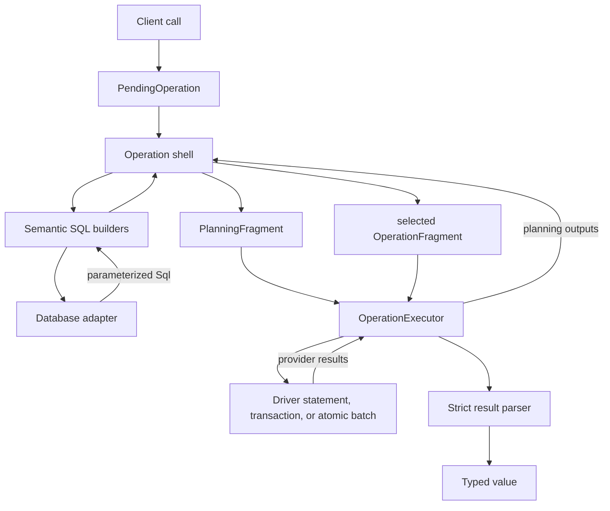
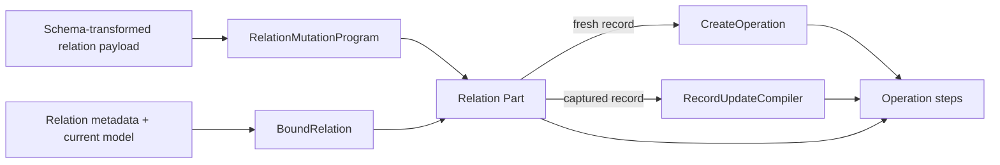

**Location:** `src/query-engine/`

## Purpose

The query engine owns database-agnostic query meaning. It validates a client
operation, compiles adapter-built SQL into a small fragment vocabulary, executes
that fragment through a driver, and parses the declared result.

PostgreSQL, MySQL, SQLite, LibSQL, and PGlite use different syntax and execution
capabilities, but portable operations keep the same accepted inputs, atomic
effects, results, and failures.

## Compilation and execution



An operation shell is the concrete owner of one public operation family. It
exposes `mode`, planning, compilation, and result parsing.
`write-engine/routing.ts` owns route-wide gates and shared-envelope parsing.
The routed root shell owns the remaining family- and arm-specific parsing,
public target and result behavior, and direct folds. `CreateOperation` can also
serve as a delegated fresh-record compiler inside an outer shell. Files in
`write-engine/*Operation.ts` contain these owners. Files in `operations/*.ts`
contain operation-specific SQL, plan, identity, and ordering helpers despite
their historical directory name. The executor knows how to run fragments, but
it does not know what a relation mutation means.

| Owner | Responsibility |
| --- | --- |
| `QueryEngine` | Driver, schema registry, instrumentation, client identity, and transaction scope |
| `PendingOperation` | Lazy and Promise-like public operation lifecycle |
| `write-engine/routing.ts` | Route-wide operation gates, shared-envelope parsing, and shell construction |
| `write-engine/*Operation.ts` | Public-operation-family owners and their executable fragments |
| `operations/*.ts` | Operation-specific SQL, plan, identity, and ordering helpers |
| `CreateOperation` | One non-bulk fresh record subtree |
| `RecordUpdateCompiler` | One already-selected non-bulk record update |
| relation Parts | Child-held/junction selection, membership, guards, pins, and edge effects |
| `ManyToManyStatements` | Adapter-backed junction SQL materialization |
| `OperationExecutor` | Generic statement, transaction, and atomic-batch execution |
| `QueryScope` | Adapter, model, aliases, root alias, and SQL-construction target |
| `builders/` | Shared SQL and semantic builders, including payload and topology parsing |
| `builders/polymorphic-*` | Direct member/inverse resolution, CASE reads, correlated filters, and atomic private storage meaning |
| `result/` | Strict row, ordinary relation, polymorphic relation, aggregate, count, scalar, and shape parsing |

`QueryEngine` is a real owner. A transaction-bound engine preserves its client
identity and receives a new transaction scope identity.

## Fragment vocabulary

The runtime vocabulary has three step kinds:

- `read` executes an adapter-built read statement;
- `write` executes an adapter-built write statement and can carry a race pin or
  conflict-skip effect;
- `guard` checks a database premise of the selected final fragment.

Produced values reference declared outputs from earlier steps. This is an
execution fragment, not a second SQL AST. It contains no relation strategy,
payload walker, driver, or arbitrary context bag.

Planning uses a guard-free `PlanningFragment`. Planning is not always read-only:
skip-duplicate capture can perform preparation writes. Final compilation emits
one `OperationFragment` for the selected effects.

## Execution substrate

Transaction and batch modes use the same semantic fragment. The executor lowers
references, checks postconditions, attributes guards, and fails closed when the
available substrate cannot represent a required effect.

Planning reads can be grouped into one round trip on atomic-batch drivers. The
final selected fragment can then run as one atomic batch. Transaction drivers
execute the same steps linearly inside a transaction.

Simple operations keep a structural fast path. A candidate is direct only when
planning is empty, final compilation produces exactly one statement, and that
statement has no unresolved executor-only effect. A direct `SELECT` or
`... RETURNING` therefore runs without a transaction or batch envelope.

The three single-statement consumers apply different policies:

| Consumer | Additional rule |
| --- | --- |
| direct execution | Allows a postcondition; rejects conflict recovery, unresolved references, and `insertId` scratch |
| prepared single statement | Also rejects postconditions because no executor will check them |
| `QueryEngine.build()` | Returns SQL only when it can be represented without executor-only behavior |

## Relation writes

Nested writes are a public feature, not a second runtime. Their compiler has
three independent inputs:

- `RelationMutationProgram` records the schema-transformed payload meaning;
- `BoundRelation` records the one stored topology — where the membership lives
  (parent-held, child-held, or a junction), how many targets the slot admits, and
  how the membership is physically stored — with every other view of the edge
  derived from it;
- a record compiler mutates one fresh or already-selected record.

`CreateOperation` compiles non-bulk fresh record subtrees except the explicit
inline junction-target insert.
`RecordUpdateCompiler` compiles non-bulk updates for a record selected by its
caller. A parent-held to-one branch stays in the record compiler because it
chooses FK columns in that record's root statement. Child-held and junction
Parts own target reads, parent correlation, membership, found/missing decisions,
guards, race pins, and standalone edge effects.

The two compilers recurse through a type-only dependency seam with exactly two
functions, `createFresh` and `updateSelected`. The write engine has no runtime
import cycle and the seam carries no strategy or lifecycle policy.

Generated identity capture is demand-driven. A fresh-record consumer requests
`rootReferenced(field)` only when a descendant, incoming edge, junction, or
terminal result needs the value. An unused database-generated identity does not
force `RETURNING` or `insertId` handling onto an otherwise plain nested insert.



These facts stay separate:

- the mutation program preserves requested meaning and input order;
- the bound relation records storage position and ordered fields only;
- the record compiler owns one record mutation;
- the relation Part owns the edge decision around that record.

`BoundRelation` is deliberately not stored inside `RelationMutationProgram`.
Binding happens at the first topology decision so an earlier validation failure
still wins and an untaken upsert arm remains inert.

Here, parent means the current source record at one relation edge and child
means its target. A `parentHeld` position means the source record stores the FK
— and, because one source row holds one FK tuple, such an edge is always to-one.
The terms do not define a global model hierarchy.

Before emission, OwnWrite analysis rejects nested trees whose writes cannot be
linearized safely. `RecordUpdateCompiler` and relation owners that pass it a
selected target address the captured primary key rather than re-evaluating the
selector.

Direct polymorphic mutation intent and its inverse relation use the same exact
discriminator-aware OwnWrite scope. The synthetic ordinary edge used to reuse
record compilation supplies endpoint orientation only. A targetless direct
disconnect contributes one exact footprint per configured variant, so no
wildcard scope can conflate equal identities under different discriminators.

The compiler exposes one `TargetProjection` for everything it consumes from the
located row: public model fields and any private physical columns. On an atomic
batch, the owner extends its existing captured-row guard with equality checks for
private values that influenced branch selection. This closes membership drift
without adding a statement or round trip.

Top-level scalar probe-first upsert follows the same identity rule on the batch
substrate: its found guard binds the complete selector to the captured primary
key, and its UPDATE addresses that key. Transaction mode keeps the original
selector because the locate locks the row. An eligible `ON CONFLICT` fold has no
planning read, and a relation-bearing found arm uses `RecordUpdateCompiler` with
its captured identity.

A conditional-skip batch arm first proves, without retry, that the complete
selector still names the captured primary key. It then proves, with a raceable
absence guard, that this same row still does not match the conditional. The
order separates replacement or deletion from a false-to-true condition change.
The absence query preserves SQL UNKNOWN as a no-match. Its terminal read uses
the captured key; a post-update terminal read uses the rebuilt key.
`RecordUpdateCompiler` never owns a public terminal read. The routed shell
normally does; a relation-bearing upsert create arm instead delegates its
result-producing fragment to `CreateOperation`, and the outer
`UpsertOperation` re-exposes and parses that result. Direct folds need no
terminal read. Both guards run in the same atomic driver batch, so the second
premise adds a statement but not a network round trip.

### Practical write-flow map

| Flow | Shell | Decision/edge owner | Record owner | Planning and identity source | Final order and premise pin |
| --- | --- | --- | --- | --- | --- |
| Structural single-statement fast path | The operation shell | The shell that produced the candidate | The specialized shell or record compiler that built the statement | Empty planning; exactly one statement with no unresolved executor-only effect | One direct statement; direct execution may still enforce its postcondition |
| Fresh record subtree | The outer routed operation | `CreateOperation` for parent-held edges; relation Parts for child-held and junction edges | `CreateOperation` | Relation probes plus literal, lookup, or demand-driven root output identities | Selected guards, parent-held target work, root INSERT, then child-held or junction descendants; a missing same-target insert uses the root `racePin` |
| Selected record update | The outer routed operation | `UpdateOperation`, `UpsertOperation`, or the enclosing relation Part | `RecordUpdateCompiler` | Target locate and descendant probes; the locate publishes the captured primary key | Locked premise or batch guard, before-root descendants, root UPDATE, then after-root descendants; the outer shell can add its terminal read, and key transitions decide each side of the root |
| Parent-held to-one edge | The outer routed operation | The fresh or selected record compiler, because the edge chooses its root FK columns | `CreateOperation` or `RecordUpdateCompiler` | Target literal, lookup, or fresh-target output supplies the FK | Target work runs before the root; the FK folds into the root INSERT or UPDATE; the selected branch uses its locked read, batch guard, or missing-arm `racePin` |
| Child-held targeted edge | The outer routed operation | The child-held relation Part | `RecordUpdateCompiler` for a selected target; `CreateOperation` for a fresh target | A correlated target read captures the target primary key and parent value | Transaction lock or batch captured-row guard, then the selected target or edge effects in relation order |
| Junction existing-target mutation | The outer routed operation | `RelationJunctionPart` | `RecordUpdateCompiler` only when the target record changes | Membership or global probes capture target identity and parent membership | Locked decision or batch membership/identity guard, then target and junction effects in the selected branch |
| Junction fresh-target attachment | The outer routed operation | `RelationJunctionPart` | Junction-local INSERT for an inline target; `CreateOperation` for a delegated target | Literal identity or a demanded inline/delegated INSERT output; a missing same-target create carries `racePin` | Inline: target INSERT, junction INSERT, descendants. Delegated: complete fresh subtree, then junction INSERT |
| Nested set/bulk relation mutation | The outer routed operation | `RelationSetPart`, `RelationWritePart`, or `RelationJunctionPart` | None; the specialized Part owns set semantics | Materialized membership sets, filters, and correlated parent values | Guards precede specialized set or bulk effects; zero matches remain legal where the operation contract allows them |
| Top-level bulk write | `CreateManyOperation`, `BulkCountOperation`, or `ManyAndReturnOperation` | The specialized shell | None; there is no one-record loop | Row-shape grouping, optional preparation writes, and captured output groups | Specialized statements preserve skip and bulk semantics; output folds concatenate rows or sum counts |

Junction compilation also uses exact discriminated state. Inline fresh targets
emit target INSERT, junction INSERT, then inline descendants. Delegated targets
emit their complete fresh-record subtree before the junction INSERT. These
orders remain explicit because merging them would require placement policy or
change observable step order.

### Source-bound relation membership

`relation-membership.ts` binds each ordinary source to one
foreign/referenced field pair, then binds those members to the child-held
relation. The polymorphic form binds fixed storage and discriminator to one
identity source. Consumers resolve the membership; they never supply a separate
field name or private-storage channel that could select the wrong value.

The same owner lowers assignment, clear, planning/final correlation, probe
projection, and captured-row membership tests. This keeps ordinary and
polymorphic relation Parts on one control-flow path without hiding their
different physical storage.

Planning and final sources are distinct. Literal and planning-field sources can
feed planning SQL. Final references and lookup SQL remain final-only. A primary
key transition uses one read source for the old value and one write source for
the transformed value, so correlation and assignment cannot silently swap.

`createMany`, `updateMany`, `deleteMany`, and relation `set` remain specialized
because they have set semantics rather than one-record semantics. The one
exception is a `createMany` row carrying a general relation program: the whole
call becomes a transactional record series whose members are ordinary create
operations, run left to right, because a later row may need to observe what an
earlier one wrote.

Nested `createMany` stays with the owner of its placement. `CreateOperation`
stores post-insert groups for a fresh parent, `nested-target-parts.ts` builds
them for a selected parent, and `RelationJunctionPart` keeps target rows ordered
with join effects. The top-level form stays in `CreateManyOperation`.

## Polymorphic relation path

A polymorphic field defines a direct multi-target to-one relation with an exact
lazy getter map and a separate stable stored-value map:

```typescript
subject: s
  .polymorphic(
    {
      post: () => post,
      video: () => video,
    },
    {
      values: {
        post: "content.post.v1",
        video: "content.video.v1",
      },
    }
  )
  .name("subjectTarget")
  .optional()
```

The map key is public: queries use it and results narrow on it. The mapped value
is physical migration history. The owning model stores neither value as a
public scalar. Its validated schema descriptor owns private
`<relation>_type` and `<relation>_id` columns plus a composite `(type, id)`
index. There is no portable database foreign key across target tables.

The direct and inverse paths are deliberately different:

| Path | Read meaning | Write meaning |
| --- | --- | --- |
| direct field | One correlated CASE statement, one exact discriminator arm per configured target | `CreateOperation` owns fresh-owner connect/create/connectOrCreate; `RecordUpdateCompiler` owns those operations plus selected-owner update/upsert and optional disconnect/delete |
| inverse `oneToMany` | Ordinary include/filter/count plus `child.id = parent.pk AND child.type = fixed discriminator` | Ordinary child-held relation Parts own the full safe to-many mutation family; record compilers own fresh and selected child records |
| inverse `oneToOne` | Ordinary singular include/filter plus the same exact type-and-identity membership | Ordinary child-held-to-one Parts own selection and membership; record compilers own fresh and selected child records |

Direct include/select supports target-specific nested projections. A configured
variant omitted from the projection object still uses that target's default
scalar projection, so the public result remains an exhaustive discriminated
union. Direct filters accept `type`, `type + is`, and `type + isNot`. An
optional relation also accepts bare `null`, `{ is: null }`, and
`{ isNot: null }`. Presence filters compare the private storage pair directly;
target-specific filters keep the discriminator-correlated target query.

The query compiler emits one CASE-based statement and does not execute a query
per row or target. Ordinary relations keep their existing capability-selected
LATERAL/correlated path. Polymorphic mutation projection folds carry private
type/id columns only when needed and decline a self-polymorphic stale-snapshot
fold; the normal terminal read remains the fallback.

Direct mutation lowering resolves one target after operation-schema parsing.
The targeted branch reuses `RelationMutationProgram` and existing lookup,
guard, race-pin, and record-compiler behavior. Targetless disconnect adds only
an empty `PolymorphicStorageValue`. Linked and empty storage values always write
or clear type and id together, and a disconnect-only selected update still
counts as root work.

The strict result parser receives the existing relation decode middleware with
kind `"polymorphic"`, validates the internal carrier, selects the exact variant
shape, and parses target data through the normal row parser. Empty storage
returns `null` only for an optional relation. A non-empty membership whose
known target is missing always throws `QueryEngineError`. Unknown
discriminators and half-null storage are malformed provider results.

Direct owner creation exposes connect, create, and connect-or-create. A selected
owner also exposes update and upsert, plus disconnect and delete when the direct
membership is optional. The direct edge is to-one, so collection set does not
apply. A bound inverse `oneToMany` exposes
create/createMany/connect/connectOrCreate/upsert on create, the ordinary
targeted and bulk update/delete family on update. Disconnect requires clearable
membership. Set is available for both storage modes; required membership uses a
materialized departing-member guard. A bound inverse `oneToOne` always has an
optional public slot: delete may empty it, while disconnect additionally
requires clearable child storage. Exact membership always includes both the
fixed discriminator and parent identity. Root createMany accepts direct connect-only
memberships; inverse nested createMany can satisfy its owning required relation
but not another required polymorphic relation. The feature adds no runtime step
kind, executor protocol, adapter semantic namespace, or round trip beyond the
ordinary child-held analogue.

## SQL and adapter boundary

> The query engine decides what to query. The adapter decides how the database
> expresses it.

```typescript
// Wrong: PostgreSQL syntax in the query engine
sql`COALESCE(json_agg(...), '[]'::json)`;

// Right: adapter-owned syntax
scope.adapter.json.agg(expression);
```

SQL-emitting builders return parameterized `Sql` fragments. The query engine
does not match provider-specific SQL tokens to recover facts that the compiler
already knows. Provider error-message and assertion-marker recognition belongs
to driver error mapping.

Compiler facts required by a later fold travel beside the opaque SQL fragment.
For example, PostgreSQL create CTE folding receives the target table,
duplicate-skip disposition, and database-assigned-identity fact directly from
the create compiler. It does not recognize `ON CONFLICT` or other PostgreSQL
tokens in rendered SQL. This keeps the fold fast without moving dialect parsing
back into L6.

## Strict results

Result parsing keeps one middleware chain per execution driver:

```text
driver parser → adapter parser → default strict parser
```

Row, relation, aggregate, count, scalar, and expected-shape parsing remain
separate concerns under `result/`. Missing or malformed provider data raises a
typed error; parsing never substitutes a plausible default.

## SQL inspection

`QueryEngine.build()` returns SQL only when an operation is representable as one
statement without executor-only behavior. It rejects guards, unresolved
references, and other multi-step semantics instead of pretending that an atomic
operation is one SQL statement.

Use `prepare()` or await the returned `PendingOperation` for general operations.

## Compatibility

`PendingOperation` is the deferred-operation class exported from the package
root and `viborm/client`. `QueryMetadata<T>` remains a deprecated type-only alias
during its compatibility window; no runtime metadata object exists.

## Architecture gates

`pnpm test:layer:query-engine` checks fragment vocabulary, parsing boundaries,
write-engine runtime import acyclicity, result contracts, and provider-neutral
behavior. `pnpm test` runs the complete core estate. Extended and provider
contracts use the scripts documented in `tests/README.md`.

The fast layer gate is not the write-engine coverage oracle. The authoritative
credential-free report is `pnpm test:coverage:write-engine`, which selects the
complete local write behavior estate plus its query and architecture sentinels.
The 2026-08-07 measurement covers 93.00% of statements and lines, 90.12% of
branches, and 98.90% of functions in 223.53–232.92 seconds across two complete
runs.

PGlite behavior is provisioned by schema family: one database and one schema
push, then table truncation with identity restart between ordinary cases.
Parity arms reset explicitly. Fresh databases remain only where the contract
observes DDL, lifecycle, destructive schema changes, independently committed
concurrency, staleness/races, or rollback isolation. Structural compiler tests
do not boot a database, and the family fixture is the sole disconnect owner.
