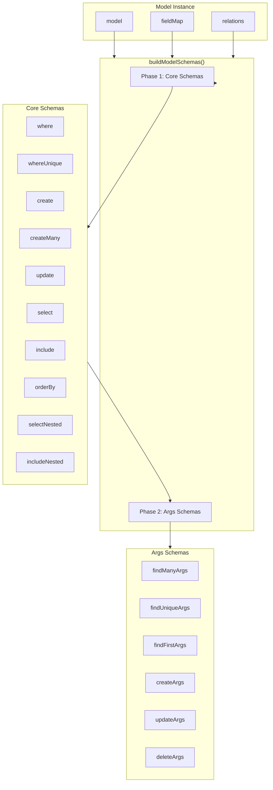
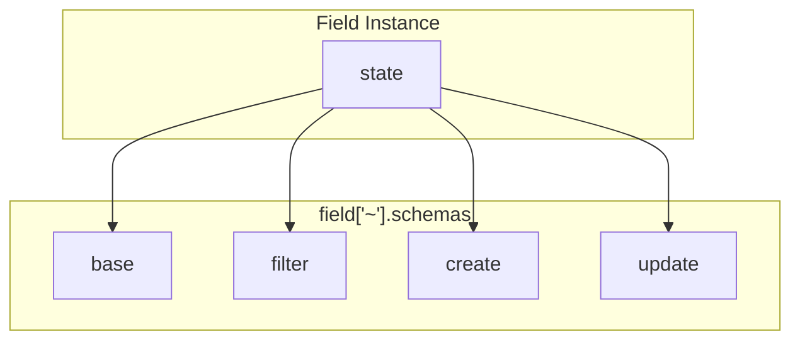
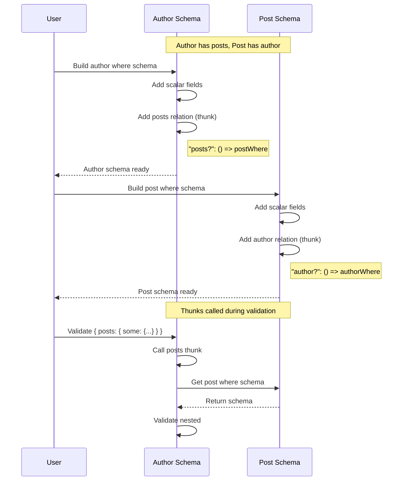

# Runtime Schemas

VibORM uses [ArkType](https://arktype.io) for runtime validation. Each model generates schemas that mirror the TypeScript types.

## Schema Building Architecture



## Two-Phase Building

Schemas are built in two phases to enable reuse:

### Phase 1: Core Schemas

```typescript
const core: CoreSchemas = {
  where: buildWhereSchema(model),
  whereUnique: buildWhereUniqueSchema(model),
  create: buildCreateSchema(model),
  createMany: buildCreateManySchema(model),
  update: buildUpdateSchema(model),
  select: buildSelectSchema(model),
  include: buildIncludeSchema(model),
  orderBy: buildOrderBySchema(model),
  selectNested: buildSelectNestedSchema(model),
  includeNested: buildIncludeNestedSchema(model),
};
```

### Phase 2: Args Schemas

Args schemas receive `core` and reuse its schemas:

```typescript
return {
  ...core,
  findMany: buildFindManyArgsSchema(model, core),
  findUnique: buildFindUniqueArgsSchema(core),  // Note: no model needed
  findFirst: buildFindFirstArgsSchema(model, core),
  createArgs: buildCreateArgsSchema(core),
  updateArgs: buildUpdateArgsSchema(core),
  deleteArgs: buildDeleteArgsSchema(core),
  // ...
};
```

## Field Schema Structure

Each field provides schemas for different operations:



### Example: String Field Schemas

```typescript
// src/schema/fields/string/schemas.ts

// Base types
export const stringBase = type.string;
export const stringNullable = stringBase.or("null");

// Filter with shorthand normalization
const stringFilterBase = type({
  equals: stringBase,
  in: stringBase.array(),
  notIn: stringBase.array(),
  contains: stringBase,
  startsWith: stringBase,
  endsWith: stringBase,
  // ...
}).partial();

export const stringFilter = stringFilterBase
  .merge(type({ "not?": stringFilterBase.or(stringNullable) }))
  .or(stringBase.pipe((v) => ({ equals: v })));  // Shorthand normalization

// Update with shorthand normalization
export const stringUpdate = type({ set: stringBase })
  .partial()
  .or(stringBase.pipe((v) => ({ set: v })));
```

## Where Schema Building

```typescript
export const buildWhereSchema = (model: Model<any>): Type => {
  const shape: Record<string, Type | (() => Type)> = {};

  // Scalar fields
  for (const [name, field] of model["~"].fieldMap) {
    shape[name + "?"] = field["~"].schemas.filter;
  }

  // Relation fields (lazy for circular references)
  for (const [name, relation] of model["~"].relations) {
    const relationType = relation["~"].relationType;
    const getTargetModel = relation["~"].getter;

    if (relationType === "oneToOne" || relationType === "manyToOne") {
      // To-one with shorthand normalization
      shape[name + "?"] = type("object | null").pipe((t) => {
        if (t === null) return { is: null };
        if (isToOneShorthand(t)) return t;
        return { is: t };
      });
    } else {
      // To-many: some/every/none
      shape[name + "?"] = type({
        "some?": () => getTargetModel()["~"].schemas.where,
        "every?": () => getTargetModel()["~"].schemas.where,
        "none?": () => getTargetModel()["~"].schemas.where,
      });
    }
  }

  return type(shape);
};
```

## Lazy Evaluation Pattern

Circular references are handled with thunks:



### Thunk Pattern

```typescript
// Bad - causes infinite recursion
shape["posts?"] = buildWhereSchema(postModel);

// Good - lazy evaluation
shape["posts?"] = type({
  "some?": () => getTargetModel()["~"].schemas.where,
});
```

## Model-Level Caching

Schemas are cached per model to prevent rebuilding:

```typescript
class Model<State> {
  private _schemas?: TypedModelSchemas;

  get ["~"]() {
    return {
      // ...
      get schemas() {
        if (!this._schemas) {
          this._schemas = buildModelSchemas(this);
        }
        return this._schemas;
      }
    };
  }
}
```

## WhereUnique Schema

Handles single-field and compound unique identifiers:

```typescript
export const buildWhereUniqueSchema = (model: Model<any>): Type => {
  const shape: Record<string, Type> = {};
  const uniqueFieldNames: string[] = [];
  const compoundKeyNames: string[] = [];

  // Single-field uniques
  for (const [name, field] of model["~"].fieldMap) {
    if (field["~"].state.isId || field["~"].state.isUnique) {
      shape[name + "?"] = field["~"].schemas.base;
      uniqueFieldNames.push(name);
    }
  }

  // Compound ID
  const compoundId = model["~"].compoundId;
  if (compoundId?.fields?.length > 0) {
    const keyName = compoundId.name ?? generateCompoundKeyName(compoundId.fields);
    const compoundShape = {};
    for (const fieldName of compoundId.fields) {
      compoundShape[fieldName] = model["~"].fieldMap.get(fieldName)["~"].schemas.base;
    }
    shape[keyName + "?"] = type(compoundShape);
    compoundKeyNames.push(keyName);
  }

  // Compound uniques (similar pattern)
  // ...

  // Validation: at least one identifier required
  return type(shape).narrow((data, ctx) => {
    const allIdentifiers = [...uniqueFieldNames, ...compoundKeyNames];
    const hasIdentifier = allIdentifiers.some(name => name in data);
    if (!hasIdentifier) {
      return ctx.mustBe(`an object with at least one of: ${allIdentifiers.join(", ")}`);
    }
    return true;
  });
};
```

## Relation Create/Update Schemas

### To-One Create

```typescript
const buildRelationCreateSchema = (relation, getTargetModel) => {
  return type({
    "create?": () => getTargetModel()["~"].schemas.create,
    "connect?": () => getTargetModel()["~"].schemas.whereUnique,
    "connectOrCreate?": type({
      where: () => getTargetModel()["~"].schemas.whereUnique,
      create: () => getTargetModel()["~"].schemas.create,
    }),
  });
};
```

### To-Many Create

```typescript
// Uses ensureArray helper for single-or-array normalization
const ensureArray = <T>(v: T | T[]): T[] => Array.isArray(v) ? v : [v];

const createSchema = type(() => getTargetModel()["~"].schemas.create);
return type({
  "create?": createSchema.or(createSchema.array()).pipe(ensureArray),
  "connect?": connectSchema.or(connectSchema.array()).pipe(ensureArray),
  // ...
});
```

### To-Many Update (Array-Only Operations)

Some operations only accept arrays due to ArkType limitations:

```typescript
return type({
  // Single-or-array (normalized)
  "create?": createSchema.or(createSchema.array()).pipe(ensureArray),
  "connect?": connectSchema.or(connectSchema.array()).pipe(ensureArray),
  
  // Array-only (no single-value shorthand)
  "deleteMany?": whereSchema.array(),
  "updateMany?": updateManySchema.array(),
  "upsert?": upsertSchema.array(),
});
```

## Schema Type Exports

ArkType schemas expose their types:

```typescript
// Get input type (what user provides)
type StringFilterInput = typeof stringFilter.inferIn;

// Get output type (after normalization)
type StringFilterOutput = typeof stringFilter.infer;
```

For piped schemas, these differ:
- `inferIn`: `string | { equals?: string, ... }`
- `infer`: `{ equals: string } | { contains?: string, ... }`

