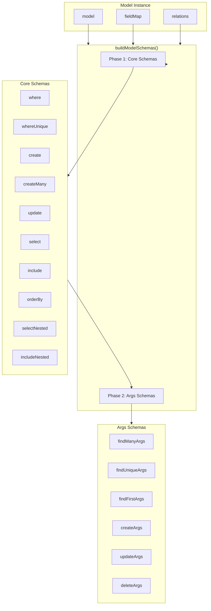
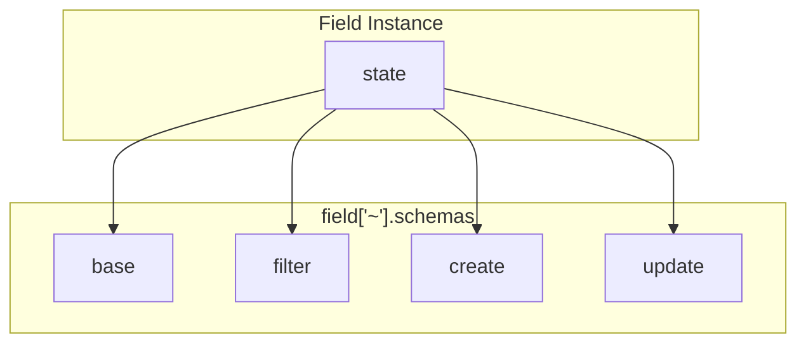
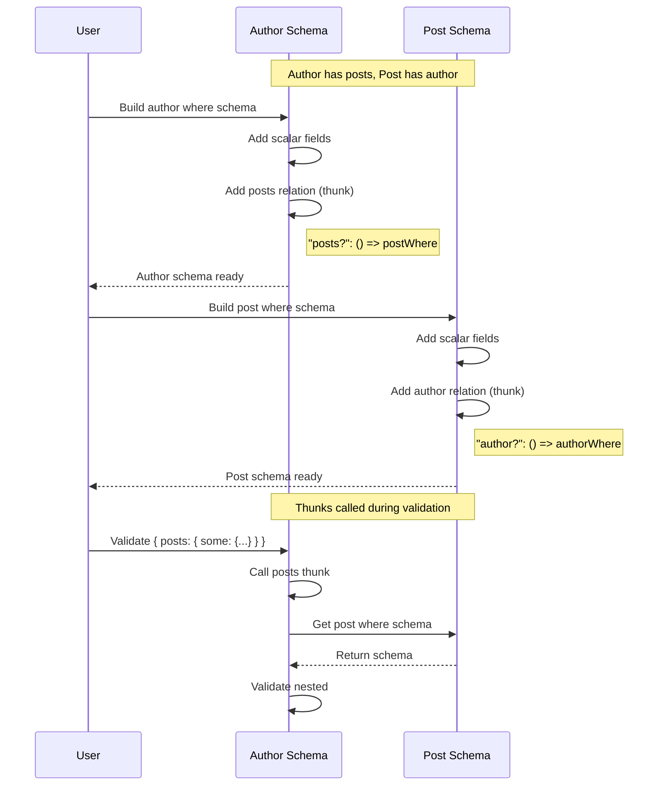

# Runtime Schemas

VibORM uses its [custom validation library](/docs/internals/validation) for runtime validation. Each model generates schemas that mirror the TypeScript types.

<Callout type="info">
  VibORM's validation library is a lightweight, StandardSchema-compliant alternative to Valibot/Zod, optimized for ORM use cases with recursive types and edge environments.
</Callout>

## Schema Building Architecture



## Two-Phase Building

Schemas are built in two phases to enable reuse:

### Phase 1: Core Schemas

```typescript
const core: CoreSchemas = {
  where: buildWhereSchema(model),
  whereUnique: buildWhereUniqueSchema(model),
  create: buildCreateSchema(model),
  createMany: buildCreateManySchema(model),
  update: buildUpdateSchema(model),
  select: buildSelectSchema(model),
  include: buildIncludeSchema(model),
  orderBy: buildOrderBySchema(model),
  selectNested: buildSelectNestedSchema(model),
  includeNested: buildIncludeNestedSchema(model),
};
```

### Phase 2: Args Schemas

Args schemas receive `core` and reuse its schemas:

```typescript
return {
  ...core,
  findMany: buildFindManyArgsSchema(model, core),
  findUnique: buildFindUniqueArgsSchema(core), // Note: no model needed
  findFirst: buildFindFirstArgsSchema(model, core),
  createArgs: buildCreateArgsSchema(core),
  updateArgs: buildUpdateArgsSchema(core),
  deleteArgs: buildDeleteArgsSchema(core),
  // ...
};
```

## Field Schema Structure

Each field provides schemas for different operations:



### Example: String Field Schemas

```typescript
// src/schema/fields/string/schemas.ts
import { v } from "viborm";

// Base types
export const stringBase = v.string();
export const stringNullable = v.nullable(v.string());

// Filter with shorthand normalization
export const stringFilter = v.union([
  v.string(),  // Shorthand: "foo" → { equals: "foo" }
  v.object({
    equals: v.string({ optional: true }),
    in: v.string({ array: true, optional: true }),
    notIn: v.string({ array: true, optional: true }),
    contains: v.string({ optional: true }),
    startsWith: v.string({ optional: true }),
    endsWith: v.string({ optional: true }),
    not: v.union([v.string(), /* nested filter */], { optional: true }),
  }),
]);

// Update with shorthand normalization
export const stringUpdate = v.union([
  v.string(),  // Shorthand: "foo" → { set: "foo" }
  v.object({
    set: v.string({ optional: true }),
  }),
]);
```

## Where Schema Building

```typescript
import { v } from "viborm";

export const buildWhereSchema = (model: Model<any>) => {
  const shape: Record<string, any> = {};

  // Scalar fields
  for (const [name, field] of model["~"].fieldMap) {
    shape[name] = field["~"].schemas.filter;  // Already optional
  }

  // Relation fields (thunks for circular references)
  for (const [name, relation] of model["~"].relations) {
    const relationType = relation["~"].relationType;
    const getTargetModel = relation["~"].getter;

    if (relationType === "oneToOne" || relationType === "manyToOne") {
      // To-one with shorthand normalization
      shape[name] = v.union([
        v.nullable(getTargetModel()["~"].schemas.whereUnique),
        v.object({ 
          is: v.nullable(getTargetModel()["~"].schemas.whereUnique) 
        }),
      ], { optional: true });
    } else {
      // To-many: some/every/none (thunks for circular refs)
      shape[name] = v.object({
        some: () => getTargetModel()["~"].schemas.where,
        every: () => getTargetModel()["~"].schemas.where,
        none: () => getTargetModel()["~"].schemas.where,
      }, { optional: true });
    }
  }

  return v.object(shape);
};
```

## Lazy Evaluation Pattern

Circular references are handled with thunks:



### Thunk Pattern

```typescript
import { v } from "viborm";

// Bad - causes infinite recursion
shape["posts"] = buildWhereSchema(postModel);

// Good - thunks for lazy evaluation
shape["posts"] = v.object({
  some: () => getTargetModel()["~"].schemas.where,  // Thunk
  every: () => getTargetModel()["~"].schemas.where,
  none: () => getTargetModel()["~"].schemas.where,
}, { optional: true });
```

Unlike Valibot's `lazy()`, VibORM's thunks preserve full type inference for circular references.

## Model-Level Caching

Schemas are cached per model to prevent rebuilding:

```typescript
class Model<State> {
  private _schemas?: TypedModelSchemas;

  get ["~"]() {
    return {
      // ...
      get schemas() {
        if (!this._schemas) {
          this._schemas = buildModelSchemas(this);
        }
        return this._schemas;
      },
    };
  }
}
```

## WhereUnique Schema

Handles single-field and compound unique identifiers:

```typescript
import { v } from "viborm";

export const buildWhereUniqueSchema = (model: Model<any>) => {
  const shape: Record<string, any> = {};
  const uniqueFieldNames: string[] = [];
  const compoundKeyNames: string[] = [];

  // Single-field uniques
  for (const [name, field] of model["~"].fieldMap) {
    if (field["~"].state.isId || field["~"].state.isUnique) {
      shape[name] = field["~"].schemas.base;  // Optional by default
      uniqueFieldNames.push(name);
    }
  }

  // Compound ID
  const compoundId = model["~"].compoundId;
  if (compoundId?.fields?.length > 0) {
    const keyName = compoundId.name ?? generateCompoundKeyName(compoundId.fields);
    const compoundShape: Record<string, any> = {};
    for (const fieldName of compoundId.fields) {
      compoundShape[fieldName] = 
        model["~"].fieldMap.get(fieldName)["~"].schemas.base;
    }
    shape[keyName] = v.object(compoundShape, { optional: true });
    compoundKeyNames.push(keyName);
  }

  // Compound uniques (similar pattern)
  // ...

  // Validation: at least one identifier required
  const allIdentifiers = [...uniqueFieldNames, ...compoundKeyNames];
  
  return v.pipe(
    v.object(shape),
    v.transform((input) => {
      const hasIdentifier = allIdentifiers.some((name) => name in input);
      if (!hasIdentifier) {
        throw new Error(`Must provide at least one of: ${allIdentifiers.join(", ")}`);
      }
      return input;
    })
  );
};
```

## Relation Create/Update Schemas

### To-One Create

```typescript
import { v } from "viborm";

const buildRelationCreateSchema = (relation, getTargetModel) => {
  return v.object({
    create: () => getTargetModel()["~"].schemas.create,  // Thunk
    connect: () => getTargetModel()["~"].schemas.whereUnique,
    connectOrCreate: v.object({
      where: () => getTargetModel()["~"].schemas.whereUnique,
      create: () => getTargetModel()["~"].schemas.create,
    }, { optional: true }),
  });
};
```

### To-Many Create

```typescript
import { v } from "viborm";

// Uses ensureArray helper for single-or-array normalization
const ensureArray = <T>(x: T | T[]): T[] => (Array.isArray(x) ? x : [x]);

const buildToManyCreate = (getTargetModel) => {
  return v.object({
    create: v.union([
      () => getTargetModel()["~"].schemas.create,
      v.array(() => getTargetModel()["~"].schemas.create),
    ], { 
      optional: true, 
      transform: ensureArray 
    }),
    connect: v.union([
      () => getTargetModel()["~"].schemas.whereUnique,
      v.array(() => getTargetModel()["~"].schemas.whereUnique),
    ], { 
      optional: true, 
      transform: ensureArray 
    }),
  });
};
```

### To-Many Update (Array-Only Operations)

Some operations only accept arrays:

```typescript
return v.object({
  // Single-or-array (normalized)
  create: v.array(() => createSchema, { optional: true }),
  connect: v.array(() => connectSchema, { optional: true }),

  // Array-only (no single-value shorthand)
  deleteMany: v.array(() => whereSchema, { optional: true }),
  updateMany: v.array(() => updateManySchema, { optional: true }),
  upsert: v.array(() => upsertSchema, { optional: true }),
});
```

## Schema Type Exports

VibORM schemas implement `StandardSchemaV1`, so types are accessed via the standard interface:

```typescript
import type { StandardSchemaV1 } from "@standard-schema/spec";

// Get input type (what user provides)
type StringFilterInput = StandardSchemaV1.InferInput<typeof stringFilter>;

// Get output type (after normalization)
type StringFilterOutput = StandardSchemaV1.InferOutput<typeof stringFilter>;
```

For union schemas with shorthand normalization, these differ:

- `InferInput`: `string | { equals?: string, ... }`
- `InferOutput`: `{ equals: string } | { contains?: string, ... }`

The output type reflects the normalized form after shorthand transformation.

See the [Validation Library](/docs/internals/validation) documentation for more details on the type system and recursive type support.
