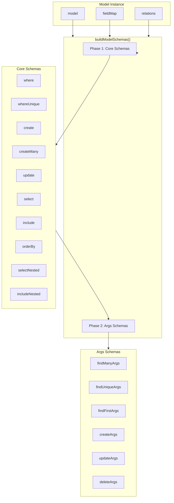
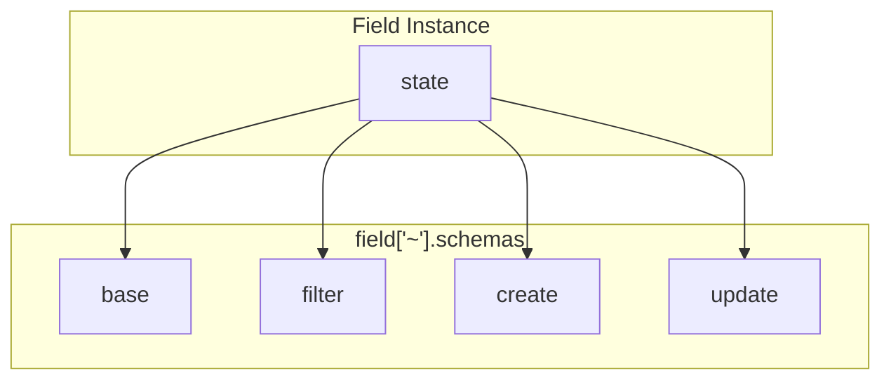
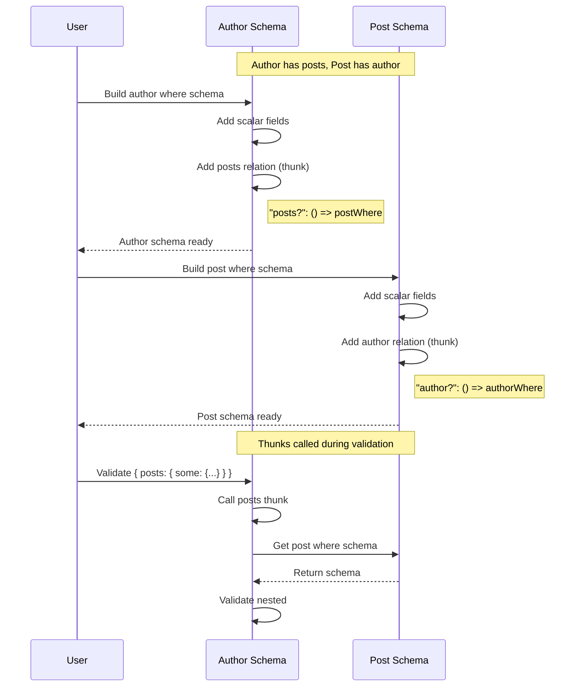

# Runtime Schemas

VibORM uses [Valibot](https://valibot.dev) for runtime validation. Each model generates schemas that mirror the TypeScript types.

## Schema Building Architecture



## Two-Phase Building

Schemas are built in two phases to enable reuse:

### Phase 1: Core Schemas

```typescript
const core: CoreSchemas = {
  where: buildWhereSchema(model),
  whereUnique: buildWhereUniqueSchema(model),
  create: buildCreateSchema(model),
  createMany: buildCreateManySchema(model),
  update: buildUpdateSchema(model),
  select: buildSelectSchema(model),
  include: buildIncludeSchema(model),
  orderBy: buildOrderBySchema(model),
  selectNested: buildSelectNestedSchema(model),
  includeNested: buildIncludeNestedSchema(model),
};
```

### Phase 2: Args Schemas

Args schemas receive `core` and reuse its schemas:

```typescript
return {
  ...core,
  findMany: buildFindManyArgsSchema(model, core),
  findUnique: buildFindUniqueArgsSchema(core), // Note: no model needed
  findFirst: buildFindFirstArgsSchema(model, core),
  createArgs: buildCreateArgsSchema(core),
  updateArgs: buildUpdateArgsSchema(core),
  deleteArgs: buildDeleteArgsSchema(core),
  // ...
};
```

## Field Schema Structure

Each field provides schemas for different operations:



### Example: String Field Schemas

```typescript
// src/schema/fields/string/schemas.ts
import { string, union, object, partial, optional, array } from "valibot";

// Base types
export const stringBase = string();
export const stringNullable = nullable(stringBase);

// Filter with shorthand normalization
const stringFilterBase = partial(
  object({
    equals: stringBase,
    in: array(stringBase),
    notIn: array(stringBase),
    contains: stringBase,
    startsWith: stringBase,
    endsWith: stringBase,
    // ...
  })
);

export const stringFilter = union([
  shorthandFilter(stringBase), // Shorthand: string -> { equals: string }
  extend(stringFilterBase, {
    not: optional(union([shorthandFilter(stringBase), stringFilterBase])),
  }),
]);

// Update with shorthand normalization
export const stringUpdate = union([
  shorthandUpdate(stringBase), // Shorthand: string -> { set: string }
  partial(object({ set: stringBase })),
]);
```

## Where Schema Building

```typescript
import { object, optional, union, nullable } from "valibot";

export const buildWhereSchema = (model: Model<any>): BaseSchema => {
  const shape: Record<string, BaseSchema | (() => BaseSchema)> = {};

  // Scalar fields
  for (const [name, field] of model["~"].fieldMap) {
    shape[name] = optional(field["~"].schemas.filter);
  }

  // Relation fields (lazy for circular references)
  for (const [name, relation] of model["~"].relations) {
    const relationType = relation["~"].relationType;
    const getTargetModel = relation["~"].getter;

    if (relationType === "oneToOne" || relationType === "manyToOne") {
      // To-one with shorthand normalization
      shape[name] = optional(
        union([
          nullable(getTargetModel()["~"].schemas.whereUnique),
          object({ is: nullable(getTargetModel()["~"].schemas.whereUnique) }),
        ])
      );
    } else {
      // To-many: some/every/none
      shape[name] = optional(
        object({
          some: optional(() => getTargetModel()["~"].schemas.where),
          every: optional(() => getTargetModel()["~"].schemas.where),
          none: optional(() => getTargetModel()["~"].schemas.where),
        })
      );
    }
  }

  return object(shape);
};
```

## Lazy Evaluation Pattern

Circular references are handled with thunks:



### Thunk Pattern

```typescript
import { lazy } from "valibot";

// Bad - causes infinite recursion
shape["posts"] = buildWhereSchema(postModel);

// Good - lazy evaluation
shape["posts"] = optional(
  object({
    some: optional(lazy(() => getTargetModel()["~"].schemas.where)),
    every: optional(lazy(() => getTargetModel()["~"].schemas.where)),
    none: optional(lazy(() => getTargetModel()["~"].schemas.where)),
  })
);
```

## Model-Level Caching

Schemas are cached per model to prevent rebuilding:

```typescript
class Model<State> {
  private _schemas?: TypedModelSchemas;

  get ["~"]() {
    return {
      // ...
      get schemas() {
        if (!this._schemas) {
          this._schemas = buildModelSchemas(this);
        }
        return this._schemas;
      },
    };
  }
}
```

## WhereUnique Schema

Handles single-field and compound unique identifiers:

```typescript
import { object, optional, union, pipe, custom } from "valibot";

export const buildWhereUniqueSchema = (model: Model<any>): BaseSchema => {
  const shape: Record<string, BaseSchema> = {};
  const uniqueFieldNames: string[] = [];
  const compoundKeyNames: string[] = [];

  // Single-field uniques
  for (const [name, field] of model["~"].fieldMap) {
    if (field["~"].state.isId || field["~"].state.isUnique) {
      shape[name] = optional(field["~"].schemas.base);
      uniqueFieldNames.push(name);
    }
  }

  // Compound ID
  const compoundId = model["~"].compoundId;
  if (compoundId?.fields?.length > 0) {
    const keyName =
      compoundId.name ?? generateCompoundKeyName(compoundId.fields);
    const compoundShape: Record<string, BaseSchema> = {};
    for (const fieldName of compoundId.fields) {
      compoundShape[fieldName] =
        model["~"].fieldMap.get(fieldName)["~"].schemas.base;
    }
    shape[keyName] = optional(object(compoundShape));
    compoundKeyNames.push(keyName);
  }

  // Compound uniques (similar pattern)
  // ...

  // Validation: at least one identifier required
  const allIdentifiers = [...uniqueFieldNames, ...compoundKeyNames];
  return pipe(
    object(shape),
    custom((input) => {
      const hasIdentifier = allIdentifiers.some((name) => name in input);
      if (!hasIdentifier) {
        return {
          kind: "validation",
          type: "custom",
          input,
          expected: `an object with at least one of: ${allIdentifiers.join(
            ", "
          )}`,
          message: `Must provide at least one of: ${allIdentifiers.join(", ")}`,
        };
      }
      return { output: input };
    })
  );
};
```

## Relation Create/Update Schemas

### To-One Create

```typescript
import { object, optional, lazy } from "valibot";

const buildRelationCreateSchema = (relation, getTargetModel) => {
  return object({
    create: optional(lazy(() => getTargetModel()["~"].schemas.create)),
    connect: optional(lazy(() => getTargetModel()["~"].schemas.whereUnique)),
    connectOrCreate: optional(
      object({
        where: lazy(() => getTargetModel()["~"].schemas.whereUnique),
        create: lazy(() => getTargetModel()["~"].schemas.create),
      })
    ),
  });
};
```

### To-Many Create

```typescript
import { array, union, pipe, transform } from "valibot";

// Uses ensureArray helper for single-or-array normalization
const ensureArray = <T>(v: T | T[]): T[] => (Array.isArray(v) ? v : [v]);

const createSchema = lazy(() => getTargetModel()["~"].schemas.create);
return object({
  create: optional(
    pipe(union([createSchema, array(createSchema)]), transform(ensureArray))
  ),
  connect: optional(
    pipe(union([connectSchema, array(connectSchema)]), transform(ensureArray))
  ),
  // ...
});
```

### To-Many Update (Array-Only Operations)

Some operations only accept arrays:

```typescript
return object({
  // Single-or-array (normalized)
  create: optional(
    pipe(union([createSchema, array(createSchema)]), transform(ensureArray))
  ),
  connect: optional(
    pipe(union([connectSchema, array(connectSchema)]), transform(ensureArray))
  ),

  // Array-only (no single-value shorthand)
  deleteMany: optional(array(whereSchema)),
  updateMany: optional(array(updateManySchema)),
  upsert: optional(array(upsertSchema)),
});
```

## Schema Type Exports

Valibot schemas expose their types via `InferInput` and `InferOutput`:

```typescript
import { InferInput, InferOutput } from "valibot";

// Get input type (what user provides)
type StringFilterInput = InferInput<typeof stringFilter>;

// Get output type (after normalization)
type StringFilterOutput = InferOutput<typeof stringFilter>;
```

For union schemas with shorthand normalization, these differ:

- `InferInput`: `string | { equals?: string, ... }`
- `InferOutput`: `{ equals: string } | { contains?: string, ... }`

The output type reflects the normalized form after shorthand transformation.
