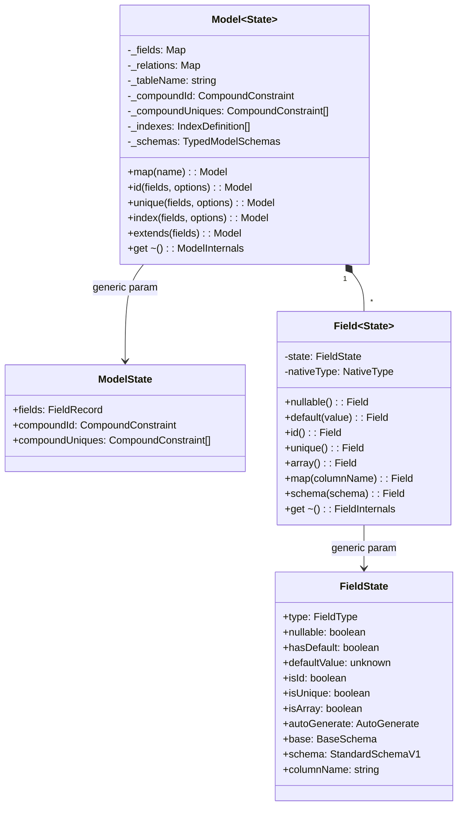
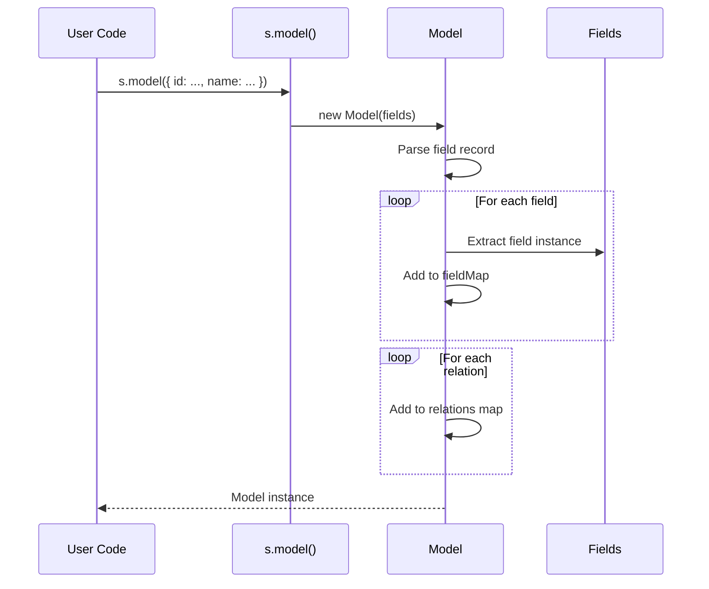
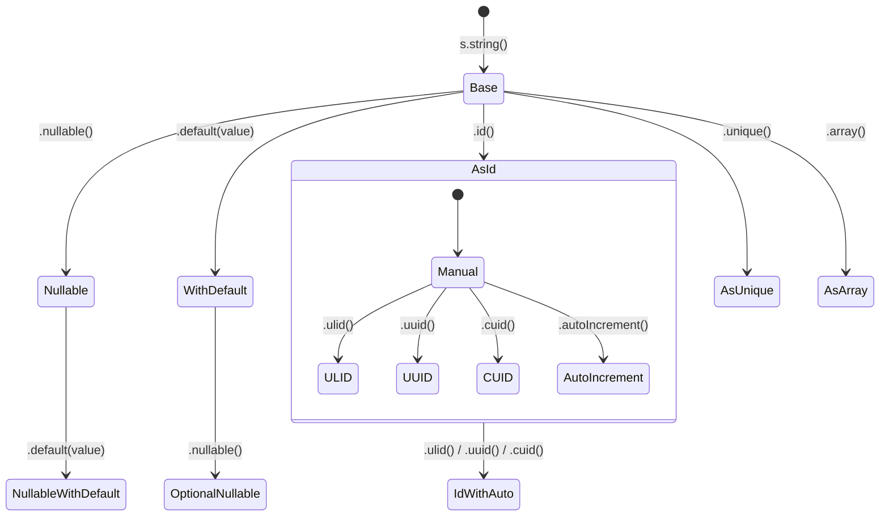
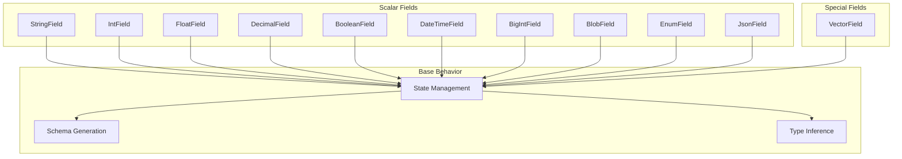
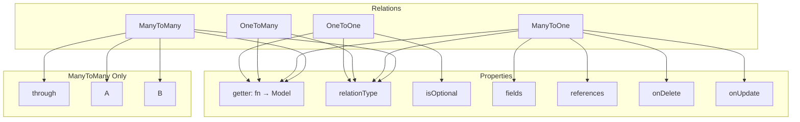
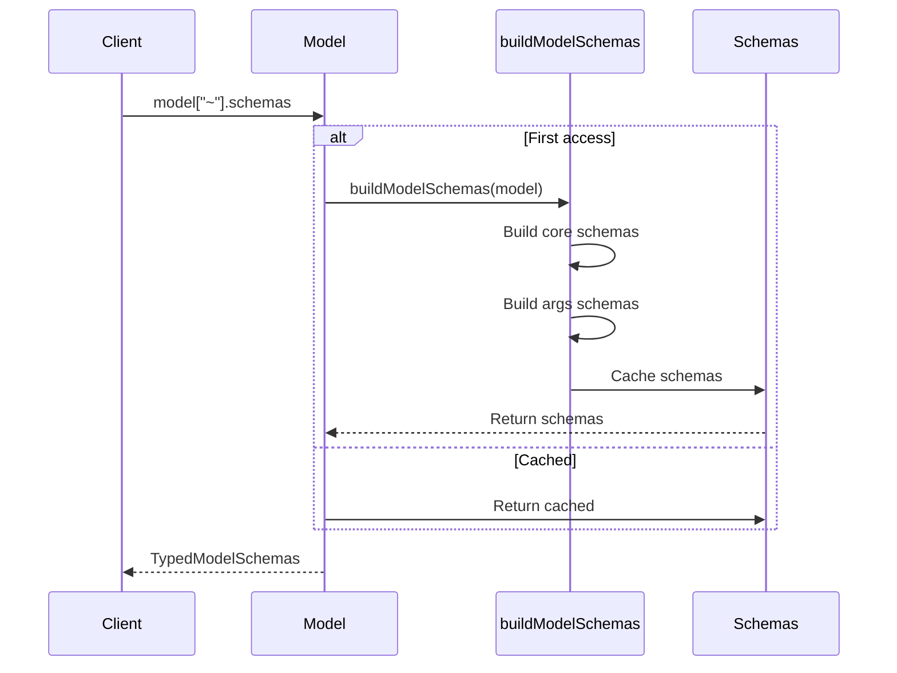

# Schema System

The schema system is the foundation of VibORM. It provides a chainable, type-safe API for defining database models.

## Core Components



## Model Definition

### Basic Model

```typescript
const user = s.model({
  id: s.string().id().ulid(),
  name: s.string(),
  email: s.string().unique(),
  age: s.int().nullable(),
});
```

### What Happens Internally



### Model State Generic

The `Model` class uses a single `State` generic that encapsulates all model metadata:

```typescript
interface ModelState<
  TFields extends FieldRecord = FieldRecord,
  TCompoundId extends CompoundConstraint | undefined = undefined,
  TCompoundUniques extends readonly CompoundConstraint[] = []
> {
  fields: TFields;
  compoundId: TCompoundId;
  compoundUniques: TCompoundUniques;
}

class Model<State extends ModelState = ModelState> {
  // State is used for type inference
}
```

This allows chainable methods to update the state:

```typescript
const user = s.model({ ... })        // Model<{ fields: {...}, compoundId: undefined, compoundUniques: [] }>
  .id(["email", "orgId"])            // Model<{ fields: {...}, compoundId: { fields: [...], name: undefined }, ... }>
  .unique(["name"], { name: "uq" })  // Model<{ fields: {...}, ..., compoundUniques: [{ fields: [...], name: "uq" }] }>
```

## Field System

### Field State Machine

Each field has a state that tracks its configuration:



### Field Types



### Field Schema Generation

Each field generates multiple schemas based on its state. The `base` schema comes directly from `field.state.base`:

```typescript
// StringField with state { nullable: false, hasDefault: false, base: string() }
get schemas() {
  return {
    base: this.state.base,           // Valibot schema: string()
    filter: stringFilter(this.state.base),       // { equals?, contains?, ... } | string
    create: createWithDefault(this.state, this.state.base),       // string (required)
    update: stringUpdate(this.state.base),       // { set?: string } | string
  };
}

// StringField with state { nullable: true, hasDefault: true, base: string() }
get schemas() {
  const nullableBase = nullable(this.state.base);  // Wrap base with nullable()
  return {
    base: nullableBase,              // string | null
    filter: stringNullableFilter(this.state.base),      // { equals?, ... } | string | null
    create: createWithDefault(this.state, nullableBase),  // string | null | undefined
    update: stringNullableUpdate(this.state.base),      // { set?: string | null } | string | null
  };
}
```

The `base` property in `FieldState` stores the core Valibot schema for the field type, which can be modified by `.schema()` to add custom validation or branded types.

## Relation System

### Relation Types



### Relation Class Hierarchy

```typescript
// Base relation with common functionality
abstract class Relation<M, RT, Optional> {
  protected _getter: () => Model<any>;
  protected _relationType: RT;
  protected _isOptional: Optional;
  // ...
}

// To-one relations (oneToOne, manyToOne)
class ToOneRelation<M, RT, Optional> extends Relation<M, RT, Optional> {
  optional(): ToOneRelation<M, RT, true>;
  fields(...fields: string[]): this;
  references(...refs: string[]): this;
  onDelete(action: ReferentialAction): this;
  onUpdate(action: ReferentialAction): this;
}

// OneToMany relation
class OneToManyRelation<M> extends Relation<M, "oneToMany", false> {
  // No optional() - always returns array
}

// ManyToMany relation
class ManyToManyRelation<M> extends Relation<M, "manyToMany", false> {
  through(tableName: string): this;
  A(columnName: string): this;
  B(columnName: string): this;
}
```

## The `~` Property

Every model, field, and relation exposes internal state via the `~` property:

```typescript
// Access model internals
model["~"].fields; // Map<string, Field>
model["~"].relations; // Map<string, Relation>
model["~"].fieldMap; // Same as fields
model["~"].compoundId; // CompoundConstraint | undefined
model["~"].schemas; // TypedModelSchemas (lazy built)

// Access field internals
field["~"].state; // FieldState
field["~"].schemas; // { base, filter, create, update }
field["~"].nativeType; // NativeType | undefined

// Access relation internals
relation["~"].getter; // () => Model
relation["~"].relationType; // "oneToOne" | "oneToMany" | ...
relation["~"].isOptional; // boolean
```

This convention:

1. Keeps public API clean
2. Provides access for internal tools
3. Uses `~` to indicate "internal" (like Rust's `unsafe`)

## Lazy Schema Building

Model schemas are built lazily on first access:



This enables:

1. Circular reference handling (relations between models)
2. Performance (schemas built once per model)
3. Memory efficiency (unused models don't build schemas)
