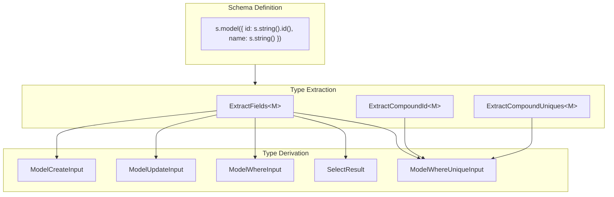
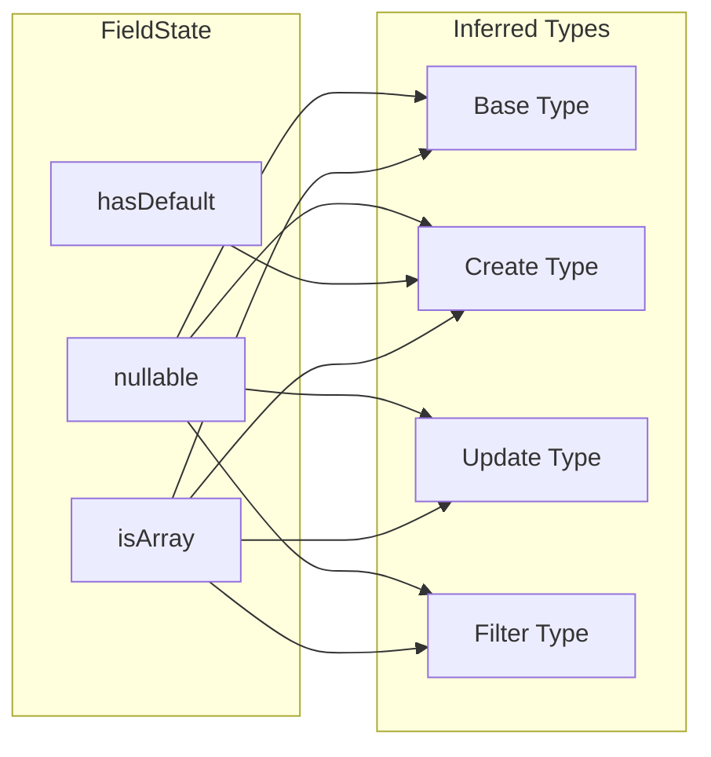
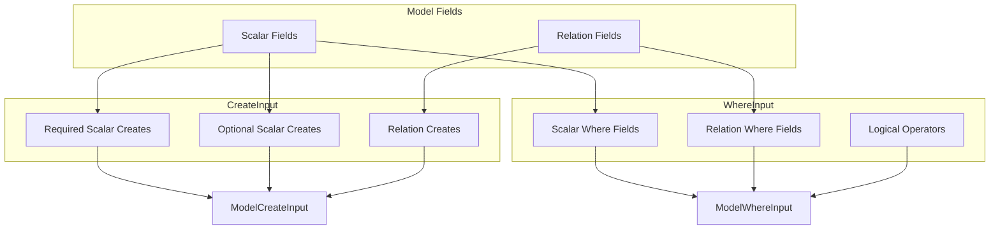

# Type System

VibORM's type system infers all types directly from schema definitions at compile time. No code generation required.

## Type Inference Flow



## Field Type Inference

### State to Type Mapping

Each field's state determines its inferred types:



### Type Derivation Rules

```typescript
// Base type inference
type InferFieldBase<F> = 
  F extends StringField<infer S> 
    ? S["isArray"] extends true 
      ? S["nullable"] extends true ? string[] | null : string[]
      : S["nullable"] extends true ? string | null : string
    : // ... other field types

// Create type inference  
type InferFieldCreate<F> =
  F extends Field<infer S>
    ? S["hasDefault"] extends true
      ? InferFieldBase<F> | undefined  // Optional if has default
      : S["nullable"] extends true
        ? InferFieldBase<F> | undefined  // Optional if nullable
        : InferFieldBase<F>  // Required
    : never;

// Update type inference
type InferFieldUpdate<F> =
  F extends StringField<infer S>
    ? S["nullable"] extends true
      ? { set?: string | null } | string | null
      : { set?: string } | string
    : // ... with operations for numeric types
```

### Complete Field Type Matrix

| Field | State | Base | Create | Update | Filter |
|-------|-------|------|--------|--------|--------|
| `s.string()` | default | `string` | `string` | `{set?} \| string` | `StringFilter` |
| `s.string().nullable()` | nullable | `string \| null` | `string \| null?` | `{set?} \| string \| null` | `StringNullableFilter` |
| `s.string().default("x")` | hasDefault | `string` | `string?` | `{set?} \| string` | `StringFilter` |
| `s.string().array()` | isArray | `string[]` | `string[]` | `{set?, push?, unshift?}` | `StringListFilter` |
| `s.int()` | default | `number` | `number` | `{set?, increment?, ...}` | `IntFilter` |

## Model Type Helpers

### Extraction Helpers

```typescript
// Extract fields from model
type ExtractFields<M extends Model<any>> = 
  M extends Model<infer S> ? S["fields"] : never;

// Extract compound ID
type ExtractCompoundId<M extends Model<any>> = 
  M extends Model<infer S> ? S["compoundId"] : never;

// Extract compound uniques
type ExtractCompoundUniques<M extends Model<any>> = 
  M extends Model<infer S> ? S["compoundUniques"] : never;
```

### Input Type Construction



### ModelCreateInput

```typescript
// Required fields: no default, not nullable, not auto-generated
type RequiredCreateFieldKeys<T extends FieldRecord> = {
  [K in keyof T]: T[K] extends Field<infer S>
    ? S["hasDefault"] extends true ? never
      : S["autoGenerate"] extends undefined
        ? S["nullable"] extends true ? never : K
        : never
    : never;
}[keyof T];

// Optional fields: has default OR nullable OR auto-generated
type OptionalCreateFieldKeys<T extends FieldRecord> = {
  [K in keyof T]: T[K] extends Field<infer S>
    ? S["hasDefault"] extends true ? K
      : S["autoGenerate"] extends undefined
        ? S["nullable"] extends true ? K : never
        : K
    : never;
}[keyof T];

// Combined create input
type ModelCreateInput<T extends FieldRecord> = 
  { [K in RequiredCreateFieldKeys<T>]: InferFieldInput<T[K]> } &
  { [K in OptionalCreateFieldKeys<T>]?: InferFieldInput<T[K]> } &
  { [K in RelationKeys<T>]?: RelationCreateInput<T[K]> };
```

### ModelWhereUniqueInput

```typescript
// Single field unique identifiers
type SingleFieldUniqueInput<T extends FieldRecord> = {
  [K in UniqueFieldKeys<T>]: { [P in K]: InferFieldBase<T[P]> };
}[UniqueFieldKeys<T>];

// Compound key object
type CompoundKeyObject<T extends FieldRecord, Fields extends readonly string[]> = {
  [K in Fields[number]]: InferFieldBase<T[K]>;
};

// Effective key name (custom or generated)
type EffectiveKeyName<C extends CompoundConstraint> =
  C["name"] extends string ? C["name"] : CompoundKeyName<C["fields"]>;

// Full where unique input
type ModelWhereUniqueInputFull<M extends Model<any>> =
  | SingleFieldUniqueInput<ExtractFields<M>>
  | CompoundIdUniqueInput<ExtractFields<M>, ExtractCompoundId<M>>
  | ExtractCompoundUniquesInput<ExtractFields<M>, ExtractCompoundUniques<M>>;
```

## Relation Type Inference

### ToOneWhereInput

```typescript
// Intersection for better autocomplete (not union)
type ToOneWhereInput<T extends FieldRecord, TOptional extends boolean> =
  TOptional extends true
    ? (ModelWhereInput<T> & { is?: ModelWhereInput<T> | null; isNot?: ModelWhereInput<T> | null }) | null
    : ModelWhereInput<T> & { is?: ModelWhereInput<T>; isNot?: ModelWhereInput<T> };
```

Why intersection instead of union?
- Union: TypeScript shows common properties in autocomplete
- Intersection: TypeScript shows ALL properties in autocomplete

### Relation Type Dispatch

```typescript
type RelationWhereInput<R> = 
  [GetRelationType<R>] extends ["oneToOne" | "manyToOne"]
    ? ToOneWhereInput<GetRelationFields<R>, GetRelationOptional<R>>
    : [GetRelationType<R>] extends ["oneToMany" | "manyToMany"]
      ? ToManyWhereInput<GetRelationFields<R>>
      : never;
```

## Result Type Inference

### Select Result

```typescript
type SelectResult<T extends FieldRecord, S> = {
  [K in keyof S as S[K] extends false ? never : K]: 
    K extends keyof T
      ? T[K] extends Relation<any, any, any>
        ? S[K] extends { select: infer NS }
          ? SelectResult<GetRelationFields<T[K]>, NS>  // Nested select
          : S[K] extends { include: infer NI }
            ? IncludeResult<GetRelationFields<T[K]>, NI>  // Nested include
            : RelationResult<T[K]>  // Boolean true
        : InferFieldBase<T[K]>  // Scalar field
      : never;
};
```

### Include Result

```typescript
type IncludeResult<T extends FieldRecord, I> = 
  ModelBaseResult<T> & {
    [K in keyof I as I[K] extends false ? never : K]:
      K extends keyof T
        ? T[K] extends Relation<any, any, any>
          ? I[K] extends { select: infer NS }
            ? SelectResult<GetRelationFields<T[K]>, NS>
            : I[K] extends { include: infer NI }
              ? IncludeResult<GetRelationFields<T[K]>, NI>
              : RelationResult<T[K]>
          : never
        : never;
  };
```

## Type Performance Optimizations

### Simplify Helper

Flattens intersection types for better IDE performance:

```typescript
type Simplify<T> = { [K in keyof T]: T[K] } & {};
```

### Non-Distributive Conditionals

Prevents union distribution for better inference:

```typescript
// Distributive (bad for relations)
type Bad<T> = T extends Relation<infer M> ? M : never;

// Non-distributive (good)
type Good<T> = [T] extends [Relation<infer M>] ? M : never;
```

### Lazy Type Evaluation

Use functions/generics to defer evaluation:

```typescript
// Eager - computed immediately
type Eager = ComplexComputation<DefaultFields>;

// Lazy - computed when needed
type Lazy<T = DefaultFields> = ComplexComputation<T>;
```

## Type System Guarantees

The type system guarantees:

1. **Create inputs have all required fields** - Missing required fields = compile error
2. **Update inputs are all optional** - Any field can be updated independently
3. **Where inputs match field types** - Can't filter string with number
4. **Select/Include match model shape** - Can't select non-existent fields
5. **Results match selection** - Return type reflects what was selected

