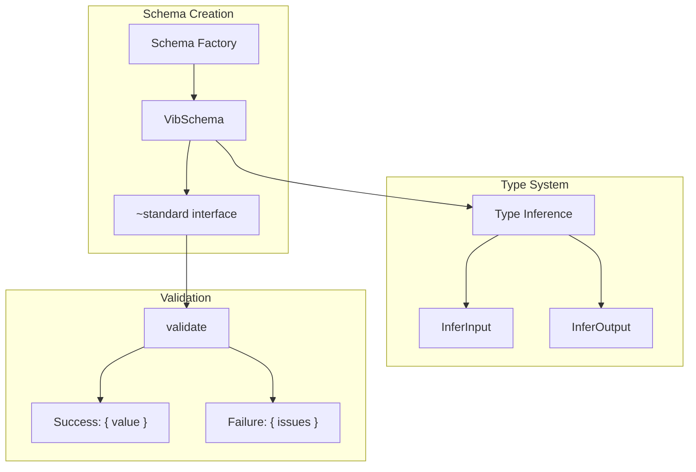

# Validation Library

VibORM includes a custom validation library built specifically for ORM use cases. It replaces Valibot to address critical requirements around recursive types, dynamic schema creation, and edge environment performance.

## Why We Built It

ORMs have unique validation requirements that existing libraries don't fully address. We evaluated the major options:

### Our Core Requirements

**1. Schema types as the single source of truth.** We don't want to maintain a separate generic type system alongside the schema—that's duplicated work and a maintenance burden.

**2. Extremely fast schema instantiation.** This is critical because VibORM creates validation schemas **dynamically at runtime**:

```typescript
// When you call orm.user.findMany({ where: { ... } })
// VibORM dynamically builds validation schemas based on:
// - The model definition (fields, relations)
// - The query constraints (where, select, include)
// - Operation-specific rules (create vs update vs filter)

const whereSchema = buildWhereSchema(userModel);  // Created per query
const selectSchema = buildSelectSchema(userModel);
const argsSchema = buildFindManyArgsSchema(userModel, { whereSchema, selectSchema });

// These schemas parse and validate user input
argsSchema["~standard"].validate(userQuery);
```

Every query triggers schema creation. With Zod's 70-750x slower instantiation, this would be a massive bottleneck. VibORM's schemas create in **microseconds**, not milliseconds.

**3. Lightweight type inference.** Heavy type computation slows down IDE responsiveness. Simple inference patterns, not complex conditional type gymnastics.

**4. Recursive-friendly.** ORM models reference each other; types must handle this elegantly.

### ArkType: Great Recursion, Heavy Types

ArkType has excellent thunk-based recursive type inference:

```typescript
// ArkType's approach - types infer correctly
const user = type({
  name: "string",
  friend: () => user,  // Thunk for circular reference
});

type User = typeof user.infer;
// { name: string; friend: ... } ✓ Works!
```

**The problems**:
1. **Heavy type system** - ArkType's type inference is complex and slow to compile, impacting IDE performance
2. **Eager thunk evaluation** - Thunks are evaluated at schema creation time, not lazily when needed
3. **Slow schema instantiation** - 70x slower than VibORM for object schema creation

### Valibot: Lazy Evaluation, Broken Types

Valibot provides `lazy()` for deferred evaluation:

```typescript
import { lazy, object, string } from "valibot";

const user = object({
  name: string(),
  friend: lazy(() => user),  // Deferred evaluation
});

type User = InferOutput<typeof user>;
// any ✗ Type inference breaks!
```

**The problem**: Valibot's `lazy()` wrapper doesn't preserve type information across circular boundaries, resulting in `any` types. This defeats the purpose of a type-safe ORM.

### Zod: Heavy Everything

```typescript
const user = z.object({
  id: z.string(),
  name: z.string(),
});
```

**The problems**:
1. **Extremely slow schema instantiation** - Zod is 70-750x slower than VibORM at creating schemas. For an ORM that dynamically creates schemas for every model, this overhead is unacceptable.
2. **Heavy compile-time type system** - Complex generic chains slow down TypeScript compilation and IDE responsiveness
3. **Poor recursive handling** - `z.lazy()` breaks type inference similar to Valibot
4. **JIT compilation** - Zod v4 uses `eval`/`new Function` for fast object parsing. We disable this in benchmarks for fair comparison (and because edge environments like Cloudflare Workers forbid it).

<Callout type="info">
  **Note on JIT**: None of the libraries (Valibot, ArkType) use JIT compilation except Zod v4. We benchmark with Zod's JIT disabled (`z.config({ jitless: true })`) for fair comparison across all libraries.
</Callout>

### Our Solution: Lightweight Types, Fast Runtime

We built a validation library optimized for ORM use cases:

| Feature | ArkType | Valibot | Zod | VibORM |
|---------|---------|---------|-----|--------|
| Recursive type inference | ✓ | ✗ | ✗ | ✓ |
| Lazy thunk evaluation | ✗ | ✓ | ✓ | ✓ |
| Lightweight type system | ✗ | ✓ | ✗ | ✓ |
| Fast schema instantiation | ✗ | ✓ | ✗ | ✓ |
| Fail-fast validation | ✗ | ✗ | ✗ | ✓ |

The key innovations:
1. **Minimal type complexity** - Simple inference patterns that don't slow down the compiler
2. **Thunks with lazy evaluation** - Like Valibot's `lazy()`, but with correct type preservation
3. **Identity conditional types** - `R extends infer _ ? _ : never` defers TypeScript evaluation
4. **Unconstrained generics** - No `extends` constraint on entry types allows circular resolution
5. **Inlined fast paths** - Zero overhead for simple schemas without options

## Architecture



### Core Interface

Every schema implements `StandardSchemaV1`:

```typescript
interface VibSchema<TInput, TOutput> {
  readonly type: string;
  readonly "~standard": {
    readonly version: 1;
    readonly vendor: "viborm";
    validate(value: unknown): ValidationResult<TOutput>;
  };
}

type ValidationResult<T> = 
  | { value: T }                    // Success
  | { issues: ValidationIssue[] };  // Failure
```

### Thunk-Based Circular References

The key innovation is using thunks (lazy functions) that TypeScript can resolve:

```typescript
// Thunks defer type resolution
const user = v.object({
  name: v.string(),
  bestFriend: () => user,  // Thunk for circular reference
});

// TypeScript correctly infers:
type User = {
  name: string;
  bestFriend: ...;  // Recursive reference
};
```

This works because:

1. **No constraint on generic parameter** - The `object()` function doesn't constrain `TEntries`, allowing deferred resolution
2. **Identity conditional type** - `R extends infer _ ? _ : never` forces lazy evaluation
3. **Branded types** - The `~standard` interface carries type information

## Performance Optimizations

### Benchmark Results

All libraries tested via `~standard.validate()` interface. Zod JIT disabled for fair comparison.

| Category | Winner | VibORM vs Others |
|----------|--------|------------------|
| **Primitives (5 tests)** | VibORM 🏆 (5/5) | 2-8x faster than Valibot/ArkType |
| **Simple Objects** | ArkType | 2.6x slower (ArkType optimizes for this) |
| **Complex Objects** | ArkType | 7.4x slower (ArkType's strength) |
| **Nullable/Optional** | VibORM 🏆 | 1.4x faster than Valibot |
| **Arrays** | ArkType | 9-22x slower (ArkType's strength) |
| **Unions** | VibORM 🏆 (first match) | 3.6x faster |
| **Error path** | VibORM 🏆 | **112x faster than Zod**, 92x faster than ArkType |
| **Schema creation** | VibORM 🏆 | **83-771x faster than Zod**, 79-105x faster than ArkType |

**Final Score: VibORM 11/16, ArkType 5/16, Zod 0/16, Valibot 0/16**

<Callout type="info">
  **Why VibORM wins for ORMs**: ArkType is fastest for validation, but **79-105x slower** at schema creation. Since VibORM creates schemas dynamically per query, instantiation speed is critical.
</Callout>

### Options vs Wrappers Syntax

VibORM supports two ways to define modifiers:

```typescript
// Options syntax - single object
v.string({ array: true, nullable: true, optional: true })

// Wrapper syntax - nested calls  
v.optional(v.nullable(v.array(v.string())))
```

| Scenario | Winner | Difference |
|----------|--------|------------|
| **Schema Creation** | Options 🏆 | 1.1-3x faster (fewer object allocations) |
| **Validate null/undefined** | Wrappers 🏆 | 2.7-3x faster (early short-circuit) |
| **Validate valid data** | Options 🏆 | 1.1-1.6x faster (less call overhead) |

**Recommendation**: Use **options syntax** for dynamic schemas (ORMs) where creation speed matters. Use **wrappers** when validating lots of null/undefined values.

### Optimization Techniques

#### 1. Inlined Fast Paths

For schemas without options, validation is inlined:

```typescript
// Fast path: no function call overhead
if (options === undefined) {
  return {
    type: "string",
    "~standard": {
      version: 1,
      vendor: "viborm",
      validate(value) {
        return typeof value === "string" 
          ? { value } 
          : STRING_ERROR;
      },
    },
  };
}
```

#### 2. Pre-computed Error Objects

Errors are frozen singletons to avoid allocation:

```typescript
const STRING_ERROR = Object.freeze({ 
  issues: Object.freeze([
    Object.freeze({ message: "Expected string" })
  ]) 
});
```

#### 3. Object Validation Optimization

```typescript
function createObjectValidator(entries, options) {
  // Pre-extract keys once at schema creation
  const keys = Object.keys(entries);
  const keyCount = keys.length;
  
  // Pre-create Set for O(1) unknown key checking
  const keySet = new Set(keys);
  
  // Cache resolved schemas (lazy for circular refs)
  let resolvedSchemas = null;
  
  return (value) => {
    // Indexed iteration (faster than for...in)
    for (let i = 0; i < keyCount; i++) {
      const key = keys[i];
      // ...
    }
  };
}
```

#### 4. Path Construction with concat()

```typescript
// Avoid spread for better performance
const newPath = issue.path
  ? ([key] as PropertyKey[]).concat(issue.path)
  : [key];
```

## Schema Types

### Scalar Schemas

```typescript
import { v } from "viborm";

v.string()              // string
v.number()              // finite number (rejects Infinity)
v.boolean()             // boolean
v.bigint()              // bigint
v.literal("admin")      // exact literal value
v.date()                // Date instance
v.isoTimestamp()        // ISO 8601 timestamp string
v.blob()                // Blob/ArrayBuffer
v.vector(1536)          // number[] with fixed dimensions
v.point()               // { x: number, y: number }
```

### Schema Options

All scalars accept an options object:

```typescript
v.string({
  optional: true,           // Allow undefined
  nullable: true,           // Allow null
  array: true,              // Validate as array
  default: "unknown",       // Default value
  transform: (s) => s.trim(), // Transform output
  schema: customValidator,  // Additional StandardSchema
});
```

### Object Schemas

```typescript
v.object({
  id: v.string(),
  name: v.string(),
  age: v.number({ optional: true }),
}, {
  partial: true,   // All fields optional (default: true)
  strict: true,    // Reject unknown keys (default: true)
  optional: true,  // Object itself can be undefined
  nullable: true,  // Object itself can be null
  array: true,     // Validate as array of objects
});
```

### Wrapper Schemas

```typescript
v.array(v.string())              // string[]
v.nullable(v.string())           // string | null
v.optional(v.string())           // string | undefined
v.union([v.string(), v.number()]) // string | number
v.record(v.string(), v.number()) // Record<string, number>

// Negative wrappers
v.nonNullable(schema)  // Remove null from type
v.nonOptional(schema)  // Remove undefined from type
v.nonArray(schema)     // Extract element type

// Transform wrapper
v.transform(v.string(), (s) => s.toUpperCase())
```

## Integration with ORM

### Model Field Schemas

Each field type exposes validation schemas:

```typescript
// src/schema/fields/string/schemas.ts
export const stringFieldSchemas = {
  base: v.string(),
  filter: v.union([
    v.string(),  // Shorthand: "foo" → { equals: "foo" }
    v.object({
      equals: v.string({ optional: true }),
      in: v.string({ array: true, optional: true }),
      contains: v.string({ optional: true }),
      startsWith: v.string({ optional: true }),
      // ...
    }),
  ]),
  create: v.string(),
  update: v.union([
    v.string(),
    v.object({ set: v.string({ optional: true }) }),
  ]),
};
```

### Model-Level Schema Building

```typescript
// Schemas are built lazily and cached
class Model<State> {
  private _schemas?: ModelSchemas;

  get ["~"]() {
    return {
      get schemas() {
        if (!this._schemas) {
          this._schemas = buildModelSchemas(this);
        }
        return this._schemas;
      },
    };
  }
}
```

### Circular Reference Example

```typescript
const user = s.model("user", {
  id: s.string().id().ulid(),
  name: s.string(),
  posts: s.relation.oneToMany(() => post),
});

const post = s.model("post", {
  id: s.string().id().ulid(),
  title: s.string(),
  author: s.relation.manyToOne(() => user),
});

// Validation schemas handle circular refs with thunks
const userWhereSchema = v.object({
  id: v.string({ optional: true }),
  name: v.string({ optional: true }),
  posts: v.object({
    some: () => postWhereSchema,  // Thunk
    every: () => postWhereSchema,
    none: () => postWhereSchema,
  }, { optional: true }),
});
```

## Type Inference

### Input vs Output Types

```typescript
const schema = v.string({ 
  transform: (s) => s.length 
});

type Input = StandardSchemaV1.InferInput<typeof schema>;
// string

type Output = StandardSchemaV1.InferOutput<typeof schema>;
// number
```

### Recursive Type Display

TypeScript displays recursive types with `...`:

```typescript
type User = {
  name: string;
  age: number;
  bestFriend: ...;  // Recursive reference
  favoritePost: {
    title: string;
    author: ...;    // Back-reference
  };
};
```

## Fail-Fast Validation

The library stops at the first error for optimal performance:

```typescript
const result = schema["~standard"].validate(input);

if (result.issues) {
  // Single issue with path
  console.log(result.issues[0].message);
  console.log(result.issues[0].path); // ["user", "posts", 0, "title"]
}
```

This is **49x faster than Zod** on error paths because:

1. No error collection overhead
2. No path array allocation until needed
3. Early return on first failure

## Edge Environment Compatibility

Unlike Zod v4 (which uses JIT/eval for object parsing), VibORM's validation works in:

- Cloudflare Workers
- Deno Deploy
- AWS Lambda@Edge
- Any environment with CSP restrictions

No configuration needed—it just works.

## API Reference

### Importing

```typescript
import { v } from "viborm";

// Or individual schemas
import { string, number, object } from "viborm/validation";
```

### Type Inference

```typescript
import type { StandardSchemaV1 } from "@standard-schema/spec";

const schema = v.object({ name: v.string() });

type Input = StandardSchemaV1.InferInput<typeof schema>;
type Output = StandardSchemaV1.InferOutput<typeof schema>;
```

### Validation

```typescript
const schema = v.string();
const result = schema["~standard"].validate(input);

if (result.issues) {
  // Handle error
  throw new Error(result.issues[0].message);
}

// Use validated value
const value = result.value;
```

