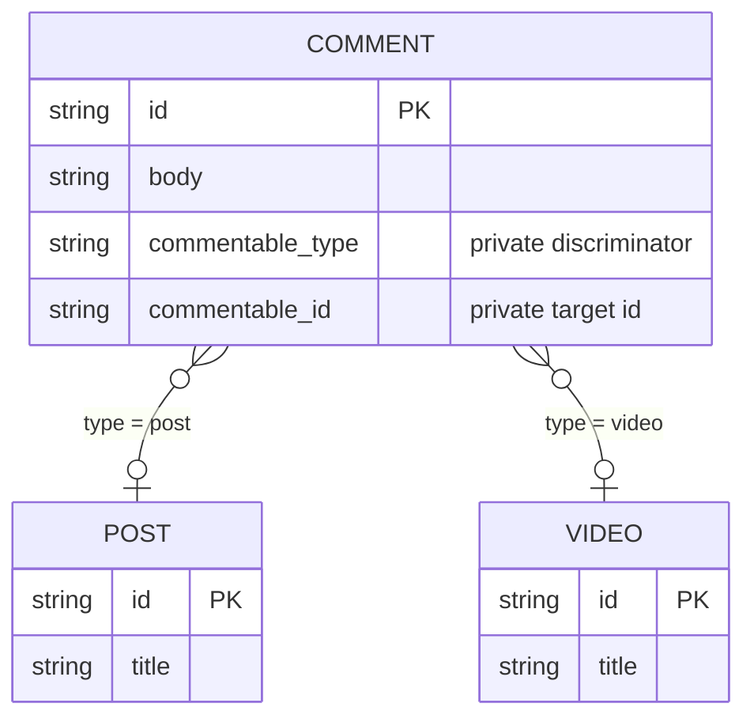

A polymorphic relation lets one field reference one of several independent
models. A comment, for example, can belong to either a post or a video while
exposing one `commentable` field in queries.

> **VibORM implements a polymorphic association, not table inheritance.** The
> owner stores a private `(type, id)` pair. Each target remains an independent
> model and table.

## Choose the relation shape

Use an ordinary relation when a field always references the same model. Use
`s.polymorphic()` when one field must select between heterogeneous models such
as posts and videos, attachments and messages, or audit subjects of several
types.

This differs from the two common
[table-inheritance patterns](https://www.prisma.io/docs/orm/prisma-schema/data-model/table-inheritance):

| Pattern | Storage | Purpose |
|---------|---------|---------|
| Single-table inheritance (STI) | All variants share one table and a discriminator | Represent a hierarchy in one wide table |
| Multi-table inheritance (MTI, or delegated types) | A base table holds shared identity and subtype tables hold variant data | Represent a normalized hierarchy |
| VibORM polymorphic association | The referring row stores a target type and target ID | Reference one of several independent models |

`s.polymorphic()` does not create a base model, shared identity, or inherited
fields. Model STI or MTI explicitly when the variants form a domain hierarchy.

## Define the direct relation

The target map defines the public variant names:

```ts
import { s } from "viborm";

const post = s.model({
  id: s.string().id().ulid(),
  title: s.string(),
  comments: s.oneToMany(() => comment).name("commentable"),
});

const video = s.model({
  id: s.string().id().ulid(),
  title: s.string(),
  duration: s.int(),
  comments: s.oneToMany(() => comment).name("commentable"),
});

const comment = s.model({
  id: s.string().id().ulid(),
  body: s.string(),
  commentable: s
    .polymorphic({
      post: () => post,
      video: () => video,
    })
    .name("commentable")
    .optional(),
});
```

| Declaration | Public meaning |
|-------------|----------------|
| `post` and `video` | Discriminators used in inputs and result narrowing |
| `() => post` and `() => video` | Lazy target getters that allow circular declarations |
| `.name("commentable")` | Pairing label shared with inverse relations |
| `.optional()` | Allows the direct field to be absent |

The direct field is a to-one slot: each `comment` references at most one target,
regardless of which inverse cardinality you declare.

### Customize stored discriminator values

By default, VibORM stores the public keys (`"post"` and `"video"`). The second
argument is optional. Supply it when database values must be namespaced,
versioned, or independent of public API names:

```ts
commentable: s.polymorphic(
  {
    post: () => post,
    video: () => video,
  },
  {
    values: {
      post: "content.post.v1",
      video: "content.video.v1",
    },
  }
)
```

The `values` keys must exactly match the target map. Values are case-sensitive
database identifiers; keep them stable after data exists.

### Required and optional direct fields

A direct polymorphic field is required by default:

```ts
commentable: s.polymorphic({
  post: () => post,
  video: () => video,
})
```

Add `.optional()` when the owner may have no target. This controls whether the
stored membership may be cleared and therefore whether direct `disconnect` is
available.

## Define an inverse relation

An inverse exposes owners from the selected target. It uses an ordinary
`oneToMany` or a fields-less `oneToOne` with the same pairing name as the direct
field.

### One-to-many inverse

Use `oneToMany` when one post or video can own several comments:

```ts
const post = s.model({
  id: s.string().id().ulid(),
  comments: s.oneToMany(() => comment).name("commentable"),
});
```

The public shape is `Comment[]`.

### One-to-one inverse

Use a fields-less `oneToOne` when one exact target may own at most one comment:

```ts
const post = s.model({
  id: s.string().id().ulid(),
  featuredComment: s
    .oneToOne(() => comment)
    .name("commentable")
    .optional(),
});
```

The public shape is `Comment | null`. A fields-bearing `oneToOne` is an
ordinary foreign-key relation, not a polymorphic inverse.

Inverse cardinality applies to the complete direct relation. All inverses that
share one private `(type, id)` pair must consistently use `oneToMany` or
fields-less `oneToOne`; mixing them is invalid. A one-to-one inverse makes the
composite storage index unique for every discriminator, including variants
without a declared inverse.

## Read the direct relation

### Include the selected target

```ts
const comments = await client.comment.findMany({
  include: { commentable: true },
});
```

The result is an exhaustive discriminated union:

```ts
type Commentable =
  | { type: "post"; data: Post }
  | { type: "video"; data: Video }
  | null; // only when commentable is optional
```

Narrow on `type` before using variant-specific fields:

```ts
for (const comment of comments) {
  const target = comment.commentable;
  if (!target) continue;

  if (target.type === "post") {
    console.log(target.data.title);
  } else {
    console.log(target.data.duration);
  }
}
```

### Select a shape for each variant

Each target can have its own `select`, `include`, or `omit`:

```ts
const comments = await client.comment.findMany({
  include: {
    commentable: {
      post: {
        select: { id: true, title: true },
      },
      video: {
        select: { id: true, title: true, duration: true },
      },
    },
  },
});
```

An omitted variant uses that model's default scalar projection, so the result
union remains exhaustive. VibORM compiles the variants into one statement; it
does not query once per owner row.

### Filter by variant and target fields

Every target-specific direct filter selects one `type` first. The selected type
determines the schema accepted by `is` or `isNot`:

```ts
const comments = await client.comment.findMany({
  where: {
    commentable: {
      type: "post",
      is: { title: { contains: "TypeScript" } },
    },
  },
});
```

The accepted shapes are:

```ts
commentable: { type: "post" }
commentable: { type: "post", is: PostWhere }
commentable: { type: "post", isNot: PostWhere }
commentable: null           // optional direct fields only
commentable: { is: null }   // equivalent to bare null
commentable: { isNot: null }
```

The three null-presence forms are available only when the direct relation is
optional. `is: null` checks that both private membership columns are null;
`isNot: null` checks that both are non-null. The latter proves stored
membership, not that the referenced target still exists: projecting a dangling
membership remains an integrity error.

`is` and `isNot` are mutually exclusive. Apart from presence checks, the filter
has no untyped form that searches all target schemas.
`{ type: "post", isNot: ... }` means “the stored variant is `post`, and its
target does not match.” Use root `NOT` when you need the global complement
across every variant.

## Read an inverse relation

### One-to-many inverse

An inverse `oneToMany` uses the ordinary to-many read shape:

```ts
const posts = await client.post.findMany({
  where: {
    comments: {
      some: { body: { contains: "helpful" } },
    },
  },
  select: {
    id: true,
    comments: true,
    _count: { select: { comments: true } },
  },
});
```

`some`, `every`, and `none` operate only on rows whose stored type and identity
both match the current parent.

### One-to-one inverse

An inverse `oneToOne` uses the ordinary to-one read shape and returns an object
or `null`:

```ts
const posts = await client.post.findMany({
  where: {
    featuredComment: {
      is: { body: { contains: "featured" } },
    },
  },
  include: { featuredComment: true },
});
```

The explicit filter forms are:

```ts
featuredComment: { is: CommentWhere }
featuredComment: { isNot: CommentWhere }
featuredComment: null // equivalent to { is: null }
featuredComment: { is: null }
featuredComment: { isNot: null }
```

You can also pass a target `where` object directly as shorthand for `is`:

```ts
featuredComment: { body: { contains: "featured" } }
```

Every inverse include, filter, and count matches the complete membership:

```sql
comment.commentable_id = post.id
AND comment.commentable_type = 'post'
```

A video with the same ID cannot appear in a post relation.

## Write the direct relation

Direct relation inputs contain exactly one operation. The selected variant is
inside that operation's payload.

In the tables below, `TargetWhereUnique` is the selected target model's unique
selector, `TargetWhere` is its normal filter, and `TargetCreate` and
`TargetUpdate` are its ordinary create and update inputs. The corresponding
`Child...` names describe the inverse child model.

### Owner create

| Operation | Payload |
|-----------|---------|
| `connect` | `{ type, where: TargetWhereUnique }` |
| `create` | `{ type, data: TargetCreate }` |
| `connectOrCreate` | `{ type, where: TargetWhereUnique, create: TargetCreate }` |

```ts
await client.comment.create({
  data: {
    body: "Useful",
    commentable: {
      connectOrCreate: {
        type: "post",
        where: { id: "post_123" },
        create: { id: "post_123", title: "Launch" },
      },
    },
  },
});
```

A required direct field must be present on owner creation. An optional field
may be omitted.

### Owner update

| Operation | Payload | Availability |
|-----------|---------|--------------|
| `connect` | `{ type, where: TargetWhereUnique }` | Always |
| `create` | `{ type, data: TargetCreate }` | Always |
| `connectOrCreate` | `{ type, where: TargetWhereUnique, create: TargetCreate }` | Always |
| `update` | `{ type, where?: TargetWhere, data: TargetUpdate }` | Always |
| `upsert` | `{ type, create: TargetCreate, update: TargetUpdate }` | Always |
| `disconnect` | `true` | Optional direct field only |
| `delete` | `{ type }` | Optional direct field only |

```ts
await client.comment.update({
  where: { id: "comment_123" },
  data: {
    commentable: {
      update: {
        type: "post",
        where: { published: true },
        data: { title: "Revised" },
      },
    },
  },
});
```

`update` and `delete` must name the type currently stored by the owner. `upsert`
updates the current target when the requested type matches; otherwise it
creates and binds the requested variant without deleting the previous target
row.

### Root createMany

Root `createMany` rows may use direct `connect`:

```ts
await client.comment.createMany({
  data: [
    {
      body: "Useful",
      commentable: {
        connect: { type: "post", where: { id: "post_123" } },
      },
    },
  ],
});
```

Other relation operations are not accepted in root bulk rows. A model with a
required polymorphic field must therefore provide one `connect` membership per
row.

## Write an inverse one-to-many relation

The parent supplies both the variant and its identity. Child `create` and
`update` data must omit the direct polymorphic field owned by the enclosing
inverse operation.

In the shapes below, `ChildCreate` and `ChildUpdate` are the normal nested
record inputs with that owning relation omitted. `ChildScalarCreate` contains
scalar fields only.

### Parent create

| Operation | Payload |
|-----------|---------|
| `create` | `ChildCreate` or `ChildCreate[]` |
| `createMany` | `{ data: ChildScalarCreate[], skipDuplicates?: boolean }` |
| `connect` | `ChildWhereUnique` or `ChildWhereUnique[]` |
| `connectOrCreate` | `{ where: ChildWhereUnique, create: ChildCreate }` or an array |
| `upsert` | `{ where: ChildWhereUnique, create: ChildCreate, update: ChildUpdate }` or an array |

```ts
await client.post.create({
  data: {
    title: "New post",
    comments: {
      create: [{ body: "First" }, { body: "Second" }],
    },
  },
});
```

### Parent update

Parent update accepts `create`, `createMany`, `connect`, and
`connectOrCreate` from parent create. It also accepts:

| Operation | Payload | Availability |
|-----------|---------|--------------|
| `update` | `{ where: ChildWhereUniqueExtended, data: ChildUpdate }` or an array | Always |
| `updateMany` | `{ where?: ChildWhere, data: ChildUpdate }` or an array | Always |
| `delete` | `ChildWhereUniqueExtended` or an array | Always |
| `deleteMany` | `ChildWhere` or an array | Always |
| `upsert` | `{ where: ChildWhereUniqueExtended, create: ChildCreate, update: ChildUpdate }` or an array | Always |
| `disconnect` | `ChildWhereUnique` or an array | Optional direct field only |
| `set` | `ChildWhereUnique` or `ChildWhereUnique[]` | Always; required membership must retain every current exact member |

```ts
await client.post.update({
  where: { id: "post_123" },
  data: {
    comments: {
      connect: { id: "comment_1" },
      update: {
        where: { id: "comment_2" },
        data: { body: "Revised" },
      },
      createMany: {
        data: [{ body: "One" }, { body: "Two" }],
        skipDuplicates: true,
      },
    },
  },
});
```

`connect` locates and adopts a child globally. `connectOrCreate` does the same
or creates a child; duplicate inputs use first-create-wins semantics. An
`upsert` below a new parent also locates globally. Below an existing parent,
its found row must already belong to that exact parent membership.

`disconnect` preserves the child and therefore exists only when its direct
polymorphic membership can be cleared. It clears both private columns
atomically.

`set` is available for optional and required child membership. Optional
membership clears both private columns on departing rows. Required membership
uses a departing-member guard: every current exact member must be retained, so
`set: []` succeeds only when the relation is already empty. Rows with the same
identity and another discriminator are not members of this relation and remain
untouched.

Nested inverse `createMany` applies the enclosing `(type, identity)` pair to
every scalar row. It is unavailable if another required polymorphic relation on
the child would remain unsatisfied.

An executable `updateMany.data` must contain scalar updates. Its input remains
broad because top-level upsert defers update-arm legality until that arm is
selected. A selected relation-bearing `updateMany` fails before SQL; use
targeted `update` for nested relation work.

## Write an inverse one-to-one relation

The singular inverse uses ordinary to-one payloads. It does not accept plural
operations. Its `ChildCreate` and `ChildUpdate` data omit the direct
polymorphic key owned by the enclosing inverse, so callers cannot spell the
same membership twice.

### Parent create

| Operation | Payload |
|-----------|---------|
| `create` | `ChildCreate` |
| `connect` | `ChildWhereUnique` |
| `connectOrCreate` | `{ where: ChildWhereUnique, create: ChildCreate }` |

### Parent update

| Operation | Payload | Availability |
|-----------|---------|--------------|
| `create` | `ChildCreate` | Always |
| `connect` | `ChildWhereUnique` | Always |
| `connectOrCreate` | `{ where, create }` | Always |
| `update` | `ChildUpdate` or `{ where?: ChildWhere, data: ChildUpdate }` | Always |
| `upsert` | `{ create: ChildCreate, update: ChildUpdate }` | Always |
| `delete` | `true` | Always |
| `disconnect` | `true` | Optional direct field only |

```ts
await client.post.update({
  where: { id: "post_123" },
  data: {
    featuredComment: {
      upsert: {
        create: { body: "First" },
        update: { body: "Revised" },
      },
    },
  },
});
```

`createMany`, `updateMany`, `deleteMany`, and `set` are not part of the singular
surface. Connecting into an occupied one-to-one slot fails with a unique
constraint error and does not leave partial effects.

An update normally contains one active operation. It may also replace the
current child in one payload with `disconnect` plus `connectOrCreate`,
`connect`, or `create`, or with `delete` plus `connect` or `create`. The vacate
runs first. `disconnect` pairs are available only when the direct membership is
optional. Other operation combinations are rejected before compilation.

The inverse slot itself is always optional because it stores no foreign key:
there may be no child row. Deleting the current child is therefore always
valid. Disconnecting preserves that child, so it is available only when the
child's direct polymorphic membership is optional and both private columns can
be cleared.

## Storage and integrity

VibORM generates two private columns on the owner table:

```sql
commentable_type TEXT         -- "post" or "video" by default
commentable_id   <target PK>  -- identity in the selected target table
INDEX (commentable_type, commentable_id)
```

For an inverse `oneToOne`, the composite index is unique. Equal IDs remain
legal under different discriminators.

The private columns are migration storage. They do not appear as public model
scalars, create fields, selections, or result properties.



A relational database cannot create one foreign key whose target table depends
on another column. VibORM therefore checks targets in the query engine and
always reads and writes the type and identity as one membership.

| Stored state | Optional direct field | Required direct field |
|--------------|-----------------------|-----------------------|
| Both columns null | Returns `null` | Integrity error |
| Known type and existing target | Returns `{ type, data }` | Returns `{ type, data }` |
| Known type and missing target | Query-engine integrity error | Query-engine integrity error |
| Unknown type or one null column | Provider-result integrity error | Provider-result integrity error |

There is no database foreign key or configurable orphan policy. Delete target
rows with care and keep related cleanup in the same application transaction
when possible. Optionality permits genuinely empty storage; it never turns a
non-empty membership with a missing target into `null`.

## Constraints

- **Target identity:** every target needs one scalar primary key. All targets
  must use the same portable `string`, `int`, or `bigint` representation.
  Compound IDs, array IDs, mixed scalar kinds, and database-native type
  overrides are not supported.
- **Topology:** polymorphic many-to-many is not supported. The same model cannot
  appear more than once in one target map when an inverse would be ambiguous.
  Inverse cardinality must be consistent across the relation.
- **Cross-target queries:** `orderBy` and explicit `_count` cannot traverse a
  direct polymorphic relation. Target-specific direct filters must select one
  `type`; optional presence filters are type-free.
- **Root bulk create:** `createMany` rows accept scalar fields and direct
  `connect` memberships only. On a driver without `RETURNING`, combining
  `select`, `skipDuplicates`, and a polymorphic membership is not supported.
- **Referential actions:** the database cannot enforce a cross-table foreign
  key. VibORM does not emulate cascade, restrict, or set-null when a target is
  changed or deleted.

Unsupported schemas and mutation shapes are rejected before SQL execution.

## Schema evolution

Stored discriminator values are database identifiers:

- add a new target with a new unique stored value;
- do not reuse an old value for a different model;
- migrate existing rows before changing a stored value;
- keep values within 191 portable indexed characters using letters, numbers,
  `.`, `_`, `:`, or `-`.

The public target key shapes TypeScript inputs and results. The stored value
protects database history, so the two may evolve independently.

Changing inverse cardinality recreates the same composite index as unique or
non-unique. Before changing from `oneToMany` to `oneToOne`, remove duplicate
`(type, id)` pairs. VibORM does not choose which duplicate row to keep.
