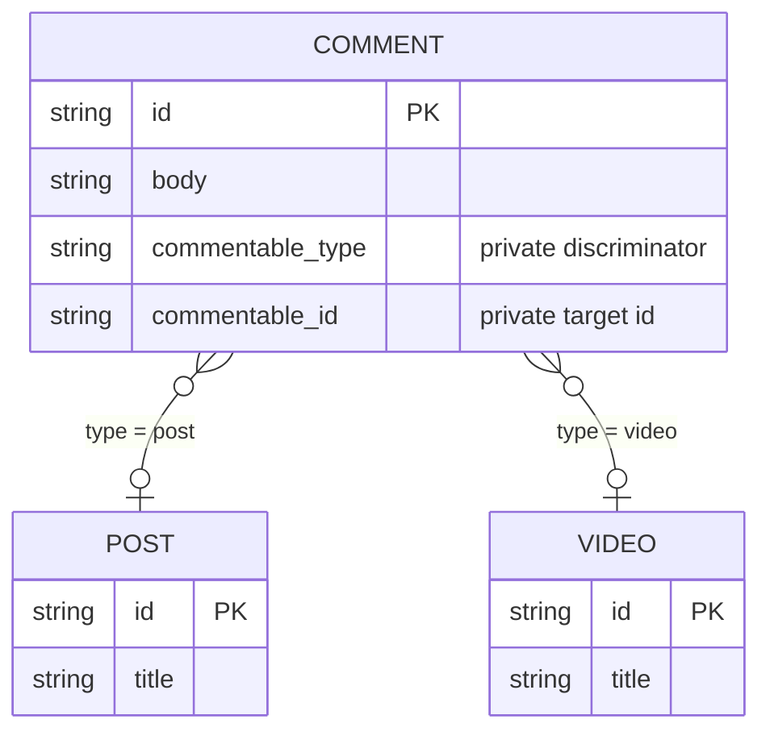

A polymorphic relation lets one field reference several independent models. A
comment, for example, can belong to either a post or a video while exposing one
`commentable` field in queries; a shelf can hold books and videos side by side in
one `items` collection.

> **VibORM implements a polymorphic association, not table inheritance.** Each
> target remains an independent model and table.

## Choose the relation shape

Use an ordinary relation when a field always references the same model. Use a
polymorphic relation when one field must select between heterogeneous models
such as posts and videos, attachments and messages, or audit subjects of several
types.

**Polymorphism is a property of the targets, not of the arity.** There is no
separate polymorphic factory: you call the same `s.toOne` / `s.toMany` as any
other relation and hand it a **map of named variants** instead of one getter.
The factory states how many memberships the slot holds; the argument states
which models it may address:

| Declaration | Slot holds | Membership stored in |
|---------|-----------|----------------------|
| `s.toOne(map, options?)` | at most one membership | a private `(type, id)` pair on the owner row |
| `s.toMany(map, options?)` | a collection of memberships, each free to use a different variant | one member junction table per variant |

Both are first-class: both read, filter, count, write, and migrate. Nothing in
the feature is to-one by nature.

This differs from the two common
[table-inheritance patterns](https://www.prisma.io/docs/orm/prisma-schema/data-model/table-inheritance):

| Pattern | Storage | Purpose |
|---------|---------|---------|
| Single-table inheritance (STI) | All variants share one table and a discriminator | Represent a hierarchy in one wide table |
| Multi-table inheritance (MTI, or delegated types) | A base table holds shared identity and subtype tables hold variant data | Represent a normalized hierarchy |
| VibORM polymorphic association | The membership names a target type and a target identity | Reference one of several independent models |

Neither factory creates a base model, shared identity, or inherited fields.
Model STI or MTI explicitly when the variants form a domain hierarchy.

## Define the direct relation

The target map defines the public variant names:

```ts
import { s } from "viborm";

const post = s.model({
  id: s.string().id().ulid(),
  title: s.string(),
  comments: s.toMany(() => comment).name("commentable"),
});

const video = s.model({
  id: s.string().id().ulid(),
  title: s.string(),
  duration: s.int(),
  comments: s.toMany(() => comment).name("commentable"),
});

const comment = s.model({
  id: s.string().id().ulid(),
  body: s.string(),
  commentable: s
    .toOne({
      post: () => post,
      video: () => video,
    })
    .name("commentable")
    .optional(),
});
```

| Declaration | Public meaning |
|-------------|----------------|
| `post` and `video` | Discriminators used in inputs and result narrowing |
| `() => post` and `() => video` | Lazy target getters that allow circular declarations |
| `s.toOne({ ... })` | The slot holds at most one membership |
| `.name("commentable")` | Pairing label shared with inverse relations |
| `.optional()` | Allows the direct field to be absent |

The factory you call IS the cardinality: `s.toOne` makes the field a singular
slot, so each `comment` references at most one target — independently of which
inverse cardinality you declare — and `s.toMany` makes it a collection. The
variant form needs a MAP of named targets, with at least one literal key; a
single target model is an ordinary relation, so pass `() => model` for that and
keep the map form for genuine variants.

### Collection slots

`s.toMany({ ... })` declares a slot that holds several memberships, each of
which may use a different variant. VibORM creates **one junction table per
variant**, named `<owner_table>_<relation>_<variant>` by default, with a
composite primary key over both sides, a reverse index, and cascading foreign
keys on both sides.

```ts
const shelf = s.model({
  id: s.string().id(),
  items: s.toMany({ book: () => book, video: () => video }),
});
// migrates to: shelf_items_book, shelf_items_video
```

A collection slot reads, writes, filters, counts, and orders through the same
client as any other relation. The sections below cover each surface.

Each variant's membership is independent, so each gets its own cardinality from
its inverse: declare a storage-less `s.toOne` back to the owner and that variant
is **singular** (one shelf per book — enforced by a unique constraint over the
complete target side of that member table). Declare an `s.toMany` and it is
**plural**, the shareable default that also applies to a variant with no declared
inverse.

A singular inverse needs nothing extra to be emptiable: its membership is one
member-junction row, and deleting that row clears it whatever the inverse
cardinality says. `disconnect` is always offered.

`.through()` names the member junctions explicitly. Unlike an ordinary
many-to-many's `.through()/.source()/.target()` triple, it takes one **exact map
keyed by public variant** — every variant present, no extra key, at both the type
level and at construction time:

```ts
items: s
  .toMany({ book: () => book, video: () => video })
  .through({
    book: { table: "shelf_books", source: "holder", target: "entry" },
    video: { table: "shelf_videos", source: "holder", target: "entry" },
  })
```

`source` and `target` are the owner-side and variant-side naming tokens, exactly
as they are on an ordinary junction. For a one-field row key the token IS the
column name; for a compound row key it expands positionally (`holder_1`,
`holder_2`, …) in that model's row-key order.

Without `.through()`, the table is `<owner_table>_<relation>_<variant>`, where
`<owner_table>` is the owner's mapped SQL table name. The owner token is derived
from the **owner schema key** (`<lowercasedOwnerSchemaKey>Id`, or that
lowercased key as the prefix for a compound key). The variant token is derived from the **public
variant name** rather than the target model's name, which keeps two variants
pointing at the same model, and self-targets, naturally distinct. An exact
`.through({ ... })` entry pins all three physical names: `table`, `source`, and
`target`.

### Customize stored discriminator values

By default, VibORM stores the public keys (`"post"` and `"video"`). The second
argument is optional. Supply it when database values must be namespaced,
versioned, or independent of public API names:

```ts
commentable: s.toOne(
  {
    post: () => post,
    video: () => video,
  },
  {
    values: {
      post: "content.post.v1",
      video: "content.video.v1",
    },
  }
)
```

The `values` keys must exactly match the target map. Values are case-sensitive
database identifiers; keep them stable after data exists.

### Required and optional direct fields

A variant `s.toOne()` field is required by default:

```ts
commentable: s.toOne({
  post: () => post,
  video: () => video,
})
```

Add `.optional()` when the owner may have no target. This controls whether the
stored membership may be cleared and therefore whether direct `disconnect` is
available. It is the one place `.optional()` still exists on a relation, because
it IS the nullability of those two private columns — an ordinary relation reads
its optionality from the foreign-key scalars instead, and a collection slot is
already empty when it holds nothing.

## Define an inverse relation

An inverse exposes owners from the selected target. Which shapes are admitted
depends on where the membership is stored, so it depends on the direct slot's
cardinality:

| Direct slot | Membership storage | Inverse slot |
|-------------|--------------------|-------------------------|
| `s.toOne({ ... })` | the owner's private `(type, id)` pair | `s.toMany` (plural), `s.toOne` (singular) |
| `s.toMany({ ... })` | that variant's member junction | `s.toMany` (plural), `s.toOne` (singular) |

An inverse is an ordinary declaration: the same two factories, one model target,
and **no `.fields(...)`** — the membership is already stored by the carrier, so
the inverse owns no foreign key of its own. Every inverse uses the same pairing
name as the direct field; a slot whose `.name(...)` matches no variant of the
carrier is not an inverse of it. The two subsections below cover the row-held
carrier; [collection inverses](#define-a-collection-inverse) follow the
collection's own sections.

### One-to-many inverse

Use `s.toMany` when one post or video can own several comments:

```ts
const post = s.model({
  id: s.string().id().ulid(),
  comments: s.toMany(() => comment).name("commentable"),
});
```

The public shape is `Comment[]`.

### One-to-one inverse

Use a storage-less `s.toOne` when one exact target may own at most one comment:

```ts
const post = s.model({
  id: s.string().id().ulid(),
  featuredComment: s
    .toOne(() => comment)
    .name("commentable"),
});
```

The public shape is `Comment | null` — a non-owning singular slot is always
nullable, so nothing declares that twice. A `toOne` that DOES declare
`.fields(...)` is an ordinary foreign-key relation, not a polymorphic inverse.

Inverse cardinality applies to the complete direct relation. All inverses that
share one private `(type, id)` pair must consistently be collections or
consistently be singular; mixing them is rejected with `P012`, because one
composite index serves the whole carrier. A singular inverse makes that index
unique for every discriminator, including variants without a declared inverse.

## Define a collection inverse

A collection stores each variant's memberships in its own member junction, so
inverse cardinality is **per variant**, not relation-wide. Declare it on the
target model with the same pairing name as the collection.

A storage-less `s.toOne` makes that variant **singular**: at most one owner may
hold a given target, enforced by a unique constraint over the complete target
side of that member table.

```ts
const book = s.model({
  id: s.string().id(),
  title: s.string(),
  shelf: s
    .toOne(() => shelf)
    .name("items"),
});
```

The public shape is `Shelf | null`. Nothing else is declared: a non-owning
singular slot is derived nullable, and its membership is one junction row, so
`disconnect` and `delete` are both available.

An `s.toMany` makes that variant **plural** — the shareable default, and also
what an undeclared variant gets:

```ts
const video = s.model({
  id: s.string().id(),
  title: s.string(),
  shelves: s.toMany(() => shelf).name("items"),
});
```

The public shape is `Shelf[]`. A plural inverse is the same member junction read
in reverse orientation, so it takes the ordinary many-to-many read, filter,
count, order and write surface unchanged — it declares no storage of its own and
emits no junction table. Two slots on the target claiming the same variant are
ambiguous and rejected as `R009`; a slot claiming a name no variant answers is
rejected as `R010`.

## Read the direct relation

This section describes a row-held variant `s.toOne` slot. A collection has its own
read grammar — see [Read a collection slot](#read-a-collection-slot).

### Include the selected target

```ts
const comments = await client.comment.findMany({
  include: { commentable: true },
});
```

The result is an exhaustive discriminated union:

```ts
type Commentable =
  | { type: "post"; data: Post }
  | { type: "video"; data: Video }
  | null; // only when commentable is optional
```

Narrow on `type` before using variant-specific fields:

```ts
for (const comment of comments) {
  const target = comment.commentable;
  if (!target) continue;

  if (target.type === "post") {
    console.log(target.data.title);
  } else {
    console.log(target.data.duration);
  }
}
```

### Select a shape for each variant

Each target can have its own `select`, `include`, or `omit`:

```ts
const comments = await client.comment.findMany({
  include: {
    commentable: {
      post: {
        select: { id: true, title: true },
      },
      video: {
        select: { id: true, title: true, duration: true },
      },
    },
  },
});
```

An omitted variant uses that model's default scalar projection, so the result
union remains exhaustive. VibORM compiles the variants into one statement; it
does not query once per owner row.

### Filter by variant and target fields

Every target-specific direct filter selects one `type` first. The selected type
determines the schema accepted by `is` or `isNot`:

```ts
const comments = await client.comment.findMany({
  where: {
    commentable: {
      type: "post",
      is: { title: { contains: "TypeScript" } },
    },
  },
});
```

The accepted shapes are:

```ts
commentable: { type: "post" }
commentable: { type: "post", is: PostWhere }
commentable: { type: "post", isNot: PostWhere }
commentable: null           // optional direct fields only
commentable: { is: null }   // equivalent to bare null
commentable: { isNot: null }
```

The three null-presence forms are available only when the direct relation is
optional. `is: null` checks that both private membership columns are null;
`isNot: null` checks that both are non-null. The latter proves stored
membership, not that the referenced target still exists: projecting a dangling
membership remains an integrity error.

`is` and `isNot` are mutually exclusive. Apart from presence checks, the filter
has no untyped form that searches all target schemas.
`{ type: "post", isNot: ... }` means “the stored variant is `post`, and its
target does not match.” Use root `NOT` when you need the global complement
across every variant.

## Read a collection slot

### The result is always an array

```ts
const shelves = await client.shelf.findMany({
  include: { items: true },
});
```

```ts
type Item =
  | { type: "book"; data: Book }
  | { type: "video"; data: Video };
// shelves[0].items: readonly Item[]
```

A collection is **never** `null`. An empty collection is a fresh empty array, so
emptiness has exactly one reading — which is also why `.optional()` does not
exist on a collection carrier. Elements arrive grouped in **target-map
declaration order**: every `book` member, then every `video` member.

Two target tables may hold rows with equal identities. They are different
memberships and come back as two correctly tagged elements.

### The `only` / `variants` envelope

`items: true` reads every configured variant at its default scalar projection,
and `items: false` emits no key and no relation SQL at all. Anything finer is
one envelope with exactly two keys:

```ts
const shelves = await client.shelf.findMany({
  include: {
    items: {
      only: ["book"],
      variants: {
        book: {
          select: { id: true, title: true },
          where: { pages: { gt: 100 } },
          orderBy: { title: "asc" },
          take: 5,
        },
      },
    },
  },
});
```

`only` is an exact allow-list over the public variant names. It narrows the
result union — with `only: ["book"]` the element type has no `video` arm — and
it also narrows the SQL: no member table outside the list is read. Duplicates
are rejected, and the list is canonicalized into declaration order, so
`["video", "book"]` and `["book", "video"]` are one query and one cache entry.
`only: []` is legal and returns a fresh empty array.

`variants` configures one arm per public variant. Naming a variant that `only`
excludes is a contradiction and is rejected by name, not as an unknown key.
There is deliberately no `false` arm: "do not read this variant" is spelled by
leaving it out of `only`.

Each arm takes `true`, or an ordinary to-many relation node:

| Arm key | Meaning |
|---------|---------|
| `select` / `include` | Mutually exclusive, as everywhere else |
| `omit` | Subtracts from that variant's projection |
| `where` | That variant's own filter |
| `orderBy`, `take`, `skip`, `cursor`, `distinct` | Ordinary list controls |

Every one of those is **arm-local**. Ordering, windowing and distinct apply
inside one variant; they never reorder or truncate across variants, and a
negative `take` restores the logical order within its own arm exactly as it does
on an ordinary relation. An omitted arm uses that model's default scalar
projection, so the result union stays exhaustive over whatever `only` admits.

The envelope is identical in `select` and `include` position; the two differ
only in whether the owner's own scalars come along.

### Filter parents by their members

A collection accepts `some`, `every`, and `none`. There is no null-presence arm —
an empty collection is the empty array, not `null` — and every quantifier is
**tagged**, taking the same `{ type }` / `{ type, is }` / `{ type, isNot }`
predicate the to-one filter takes:

```ts
const shelves = await client.shelf.findMany({
  where: {
    items: { some: { type: "book", is: { title: { contains: "SQL" } } } },
  },
});
```

The tag is part of the question, so read the three carefully:

| Filter | True when |
|--------|-----------|
| `some: { type: "book", is: P }` | at least one `book` member satisfies `P` |
| `every: { type: "book", is: P }` | every member is a `book` **and** satisfies `P` — a member of another variant makes it false |
| `none: { type: "book", is: P }` | no `book` member satisfies `P` |

`every` and `none` are vacuously true on an empty collection; `some` is false.
"Every book satisfies `P`, other variants allowed" is therefore spelled
`none: { type: "book", isNot: P }`.

### Count and order by count

```ts
const shelves = await client.shelf.findMany({
  select: {
    id: true,
    _count: { select: { items: true } },
  },
  orderBy: { items: { _count: "desc" } },
});
```

`items: true` counts every member of every configured variant — one correlated
count per member table, summed in declaration order. The filtered form takes the
same tagged predicate the quantifiers take, so "count the books matching `P`"
and "some book matches `P`" are two readings of one grammar:

```ts
_count: {
  select: {
    items: { where: { type: "book", is: { pages: { gt: 100 } } } },
  },
}
```

`orderBy: { items: { _count: "asc" | "desc" } }` is the only ordering a
collection offers, and it lowers through the same summed-count expression.
Ordering a parent by a *member column* is not offered: which table a column
lives in is decided per row by the discriminator. A to-one slot has no
collection to count, so `_count` and `orderBy` on one are refused by name rather
than reported as an unknown key.

### Integrity

A membership row whose target no longer exists fails the read with a
`QueryEngineError` naming the relation and variant. `only` cannot hide it: even
`only: []` still computes every arm's integrity facts, so an orphan under an
excluded variant still fails. Member junctions carry real foreign keys with
cascade on both sides, so reaching that state requires a disabled constraint or
a hostile raw write.

## Read an inverse relation

This section describes the inverse of a row-held variant `s.toOne` slot. A
collection inverse is an ordinary relation in reverse orientation — a plural
`s.toMany` reads like any other many-to-many, and a singular `s.toOne` returns
one record or `null` — so it needs no special read grammar.

### One-to-many inverse

A plural inverse (`s.toMany`) uses the ordinary to-many read shape:

```ts
const posts = await client.post.findMany({
  where: {
    comments: {
      some: { body: { contains: "helpful" } },
    },
  },
  select: {
    id: true,
    comments: true,
    _count: { select: { comments: true } },
  },
});
```

`some`, `every`, and `none` operate only on rows whose stored type and identity
both match the current parent.

### One-to-one inverse

A singular inverse (`s.toOne`) uses the ordinary to-one read shape and returns an
object or `null`:

```ts
const posts = await client.post.findMany({
  where: {
    featuredComment: {
      is: { body: { contains: "featured" } },
    },
  },
  include: { featuredComment: true },
});
```

The explicit filter forms are:

```ts
featuredComment: { is: CommentWhere }
featuredComment: { isNot: CommentWhere }
featuredComment: null // equivalent to { is: null }
featuredComment: { is: null }
featuredComment: { isNot: null }
```

You can also pass a target `where` object directly as shorthand for `is`:

```ts
featuredComment: { body: { contains: "featured" } }
```

Every inverse include, filter, and count matches the complete membership:

```sql
comment.commentable_id = post.id
AND comment.commentable_type = 'post'
```

A video with the same ID cannot appear in a post relation.

## Write the direct relation

This section describes a row-held variant `s.toOne` slot. A collection has its own
write grammar — see [Write a collection slot](#write-a-collection-slot).

Direct relation inputs contain exactly one operation. The selected variant is
inside that operation's payload.

In the tables below, `TargetWhereUnique` is the selected target model's unique
selector, `TargetWhere` is its normal filter, and `TargetCreate` and
`TargetUpdate` are its ordinary create and update inputs. The corresponding
`Child...` names describe the inverse child model.

### Owner create

| Operation | Payload |
|-----------|---------|
| `connect` | `{ type, where: TargetWhereUnique }` |
| `create` | `{ type, data: TargetCreate }` |
| `connectOrCreate` | `{ type, where: TargetWhereUnique, create: TargetCreate }` |

```ts
await client.comment.create({
  data: {
    body: "Useful",
    commentable: {
      connectOrCreate: {
        type: "post",
        where: { id: "post_123" },
        create: { id: "post_123", title: "Launch" },
      },
    },
  },
});
```

A required direct field must be present on owner creation. An optional field
may be omitted.

### Owner update

| Operation | Payload | Availability |
|-----------|---------|--------------|
| `connect` | `{ type, where: TargetWhereUnique }` | Always |
| `create` | `{ type, data: TargetCreate }` | Always |
| `connectOrCreate` | `{ type, where: TargetWhereUnique, create: TargetCreate }` | Always |
| `update` | `{ type, where?: TargetWhere, data: TargetUpdate }` | Always |
| `upsert` | `{ type, create: TargetCreate, update: TargetUpdate }` | Always |
| `disconnect` | `true` | Optional direct field only |
| `delete` | `{ type }` | Optional direct field only |

```ts
await client.comment.update({
  where: { id: "comment_123" },
  data: {
    commentable: {
      update: {
        type: "post",
        where: { title: { contains: "Launch" } },
        data: { title: "Revised" },
      },
    },
  },
});
```

`update` and `delete` must name the type currently stored by the owner. `upsert`
updates the current target when the requested type matches; otherwise it
creates and binds the requested variant without deleting the previous target
row.

### Root createMany

Root `createMany` rows may use direct `connect`:

```ts
await client.comment.createMany({
  data: [
    {
      body: "Useful",
      commentable: {
        connect: { type: "post", where: { id: "post_123" } },
      },
    },
  ],
});
```

Other relation operations are not accepted in root bulk rows for a **to-one**
slot. A model with a required polymorphic to-one field must therefore provide
one `connect` membership per row. A collection slot is not restricted this way —
see [Root createMany](#root-createmany-with-a-collection) below.

## Write a collection slot

Unlike a to-one slot, a collection's input is a **keyed bag**: several verbs may
appear together, and an empty bag is inert rather than malformed. Every verb
takes one tagged item or an array of them, and each item carries its own `type`
literal, which is what correlates the discriminator with the payload:

```ts
await client.shelf.update({
  where: { id: "shelf_1" },
  data: {
    items: {
      connect: [{ type: "book", where: { id: "book_1" } }],
      create: { type: "video", data: { title: "Reel" } },
      disconnect: [{ type: "video", where: { id: "video_9" } }],
    },
  },
});
```

Because the discriminator sits inside each item, `where`, `data`, `create` and
`update` beside it are that variant's own schemas: naming a `book` field under
`type: "video"` is a type error, not a runtime surprise.

In the tables below, `TargetWhereUnique`, `TargetWhere`, `TargetCreate` and
`TargetUpdate` are the named variant's ordinary inputs, and
`TargetWhereUniqueExtended` is its extended unique selector — a unique key plus
optional non-unique filters, the same shape a targeted write on an ordinary
to-many relation addresses its member with.

### Verbs by context

A **fresh** owner (`create`, or the create branch of `upsert`) may name four
supply verbs:

| Verb | Payload |
|------|---------|
| `create` | `{ type, data: TargetCreate }` |
| `createMany` | `{ type, data: TargetCreate[], skipDuplicates? }` |
| `connect` | `{ type, where: TargetWhereUnique }` |
| `connectOrCreate` | `{ type, where: TargetWhereUnique, create: TargetCreate }` |

There is no `upsert` on a fresh owner. A collection `upsert` scopes its found arm
to *this owner's* membership, and a fresh owner has none to scope to; rather than
silently adopt globally or accept a shape the engine must refuse, the key is
absent.

A **located** owner (`update`, `updateMany`, the update branch of `upsert`) names
all eleven:

| Verb | Payload |
|------|---------|
| `create` | `{ type, data: TargetCreate }` |
| `createMany` | `{ type, data: TargetCreate[], skipDuplicates? }` |
| `connect` | `{ type, where: TargetWhereUnique }` |
| `connectOrCreate` | `{ type, where: TargetWhereUnique, create: TargetCreate }` |
| `set` | `{ type, where: TargetWhereUnique }` |
| `disconnect` | `{ type, where: TargetWhereUnique }` |
| `delete` | `{ type, where: TargetWhereUniqueExtended }` |
| `deleteMany` | `{ type, where: TargetWhere }` |
| `update` | `{ type, where: TargetWhereUniqueExtended, data: TargetUpdate }` |
| `updateMany` | `{ type, where?: TargetWhere, data: TargetUpdate }` |
| `upsert` | `{ type, where: TargetWhereUniqueExtended, create: TargetCreate, update: TargetUpdate }` |

Semantics:

- `connect` is idempotent for the same owner and target.
- `disconnect` is unconditional — a member junction row simply goes, and no
  column is nulled, so there is nothing for optionality to gate. There is no
  `disconnect: true` spelling; `set: []` is how you empty the collection.
- `delete` deletes the *target row*; its membership goes with it through the
  member junction's own cascade. `deleteMany` does the same over a filter.
- `update`, `updateMany`, `deleteMany` and the found arm of `upsert` reach only
  targets that are members of **this** owner.
- `createMany` writes one bulk group per variant. `skipDuplicates` behaves as it
  does on an ordinary bulk insert for that dialect.
- On a variant whose inverse is **singular**, a membership-adding verb is a slot
  *replacement*, not an insert: the unique over the complete target side means at
  most one owner may hold a given target, and the previous owner's row is removed
  in the same unit rather than colliding on a constraint the caller never named.

### `set` is one indivisible unit

`set` clears **every configured variant exactly once** — including variants the
payload never mentions — and then inserts the desired memberships. `set: []`
therefore empties the whole collection while deleting no target row, and a
`set` naming only books still empties the video and note member tables.

```ts
await client.shelf.update({
  where: { id: "shelf_1" },
  data: {
    items: {
      set: [
        { type: "book", where: { id: "book_1" } },
        { type: "video", where: { id: "video_2" } },
      ],
    },
  },
});
```

The clear and the refill must commit together. On an interactive driver they do.
On a driver without transactions, if the owner's own row key arrives as a
produced output the batch could legally be split between the two halves — so
that shape is refused at construction, **before the clear**, with an
`UnsupportedOperationError` naming the relation. A refusal, never a committed
empty collection.

### Root createMany with a collection

A `createMany` row that names a collection slot is a relation-bearing row. The
whole call therefore routes to the ordered record series and each row runs as an
ordinary `create` — the collection mounts the same four supply verbs it does
anywhere else, with no bulk-only restriction:

```ts
await client.shelf.createMany({
  data: [
    {
      id: "shelf_1",
      items: { connect: [{ type: "book", where: { id: "book_1" } }] },
    },
  ],
});
```

This is the opposite of the to-one rule above, and deliberately so: a to-one
`connect` contributes two literal column values to a grouped `INSERT`, which is
why that row stays on the grouped path; a collection membership is a separate
member-table write and cannot ride the owner's `INSERT` at all.

`skipDuplicates` still applies to the root rows, and a skipped root contributes
neither a key nor nested effects: its **complete settled subtree** is suppressed,
so the memberships that row would have written never run. `count` remains the
number of inserted root rows.

## Write a collection inverse

A collection inverse writes through the same member junction in reverse
orientation, so both arities use ordinary vocabulary.

### Plural inverse (`s.toMany`)

A plural inverse is an ordinary many-to-many view over a fixed variant. It takes
the ordinary junction write family whole — `create`, `createMany`, `connect`,
`connectOrCreate`, `set`, `disconnect`, `delete`, `deleteMany`, `update`,
`updateMany`, `upsert` — with untagged payloads, because the variant is already
fixed by which model you are writing from.

```ts
await client.video.update({
  where: { id: "video_1" },
  data: { shelves: { connect: [{ id: "shelf_1" }] } },
});
```

### Singular inverse (`s.toOne`)

A singular inverse is a to-one **slot** whose membership is one member-junction
row under a unique over the complete target side. It takes the ordinary to-one
create and update families:

| Verb | Payload | Meaning |
|------|---------|---------|
| `create` | `OwnerCreate` | Create the owner and the membership |
| `connect` | `OwnerWhereUnique` | **Transfer** the slot to that owner |
| `connectOrCreate` | `{ where, create }` | Locate or create, then hold the slot |
| `update` | `OwnerUpdate` or `{ where?, data }` | Update the currently connected owner |
| `upsert` | `{ create, update }` | Update the connected owner, or create and connect one |
| `disconnect` | `true` | Delete **the junction row**; both records survive |
| `delete` | `true` | Delete **the connected owner row** |

```ts
await client.book.update({
  where: { id: "book_1" },
  data: { shelf: { connect: { id: "shelf_right" } } },
});
```

`connect` on an occupied slot **transfers** it: the target-side unique makes a
bare insert impossible and an untargeted duplicate-skip silently ineffective, so
the previous membership row is removed and the new one written as one unit.
Deleting the owner takes its other memberships with it through the member
tables' own source-side cascade; the variant target itself survives.

One update may also compose a vacate with a supply and a modify. The order is
`(vacate, supplier, modify)` — not the key order you wrote — so a
`{ disconnect: true, connect: …, update: … }` payload updates the **incoming**
owner:

```ts
await client.book.update({
  where: { id: "book_1" },
  data: {
    shelf: {
      disconnect: true,
      connect: { id: "shelf_right" },
      update: { label: "Supplied" },
    },
  },
});
```

## Write an inverse one-to-many relation

This section and the next describe inverses of a row-held variant `s.toOne` slot
— a plural `s.toMany` and a singular `s.toOne`. For collection inverses see
[Write a collection inverse](#write-a-collection-inverse).

The parent supplies both the variant and its identity. Child `create` and
`update` data must omit the direct polymorphic field owned by the enclosing
inverse operation.

In the shapes below, `ChildCreate` and `ChildUpdate` are the normal nested
record inputs with that owning relation omitted. They may contain other
relation writes.

### Parent create

| Operation | Payload |
|-----------|---------|
| `create` | `ChildCreate` or `ChildCreate[]` |
| `createMany` | `{ data: ChildCreate[], skipDuplicates?: boolean }` |
| `connect` | `ChildWhereUnique` or `ChildWhereUnique[]` |
| `connectOrCreate` | `{ where: ChildWhereUnique, create: ChildCreate }` or an array |
| `upsert` | `{ where: ChildWhereUnique, create: ChildCreate, update: ChildUpdate }` or an array |

```ts
await client.post.create({
  data: {
    title: "New post",
    comments: {
      create: [{ body: "First" }, { body: "Second" }],
    },
  },
});
```

### Parent update

Parent update accepts `create`, `createMany`, `connect`, and
`connectOrCreate` from parent create. It also accepts:

| Operation | Payload | Availability |
|-----------|---------|--------------|
| `update` | `{ where: ChildWhereUniqueExtended, data: ChildUpdate }` or an array | Always |
| `updateMany` | `{ where?: ChildWhere, data: ChildUpdate }` or an array | Always |
| `delete` | `ChildWhereUniqueExtended` or an array | Always |
| `deleteMany` | `ChildWhere` or an array | Always |
| `upsert` | `{ where: ChildWhereUniqueExtended, create: ChildCreate, update: ChildUpdate }` or an array | Always |
| `disconnect` | `ChildWhereUnique` or an array | Optional direct field only |
| `set` | `ChildWhereUnique` or `ChildWhereUnique[]` | Always; required membership must retain every current exact member |

```ts
await client.post.update({
  where: { id: "post_123" },
  data: {
    comments: {
      connect: { id: "comment_1" },
      update: {
        where: { id: "comment_2" },
        data: { body: "Revised" },
      },
      createMany: {
        data: [{ body: "One" }, { body: "Two" }],
        skipDuplicates: true,
      },
    },
  },
});
```

`connect` locates and adopts a child globally. `connectOrCreate` does the same
or creates a child; duplicate inputs use first-create-wins semantics. An
`upsert` below a new parent also locates globally. Below an existing parent,
its found row must already belong to that exact parent membership.

`disconnect` preserves the child and therefore exists only when its direct
polymorphic membership can be cleared. It clears both private columns
atomically.

`set` is available for optional and required child membership. Optional
membership clears both private columns on departing rows. Required membership
uses a departing-member guard: every current exact member must be retained, so
`set: []` succeeds only when the relation is already empty. Rows with the same
identity and another discriminator are not members of this relation and remain
untouched.

Nested inverse `createMany` applies the enclosing `(type, identity)` pair to
every row. Scalar-only rows remain grouped; a row with another relation becomes
an ordered fresh-record subtree. It is unavailable if another required
polymorphic relation on the child would remain unsatisfied.

Nested inverse `updateMany` also accepts relation-bearing `ChildUpdate` data.
VibORM captures the exact discriminator-scoped members and runs the ordinary
selected-record compiler once per captured child. If more than one child is
captured, a deeper child-held operation cannot move the same named target to
all of them.

On an interactive driver, these relation-bearing nested bulk forms share the
enclosing transaction. D1 executes them as ordered committed segments when the
compiler can re-assert the exact parent or polymorphic membership in every
later write batch. An unguardable shape is refused before its containing member
writes. If reached inside a progressive root bulk call, earlier root members
can already be committed and are reported.

## Write an inverse one-to-one relation

The singular inverse uses ordinary to-one payloads. It does not accept plural
operations. Its `ChildCreate` and `ChildUpdate` data omit the direct
polymorphic key owned by the enclosing inverse, so callers cannot spell the
same membership twice.

### Parent create

| Operation | Payload |
|-----------|---------|
| `create` | `ChildCreate` |
| `connect` | `ChildWhereUnique` |
| `connectOrCreate` | `{ where: ChildWhereUnique, create: ChildCreate }` |

### Parent update

| Operation | Payload | Availability |
|-----------|---------|--------------|
| `create` | `ChildCreate` | Always |
| `connect` | `ChildWhereUnique` | Always |
| `connectOrCreate` | `{ where, create }` | Always |
| `update` | `ChildUpdate` or `{ where?: ChildWhere, data: ChildUpdate }` | Always |
| `upsert` | `{ create: ChildCreate, update: ChildUpdate }` | Always |
| `delete` | `true` | Always |
| `disconnect` | `true` | Optional direct field only |

```ts
await client.post.update({
  where: { id: "post_123" },
  data: {
    featuredComment: {
      upsert: {
        create: { body: "First" },
        update: { body: "Revised" },
      },
    },
  },
});
```

`createMany`, `updateMany`, `deleteMany`, and `set` are not part of the singular
surface. Connecting into an occupied one-to-one slot fails with a unique
constraint error and does not leave partial effects.

An update normally contains one active operation. It may also replace the
current child in one payload with `disconnect` plus `connectOrCreate`,
`connect`, or `create`, or with `delete` plus `connect` or `create`. The vacate
runs first. `disconnect` pairs are available only when the direct membership is
optional. Other operation combinations are rejected before compilation.

The inverse slot itself is always optional because it stores no foreign key:
there may be no child row. Deleting the current child is therefore always
valid. Disconnecting preserves that child, so it is available only when the
child's direct polymorphic membership is optional and both private columns can
be cleared.

## Storage and integrity

A variant `s.toOne` slot is **row-held**: the membership lives in two private
columns on the owner. A variant `s.toMany` slot is **junction-held**: the
membership lives in one member junction per variant, and the owner table gains
no columns at all. The rest of this section describes the row-held storage; see
[Collection storage](#collection-storage) for the other.

VibORM generates two private columns on the owner table:

```sql
commentable_type TEXT         -- "post" or "video" by default
commentable_id   <target PK>  -- identity in the selected target table
INDEX (commentable_type, commentable_id)
```

For a singular inverse, the composite index is unique. Equal IDs remain
legal under different discriminators.

The private columns are migration storage. They do not appear as public model
scalars, create fields, selections, or result properties.



A relational database cannot create one foreign key whose target table depends
on another column. VibORM therefore checks targets in the query engine and
always reads and writes the type and identity as one membership.

| Stored state | Optional direct field | Required direct field |
|--------------|-----------------------|-----------------------|
| Both columns null | Returns `null` | Integrity error |
| Known type and existing target | Returns `{ type, data }` | Returns `{ type, data }` |
| Known type and missing target | Query-engine integrity error | Query-engine integrity error |
| Unknown type or one null column | Provider-result integrity error | Provider-result integrity error |

There is no database foreign key or configurable orphan policy. Delete target
rows with care and keep related cleanup in the same application transaction
when possible. Optionality permits genuinely empty storage; it never turns a
non-empty membership with a missing target into `null`.

### Collection storage

A collection stores nothing on the owner. Each variant gets one ordinary junction
table whose owner side and variant side are both **real, complete foreign keys**:

```sql
CREATE TABLE shelf_items_book (
  book_id   <target row key> NOT NULL REFERENCES book  (id) ON DELETE CASCADE,
  shelf_id  <owner row key>  NOT NULL REFERENCES shelf (id) ON DELETE CASCADE,
  PRIMARY KEY (book_id, shelf_id)
);
-- the primary key covers first-side lookups; one index covers the second side
CREATE INDEX ON shelf_items_book (shelf_id);
```

The two sides are laid out in canonical order, so which one comes first is
decided by the topology rather than by the direction you declared. Each side
expands to as many columns as that endpoint's row key has, so a compound key on
either end simply contributes more columns to its group. A variant whose inverse
is singular additionally carries a `UNIQUE` over the **complete target side** —
never the reverse index flipped, and never a primary-key prefix — which is what
makes at most one owner able to hold a given target, and what the
slot-replacement protocol arbitrates on.

Because both sides are genuine foreign keys, the database enforces the
membership: an orphan cannot be created, and deleting either endpoint cascades
its membership rows away. A dangling membership is therefore only reachable
through a disabled constraint or a hostile raw write, and VibORM answers it with
the same integrity error the row-held storage raises.

The stored discriminator is not a column here — the *member table* is the
discriminator. `{ values }` still matters: it is what member history compares
across migrations.

## Constraints

- **To-one target identity:** every target of a variant `s.toOne` slot needs
  one scalar primary key, and all of them must share the same portable `string`,
  `int`, or `bigint` representation — because they all land in one private `_id`
  column. Compound IDs, array IDs, mixed scalar kinds, and database-native type
  overrides are not supported there.
- **Collection target identity:** a variant `s.toMany` slot has no shared
  column, so this restriction does not apply. Each member junction carries its
  own complete owner-side and target-side key groups, so compound owner keys,
  compound target keys, and variants whose key kinds differ from each other are
  all supported. What it does require is that the owner and every target have a
  complete row key (`P018`, `P009`).
- **Topology:** the same model cannot appear more than once in one target map
  when an inverse would be ambiguous. On a to-one slot, inverse cardinality is
  relation-wide and every declared inverse must agree. On a collection it is
  per variant, and two slots on one target claiming the same variant are
  ambiguous (`R009`).
- **Cross-target queries:** a **to-one** slot cannot be traversed by `orderBy` or
  by an explicit `_count` — the target model is chosen per row, so there is no
  single column to sort by and no list to count. Both are refused by name. A
  **collection** offers `_count` and `orderBy: { rel: { _count } }`, but not
  ordering by a member column, for the same per-row reason. Target-specific
  direct filters must select one `type`; optional presence filters are type-free.
- **Root bulk create:** a polymorphic **to-one** membership in a `createMany`
  row is `connect` only — the grouped bulk path has no `create` or
  `connectOrCreate` arm for one. (Ordinary relations and collection slots in
  such a row are unrestricted; a row that carries one simply leaves the grouped
  path for the record series.) On a driver without `RETURNING`, combining
  `select`, `skipDuplicates`, and a polymorphic to-one membership is not
  supported.
- **Referential actions on a to-one slot:** the database cannot enforce a
  cross-table foreign key from one private `_id` column. VibORM does not emulate
  cascade, restrict, or set-null when a target is changed or deleted, and neither
  `.onDelete()` nor `.onUpdate()` exists on the carrier. A **collection** does not
  share this limit — its member junctions carry real foreign keys on both sides —
  but its actions are not configurable either: both sides are fixed `cascade`.

Unsupported schemas and mutation shapes are rejected before SQL execution.

## Schema evolution

Stored discriminator values are database identifiers:

- add a new target with a new unique stored value;
- do not reuse an old value for a different model;
- migrate existing rows before changing a stored value;
- keep values within 191 portable indexed characters using letters, numbers,
  `.`, `_`, `:`, or `-`.

The public target key shapes TypeScript inputs and results. The stored value
protects database history, so the two may evolve independently.

Changing a to-one slot's inverse cardinality recreates the same composite index
as unique or non-unique. Before changing the inverse from a collection to a
singular slot, remove duplicate `(type, id)` pairs. VibORM does not choose which
duplicate row to keep.

Changing one collection variant's inverse cardinality adds or drops that member
table's `UNIQUE` over the complete target side, and nothing else — the other
variants are untouched, because each member keeps its own cardinality. Before
turning a plural inverse into a singular one, remove the member rows that would
make the target side non-unique.

Member history is compared per variant, keyed by the stable stored value. A
public rename with a stable stored value and target is metadata-only. A
stored-value change, a member removal, a retarget, an unexplained junction move,
or a direct-cardinality flip is **data-bearing**: generation refuses it outright
(`V11010`). The only way past that refusal is a complete caller-owned
`manualMigration` artifact with an honest rollback policy — see
[Migrations](/docs/migration).
