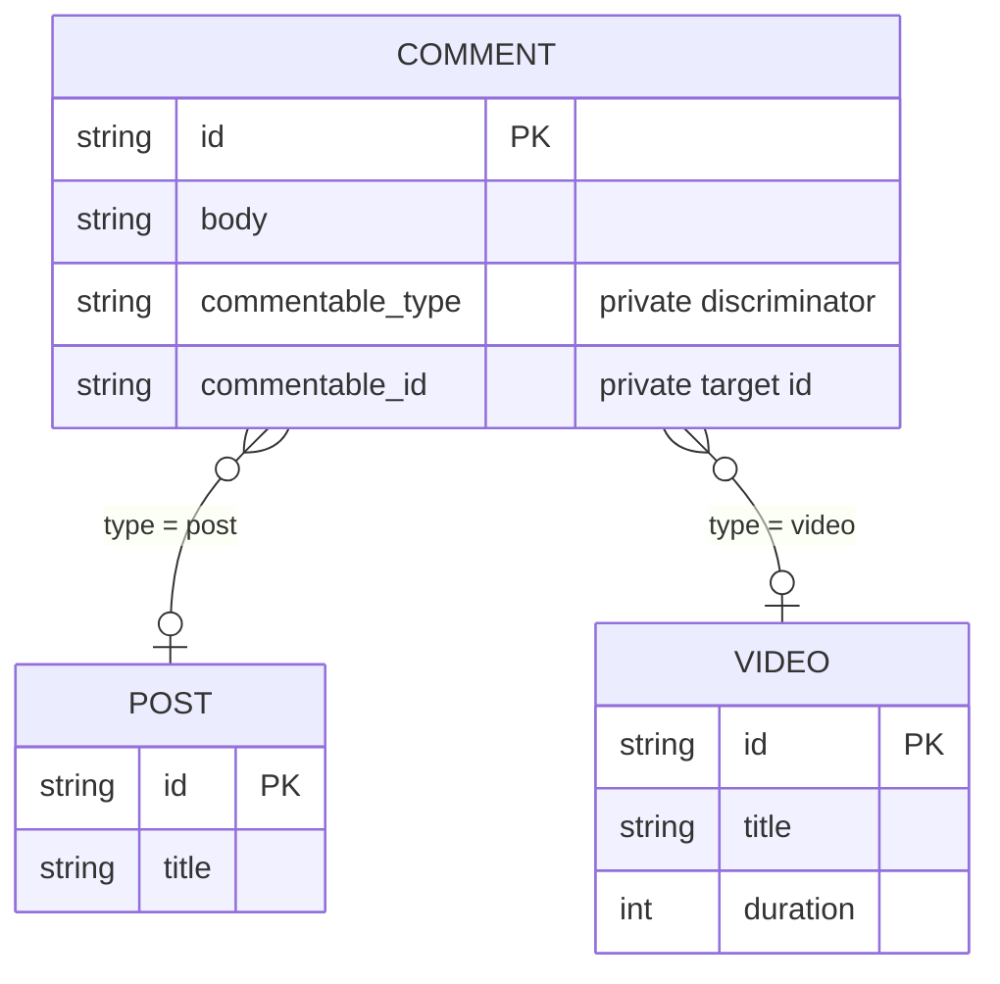

A polymorphic relation lets one field point to records from several models. A
comment, for example, can belong to either a post or a video while exposing one
`commentable` field in queries.

> **VibORM uses a polymorphic association, not table inheritance.** The owner
> stores a private `(type, id)` pair. Each target remains an independent model
> and table.

## Which relational pattern does VibORM use?

[Table inheritance](https://www.prisma.io/docs/orm/prisma-schema/data-model/table-inheritance)
models a hierarchy of entities that share an identity or common fields. Its two
usual forms are:

| Pattern | Physical model | Typical purpose | VibORM `s.polymorphic()` |
|---------|----------------|-----------------|--------------------------|
| Single-table inheritance (STI) | Every variant is stored in one wide table with a discriminator | Model a base type and its subtypes without joins | No |
| Multi-table inheritance (MTI, or delegated types) | A base table stores shared fields; subtype tables reference it | Model a base type and normalized subtype data | No |
| Polymorphic association | The referring row stores a discriminator and an ID; targets stay in their own tables | Let one relation point to heterogeneous existing models | **Yes** |

This distinction matters. In an MTI design, `Post` and `Video` would be
subtypes of a shared base row such as `Content`. With a VibORM polymorphic
relation, they do not inherit anything from one another. A `Comment` merely
holds a typed reference to either table.

This is the same broad relational pattern commonly called a
[polymorphic association](https://guides.rubyonrails.org/association_basics.html#polymorphic-associations).
It is a relation feature, not an object-inheritance feature.

### When to use each approach

- Use an ordinary VibORM relation when a field has exactly one target model.
- Use `s.polymorphic()` when an owner must reference one of several independent
  models, such as comments, attachments, reactions, or audit subjects.
- Model STI or MTI explicitly when the variants form a real domain hierarchy
  with shared fields, lifecycle, or identity. `s.polymorphic()` does not create
  a base model or share columns between targets.

## Model a polymorphic relation

The target map defines the public variants. By default, each public key is also
the discriminator stored in the database.

```ts
import { s } from "viborm";

const post = s.model({
  id: s.string().id().ulid(),
  title: s.string(),
  comments: s.oneToMany(() => comment).name("commentable"),
});

const video = s.model({
  id: s.string().id().ulid(),
  title: s.string(),
  duration: s.int(),
  comments: s.oneToMany(() => comment).name("commentable"),
});

const comment = s.model({
  id: s.string().id().ulid(),
  body: s.string(),
  commentable: s
    .polymorphic({
      post: () => post,
      video: () => video,
    })
    .name("commentable")
    .optional(),
});
```

The declaration has four important parts:

| Part | Meaning |
|------|---------|
| `post` and `video` keys | Public discriminators used in inputs and result narrowing |
| `() => post` and `() => video` | Lazy target getters, which keep circular model declarations safe |
| Optional `values` argument | Custom stable strings persisted instead of the public keys |
| `.name("commentable")` | Pairing label used by inverse `oneToMany` relations |

With no second argument, VibORM stores `"post"` and `"video"`. This is the
smallest useful form and does not depend on model or table names.

### Custom stored discriminators

Pass an explicit `values` map when the database identifier should be
namespaced, versioned, or independent of the public API key:

```ts
commentable: s.polymorphic(
  {
    post: () => post,
    video: () => video,
  },
  {
    values: {
      post: "content.post.v1",
      video: "content.video.v1",
    },
  }
)
```

The second argument is all-or-nothing: its keys must exactly match the target
map. Stored values are case-sensitive and must remain stable after data exists.
Prefer versioned, domain-qualified values instead of class or table names that
may later change.

### Required and optional relations

The relation is required by default:

```ts
subject: s.polymorphic({
  post: () => post,
  video: () => video,
})
```

A required relation must be supplied when its owner is created. Add
`.optional()` when both private storage columns may be null:

```ts
commentable: s
  .polymorphic({
    post: () => post,
    video: () => video,
  })
  .optional()
```

### Add inverse relations

The inverse side is an ordinary `oneToMany` relation. Give it the same pairing
name as the polymorphic field:

```ts
const post = s.model({
  id: s.string().id().ulid(),
  title: s.string(),
  comments: s.oneToMany(() => comment).name("commentable"),
});
```

The label is especially important when the target model owns more than one
polymorphic relation. It identifies the relation pair; it is not a database
column name.

## How it is stored

VibORM generates two private columns on the owner table and a composite index.
For the `commentable` field above, the logical shape is:

```sql
commentable_type TEXT         -- "post" or "video" by default
commentable_id   <target PK>  -- ID in the selected target table
INDEX (commentable_type, commentable_id)
```

The private columns are migration storage. They do not appear as public model
scalars, create fields, selections, or result properties.



A relational database cannot create one foreign-key constraint whose target
changes according to another column. VibORM therefore enforces this association
at the application and result boundaries:

- direct writes verify the selected target and store its type and ID together;
- inverse queries correlate on **both** the discriminator and the ID;
- result parsing rejects unknown or half-null storage;
- the generated `(type, id)` index supports inverse reads.

The ID alone is never enough. A post and a video may legally have the same
primary-key value.

## Read the direct relation

Use `include: { commentable: true }` to return the default scalar projection of
the selected target:

```ts
const comments = await client.comment.findMany({
  include: { commentable: true },
});
```

The relation is an exhaustive discriminated union:

```ts
type Commentable =
  | { type: "post"; data: Post }
  | { type: "video"; data: Video }
  | null; // only when the relation is optional
```

Narrow on `type` before using variant-specific fields:

```ts
for (const comment of comments) {
  const target = comment.commentable;
  if (!target) continue;

  switch (target.type) {
    case "post":
      console.log(target.data.title);
      break;
    case "video":
      console.log(target.data.duration);
      break;
  }
}
```

### Select a shape per variant

Each variant can have its own `select`, `include`, or `omit`:

```ts
const comments = await client.comment.findMany({
  include: {
    commentable: {
      post: {
        select: { id: true, title: true },
      },
      video: {
        select: { id: true, title: true, duration: true },
      },
    },
  },
});
```

An omitted configured variant still uses that model's default scalar
projection. The result therefore remains an exhaustive union.

VibORM compiles the variants into one portable `CASE` expression with one
correlated target branch per configured variant. The database receives one
statement; VibORM does not issue a query per row.

## Filter the direct relation

The `type` discriminator selects the target schema before the nested filter is
validated:

```ts
const commentsOnTypeScriptPosts = await client.comment.findMany({
  where: {
    commentable: {
      type: "post",
      is: {
        title: { contains: "TypeScript" },
      },
    },
  },
});
```

Supported direct forms are:

```ts
commentable: { type: "post" }
commentable: { type: "post", is: { title: "Hello" } }
commentable: { type: "post", isNot: { title: "Draft" } }
commentable: null // optional relations only
```

`is` and `isNot` are mutually exclusive. VibORM deliberately does not provide
an untyped filter that searches every target table.

## Query from the inverse side

Inverse polymorphic relations behave as type-safe to-many relations for reads:

```ts
const post = await client.post.findUniqueOrThrow({
  where: { id: "post_123" },
  include: { comments: true },
});
```

They support normal to-many filters and counts:

```ts
const posts = await client.post.findMany({
  where: {
    comments: {
      some: { body: { contains: "helpful" } },
    },
  },
  select: {
    id: true,
    title: true,
    _count: { select: { comments: true } },
  },
});
```

Every inverse include, filter, and count matches both
`commentable_id = post.id` and
`commentable_type = "post"`. A video with the same ID cannot leak
into the post's comments.

## Write the direct relation

### Connect an existing target

```ts
await client.comment.create({
  data: {
    body: "Useful",
    commentable: {
      connect: {
        type: "post",
        where: { id: "post_123" },
      },
    },
  },
});
```

### Create the target and owner together

```ts
await client.comment.create({
  data: {
    body: "First!",
    commentable: {
      create: {
        type: "video",
        data: {
          title: "Launch",
          duration: 42,
        },
      },
    },
  },
});
```

### Replace or disconnect the target

An update can connect another target:

```ts
await client.comment.update({
  where: { id: "comment_123" },
  data: {
    commentable: {
      connect: {
        type: "video",
        where: { id: "video_456" },
      },
    },
  },
});
```

Optional relations can also be disconnected:

```ts
await client.comment.update({
  where: { id: "comment_123" },
  data: {
    commentable: { disconnect: true },
  },
});
```

`connect` and `create` are exact one-intent inputs. They cannot be combined in
one payload.

## Write from the inverse side

An inverse polymorphic `oneToMany` behaves like an ordinary child-held to-many
relation. The parent fixes both the variant and the target ID, so child create
and update payloads do not repeat `commentable`:

```ts
await client.post.update({
  where: { id: "post_123" },
  data: {
    comments: {
      create: [
        { body: "First comment" },
        { body: "Second comment" },
      ],
    },
  },
});
```

The same form works when creating the parent:

```ts
await client.post.create({
  data: {
    title: "New post",
    comments: {
      create: [{ body: "Welcome" }],
    },
  },
});
```

On create, the inverse relation supports `create`, scalar-only `createMany`,
`connect`, `connectOrCreate`, and `upsert`. On update it also supports `update`,
`updateMany`, `delete`, and `deleteMany`.

```ts
await client.post.update({
  where: { id: "post_123" },
  data: {
    comments: {
      connect: { id: "comment_1" },
      update: {
        where: { id: "comment_2" },
        data: { body: "Revised" },
      },
      createMany: {
        data: [{ body: "One" }, { body: "Two" }],
        skipDuplicates: true,
      },
    },
  },
});
```

`connect` locates a row globally and adopts it. `connectOrCreate` does the same
or creates it, with first-create-wins for duplicate inputs. An upsert below a
new parent also adopts globally. Below an existing parent, the found row must
already belong to that exact parent variant; a same-ID row owned by another
variant is rejected.

If the direct polymorphic relation is optional, inverse `disconnect` and `set`
are also available. Both private columns are cleared together. `set: []`
disconnects every current member, while same-ID rows with another discriminator
remain untouched. Required storage rejects both operations before SQL.

Nested inverse `createMany` stays scalar-only and applies the one enclosing
`(type, identity)` pair to every row. It is unavailable when another required
polymorphic relation on the child would remain unsatisfied.

## Integrity and orphan behavior

VibORM treats the private pair as one atomic value:

| Stored state | Optional relation | Required relation |
|--------------|-------------------|-------------------|
| Both columns null | Returns `null` | Integrity error |
| Known type and existing target | Returns `{ type, data }` | Returns `{ type, data }` |
| Known type and missing target | Returns `null` | Query-engine integrity error |
| Unknown type or only one null column | Provider-result integrity error | Provider-result integrity error |

There is no configurable orphan policy in the current release. Since the
database cannot enforce a cross-table foreign key, delete target records with
care and keep related cleanup in the same application transaction when
possible.

## Limits removed by inverse membership

The inverse side is no longer create-only. It now uses the ordinary child-held
relation machinery:

- parent create supports `create`, scalar-only `createMany`, `connect`,
  `connectOrCreate`, and `upsert`;
- parent update adds `update`, `updateMany`, `delete`, and `deleteMany`;
- optional storage adds `disconnect` and `set`, including `set: []`;
- every operation matches and writes the complete `(type, id)` membership, so a
  same-ID row from another variant is not a member.

These operations add no query or round trip beyond the corresponding ordinary
child-held relation operation.

## Remaining limitations

The current release keeps these boundaries:

- **Target identity:** every target needs exactly one scalar primary key. All
  targets in the relation must use the same portable `string`, `int`, or
  `bigint` representation. Compound IDs, array IDs, mixed scalar kinds, and
  database-native type overrides are not supported.
- **Direct create:** an owner create supports `connect` or nested `create`, but
  not direct `connectOrCreate`.
- **Direct update:** a selected owner supports `connect` and, for optional
  storage, `disconnect`. It cannot create, update, delete, `connectOrCreate`, or
  `upsert` the target through the direct relation. The direct relation is
  to-one, so it has no collection-style `set` operation.
- **Topology:** polymorphic many-to-many and inverse one-to-one relations are
  not supported. An inverse is also ambiguous when the same model appears more
  than once in one target map.
- **Cross-target queries:** `orderBy` cannot traverse a direct polymorphic
  relation, and filters must select one `type`; there is no untyped filter that
  searches all target schemas.
- **Root bulk create:** root `createMany` rows remain scalar-only and cannot
  contain relation payloads. A model with a required polymorphic relation cannot
  use root `createMany`; use `create`. Inverse nested `createMany` is the
  exception because its enclosing relation supplies one complete storage pair.
- **Database integrity:** one SQL foreign key cannot target several tables, so
  the database does not enforce the association. VibORM does not yet emulate
  referential actions such as cascade or set-null when a target changes or is
  deleted.

Operation schemas reject unsupported mutation shapes before SQL execution.
Schema validation rejects unsupported topology and identity declarations.

## Schema evolution

The generated migration snapshot records the relation members and their stored
discriminators even though the private columns are shared. This lets migration
generation distinguish a newly added target from an unsafe retargeting.

Treat stored discriminator values as database identifiers:

- add a new target with a new unique stored value;
- do not reuse an old stored value for a different model;
- migrate existing rows deliberately before changing a stored value;
- keep each value within 191 portable indexed characters using letters,
  numbers, `.`, `_`, `:`, or `-`.

The public target key and stored value serve different purposes: the key shapes
TypeScript inputs and results, while the stored value protects database history.

## Summary

VibORM's model is best described as a **typed polymorphic association**:

- independent target tables, with no base or subtype hierarchy;
- one private `(type, id)` pair on the owner;
- one discriminated TypeScript result union;
- one SQL statement for a direct polymorphic include;
- application-level integrity because SQL cannot express the cross-table FK.

If your domain needs shared subtype fields or a common base identity, model STI
or MTI explicitly. If it needs one relation to select among heterogeneous
records, use `s.polymorphic()`.
