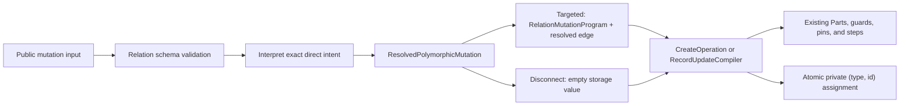

# Polymorphic Relations in VibORM

> **Revision 4 — 2026-08-08**
>
> This revision replaces the 2026-08-03 design where it described the deleted
> `query-engine-v2` layout. It is aligned with the current query engine:
> `RelationMutationProgram`, `BoundRelation`, `CreateOperation`,
> `RecordUpdateCompiler`, field-bound foreign-key references, strict result
> shapes, and the current contract-test estate.
>
> **Status:** the narrow V1 implementation is complete on the feature branch.
> Core, extended-local, performance, package, PGlite, SQLite3, libSQL,
> PostgreSQL, and MySQL2 gates are green. The final feature commit is the
> remaining delivery action.
>
> **Implementation plan:**
> [`polymorphic-relations-implementation-plan.md`](./polymorphic-relations-implementation-plan.md)

## 1. Verdict

Polymorphic relations are implemented at the schema, validation, migration,
query-engine, adapter-result, driver-result, and public TypeScript boundaries.
Y0 falsified the original getter-of-map API and proved the exact getter-map
redesign. The compressed write architecture kept the implementation narrow:

- one schema-transformed mutation representation;
- one topology binder;
- one fresh-record compiler;
- one selected-record update compiler;
- one field-bound provenance model for values that cross statement boundaries.

The feature is not trivial, however. The previous plan hid five real boundaries:

1. `{relation}_type` and `{relation}_id` are physical columns without public
   model scalars. Current INSERT and UPDATE builders deliberately ignore unknown
   scalar keys. A fabricated `RelationInfo` plus an extra object property cannot
   write either column.
2. A polymorphic include cannot use the ordinary relation result parser. The
   parser must choose a target schema from the returned discriminator and then
   validate that target's exact nested result shape.
3. Exact `values` typing and exhaustive per-target nested results can force a
   recursive getter too early. Y0 falsified the getter-of-map shape and the
   implementation uses the passing getter-map carrier.
4. Scalar-only `createMany` cannot construct a required private relation. V1
   must refuse bulk creation of such a model before planning instead of leaking
   a database `NOT NULL` failure.
5. A stable stored discriminator can still be retargeted to another table or
   referenced field. Snapshot history must treat that as destructive even
   though the text value did not change.

This revision also closes three implementation traps: polymorphic inverse
resolution is separate from the ordinary FK-tuple helper, disconnect-only
updates count as root work, and discriminator width/generated-name limits are
fixed before DDL generation rather than left to an adapter or database error.

The implementation keeps five distinct facts:

1. **`PolymorphicRelation`** describes the public multi-target schema relation.
2. **`ResolvedPolymorphicMutation`** is the exact direct intent: targeted
   connect/create or targetless disconnect.
3. **`ResolvedPolymorphicEdge`** describes one direct target selected by a
   validated discriminator for one compilation.
4. **`ResolvedPolymorphicInverse`** describes one ordinary inverse relation and
   its fixed child-storage member without lying about cardinality.
5. **`PolymorphicStorage`** describes the private `(type, id)` columns owned by
   the relation.

Connect/create become single-target after discriminator resolution; disconnect
is storage-only. Reads remain genuinely polymorphic because the discriminator
is known only from each row.

### Relative difficulty after the engine changes

| Concern | Effect of the current architecture |
|---|---|
| Direct writes | Easier: lower once, then reuse the record compilers and existing branch/guard machinery |
| Inverse nested create | Easier: fixed discriminator plus existing field-bound parent identity |
| Direct include/filter | Similar inherent complexity: one target branch per configured variant |
| Strict hydration | More explicit than the old plan, but safer; target-specific shapes cannot be skipped |
| Recursive public typing | The getter-map carrier passed Y0; final type-suite timing remains a release gate |
| Private storage/migrations | Slightly harder than the old plan admitted: hidden columns, stable member history, and retarget detection need explicit owners |
| Broad inverse writes | Still hard: every membership probe and write needs both the id correlation and discriminator predicate |
| Navigation | Fewer owners, but the remaining compiler files are denser |

The implementation adds no runtime step kind, adapter execution protocol,
database round trip, or generic mutation framework. Finalization still stops if
the production public types widen to `any`, trigger TS2589, or materially
regress type-check time.

## 2. Scope

### V1 feature surface

V1 supports:

- a direct optional or required polymorphic to-one relation;
- inverse `oneToMany` reads;
- direct include/select;
- direct type-correlated filters;
- inverse include, relation filters, and relation count;
- direct `connect`, `create`, and `disconnect`;
- inverse nested `create`;
- one SQL statement for a read with a polymorphic include;
- application-level integrity with generated private columns and an index.

### Explicitly outside V1

- compound target primary keys;
- target primary keys with a database-native type override;
- direct update-through, `set`, `upsert`, and `connectOrCreate`;
- relation payloads inside `createMany`; a model with a required direct
  polymorphic relation has no valid scalar-only `createMany` row in V1;
- inverse connect/disconnect/delete/set/update/upsert;
- polymorphic many-to-many storage;
- database foreign-key constraints across target tables;
- ORM-emulated referential actions;
- untyped `is` filters that search every target;
- order-by through a direct polymorphic target;
- inverse `oneToOne` (portable mixed-cardinality uniqueness needs a separate
  design);
- a semantic `adapter.polymorphic` namespace;
- a new query-engine runtime step or strategy framework.

Unsupported mutation verbs are absent from the validation schema. The query
engine must not duplicate those refusals with a second guard.

## 3. Public schema model

### Direct side

```ts
const comment = s.model({
  id: s.string().id().ulid(),
  body: s.string(),
  commentable: s
    .polymorphic({
      post: () => post,
      video: () => video,
      photo: () => photo,
    })
    .name("commentableTarget"),
});
```

The map key is the public discriminator used by query inputs and result
narrowing. Each target is its own lazy getter. This is intentional: the original
getter-of-map prototype, `() => ({ post, video })`, forced
`keyof ReturnType<G>` while recursive models were still initializing and
collapsed self/mutual declarations to `any`. A getter map exposes the exact
public keys without evaluating any model body. When the second argument is
omitted, each stored discriminator defaults to its public key. An explicit
`{ values }` map remains exact for fresh and non-fresh objects and replaces all
defaults; partial maps are rejected. This keeps recursion lazy while allowing
durable namespaced values where the application needs them.

```ts
s.polymorphic(
  { post: () => post, video: () => video },
  {
    values: {
      post: "content.post.v1",
      video: "content.video.v1",
    },
  }
)
```

An optional relation uses the normal chainable form:

```ts
commentable: s
  .polymorphic({
    post: () => post,
    video: () => video,
    photo: () => photo,
  })
  .name("commentableTarget")
  .optional()
```

### Inverse side

The V1 inverse remains an ordinary `oneToMany` relation whose `.name()`
identifies the owning polymorphic relation:

```ts
const post = s.model({
  id: s.string().id().ulid(),
  comments: s.oneToMany(() => comment).name("commentableTarget"),
});
```

`.name()` keeps its existing meaning: it is a relation-pairing label, not the
model field key. The direct polymorphic relation and inverse ordinary relation
must carry the same label when disambiguation is needed. When the target owns
exactly one polymorphic relation, the pairing is inferred regardless of a
decorative label mismatch. When it owns several polymorphic relations, the
inverse must carry a label that selects exactly one of them, even when only one
contains the source model. This conservative rule is necessary because
TypeScript cannot distinguish separate model instances with identical
structural types. Code must not silently treat `.name("commentable")` as a
lookup of the field named `commentable`.

Inference compares registered model identity and configured target entries. It
must not lowercase model names or discriminator keys.

Two public discriminator keys may target the same model for a direct-only
relation. They are distinct public/storage members. Such a relation cannot have
an inverse in V1: `.name()` identifies the owning relation, not one member inside
it, so the source model would not determine which discriminator to correlate.
Schema validation rejects inverse binding when the source model occurs more than
once in the chosen target map.

### Self-reference

Self-polymorphism is not rejected by design. A relation such as a threaded
comment target is legal unless the Y0 recursive-carrier spike proves a concrete
TypeScript recursion failure. A speculative `P006` ban must not ship.

### Schema-type separation

`"polymorphic"` does not join the current ordinary `RelationType` union, and
`PolymorphicRelation` is not added to `AnyRelation`. Those types promise one
target getter and are consumed by exhaustive ordinary-relation switches. The
model therefore gains a third field category explicitly:

```ts
type AnyModelField = Scalar | AnyRelation | AnyPolymorphicRelation;
type ModelShape = Record<string, AnyModelField>;
```

The implementation stores separate `PolymorphicRelationState` and
`AnyPolymorphicRelation` values in `ModelState.polymorphicRelations`.
`ScalarKeys` and ordinary `RelationKeys` keep their current meanings;
`PolymorphicRelationKeys` is composed only at public select/include, filter,
operation-schema, and result-type boundaries. No scalar extractor may
classify an unknown non-ordinary field as a scalar merely because it is not an
`AnyRelation`.

Model extraction/hydration, create/update/where/select schema construction,
client result inference, query scope, and scalar/relation predicates now handle
the third category explicitly. Ordinary topology, builders, and result parsing
remain honestly typed to `AnyRelation`.

### Separate inverse binding

Do not extend `GetInverseRelationMap` or `getInverseRelationMap`. Their contract
is an ordinary relation's public FK-field tuple. A polymorphic inverse has no
public FK tuple; it needs the selected owner field and member:

```ts
interface PolymorphicInverseBinding<
  TRelationKey extends string = string,
  TPublicType extends string = string,
  TStoredType extends string = string,
> {
  readonly relationKey: TRelationKey;
  readonly publicType: TPublicType;
  readonly storedType: TStoredType;
}
```

`GetPolymorphicInverseBinding` and its runtime
`getPolymorphicInverseBinding` sibling are separate from the ordinary tuple
resolver. The type-level resolver selects only the
direct relation key: TypeScript model types are structural, so two separately
declared identical-shape models cannot truthfully select an exact member. The
runtime resolver uses registered model identity and also returns `publicType`
and `storedType`. Both select the sole owner relation or the uniquely named
owner relation before checking source membership; the mandatory definition gate
owns exact member uniqueness. The type-level key
drives inverse nested-create omission; the runtime result resolves storage and
the inverse query/write edge. Neither returns generated column names nor
masquerades as the ordinary FK-field tuple.

## 4. Public query and mutation shapes

### Result

```ts
type Commentable =
  | { type: "post"; data: Post }
  | { type: "video"; data: Video }
  | { type: "photo"; data: Photo };
```

An optional relation returns `Commentable | null`. A required relation remains
non-null in the public type; a missing required target is a runtime integrity
error, not an undocumented `null`.

### Include

```ts
await orm.comment.findMany({
  include: {
    commentable: true,
  },
});
```

`false` omits the relation, as it does for an ordinary include/select.

Per-target selection is also supported:

```ts
await orm.comment.findMany({
  include: {
    commentable: {
      post: { select: { id: true, title: true } },
      video: { include: { channel: true } },
      photo: { omit: { metadata: true } },
    },
  },
});
```

The object is a projection override, not a target filter. Each target node uses
the existing mutually exclusive target projection forms (`select`, `include`,
or `omit`) and their normal nested arguments. A configured variant omitted from
the object uses that target's default scalar projection, so the result remains
an exhaustive union. Use `where.commentable.type` to restrict which target type
matches.

The result union narrows each `data` member to that variant's requested shape.
Unknown target keys are rejected through the public client/driver call surface.

### Direct filter

V1 uses correlated filters. `is` and `isNot` require a discriminator:

```ts
where: {
  commentable: {
    type: "post",
    is: { title: { contains: "TypeScript" } },
  },
}
```

Supported direct forms are:

```ts
commentable: null
commentable: { type: "post" }
commentable: { type: "post", is: { ...postWhere } }
commentable: { type: "post", isNot: { ...postWhere } }
```

The bare `null` form exists only for an optional polymorphic relation.

The target schema is selected by `type` before the nested filter is parsed.
`is` and `isNot` are mutually exclusive; `{ type, is, isNot }` is rejected at
the schema boundary. There is no untyped OR-across-targets filter in V1.

### Direct create input

The relation payload is an **exact one-intent union**:

```ts
type PolymorphicCreateInput =
  | { connect: { type: "post"; where: PostWhereUnique } }
  | { create: { type: "post"; data: PostCreateInput } }
  | { connect: { type: "video"; where: VideoWhereUnique } }
  | { create: { type: "video"; data: VideoCreateInput } };
```

Examples:

```ts
data: {
  body: "Useful",
  commentable: {
    connect: { type: "post", where: { id: "post_123" } },
  },
}
```

```ts
data: {
  body: "Useful",
  commentable: {
    create: {
      type: "post",
      data: { title: "New post" },
    },
  },
}
```

`connect` and `create` cannot be present together. This prevents one payload
from selecting two targets or two discriminator values. The nested selector is
under `where`; flat-merging it beside `type` would collide with a target field
named `type` and would break compound unique selector objects.

A required direct polymorphic relation must be present on direct record create.
An optional one may be omitted; omission writes both private columns as null.
The only required-field omission is the inverse nested-create path below, where
the parent owns and injects the edge.

### Direct update input

```ts
type PolymorphicUpdateInput =
  | { connect: { type: "post"; where: PostWhereUnique } }
  | { connect: { type: "video"; where: VideoWhereUnique } }
  | { disconnect: true };
```

Disconnect is exposed only for an optional relation.

### Inverse write input

V1 supports nested create:

```ts
await orm.post.update({
  where: { id: "post_123" },
  data: {
    comments: {
      create: [{ body: "New comment" }],
    },
  },
});
```

The source fixes the target variant. The compiler writes the parent's id and
the stored discriminator as one relation-owned storage assignment.

The inverse relation key is resolved while operation schemas are built by
`GetPolymorphicInverseBinding`, not by the ordinary FK-tuple helper. Its nested
create schema omits the returned child `relationKey` because the parent injects
that edge. The runtime sibling resolves the exact `publicType`/`storedType`
member and private storage descriptor. The same binding restricts the inverse mutation
object to `create`; it must not inherit ordinary to-many
connect/createMany/update/delete/set/upsert keys merely because its public
relation class is `oneToMany`.

Required direct create uses the existing `requiresOneOfKeySets` mechanism with
one allowed set: the polymorphic relation key itself. There is no public scalar
FK alternative. Inverse nested create omits that relation key from the child's
full create schema; it does not omit or invent hidden scalar names.

Top-level and nested `createMany` remain scalar-only. If their target model has
any required direct polymorphic relation, their args schema has no valid input
and rejects before query planning with:

```text
createMany is not available for model '<model>' because required polymorphic relation '<relation>' cannot be supplied by a scalar-only bulk row. Use create instead.
```

When several required polymorphic fields exist, `<relation>` is the first one
in model declaration order. Optional polymorphic fields do not block
`createMany`; omitting their nullable private columns stores null. V1 does not
silently defer a required-column failure to the database and does not invent a
bulk relation envelope.

## 5. Private storage contract

### Generated columns

For a required relation, the logical storage is:

```sql
commentable_type <portable text> NOT NULL
commentable_id   <compatible target-pk type> NOT NULL
```

The type column uses one internal `StringScalar` with no native override,
default, or auto-generation. Existing migration mapping produces `TEXT` on
PostgreSQL, SQLite, and libSQL, and the existing keyed-text finalizer produces
`VARCHAR(191)` on MySQL. Stored discriminator values must match
`^[A-Za-z0-9][A-Za-z0-9._:-]{0,190}$`; this is the portable indexed limit and
is validated at schema definition. V1 exposes no enum or integer discriminator
mode.

For an optional relation both are nullable. VibORM writes or clears them
atomically. V1 does not add a database CHECK: the current migration snapshot and
diff IR have no check-constraint primitive, and adding that cross-dialect
facility only for this relation would enlarge the feature substantially.
Externally introduced half-null storage is detected as an integrity error by the
strict result parser.

Generated physical names are fixed:

```text
type column: <relationField>_type
id column:   <relationField>_id
index:       <mappedOwnerTable>_<relationField>_poly_idx
```

All three names must pass the existing ASCII/63-byte
`isValidSchemaIdentifier` rule and must not collide with public columns,
constraints, indexes, or another generated storage object. V1 does not
silently truncate or hash names; P008 asks the user to shorten the mapped table
name or relation field.

Every relation receives the composite index:

```sql
CREATE INDEX ... ON comments (commentable_type, commentable_id);
```

There is no cross-table foreign-key constraint.

### Why the columns cannot be public scalars

The generated columns must not enter `model["~"].state.scalars`. Doing so would
leak them into:

- create and update validation;
- default select and result types;
- scalar filters and ordering;
- public model field inference;
- ordinary migration field iteration.

They are relation-owned physical storage.

### Required internal descriptor

The schema layer exposes one cached `PolymorphicStorage` descriptor per
polymorphic field:

```ts
interface PolymorphicStorage {
  readonly relationName: string;
  readonly ownerModel: Model<any>;
  readonly indexName: string;
  readonly typeColumn: {
    readonly name: string;
    readonly scalar: Scalar;
    readonly nullable: boolean;
  };
  readonly idColumn: {
    readonly name: string;
    readonly scalar: Scalar;
    readonly nullable: boolean;
  };
  readonly members: ReadonlyMap<
    string,
    {
      readonly storedType: string;
      readonly targetModel: Model<any>;
      readonly referencedField: string;
    }
  >;
}
```

`typeColumn.scalar` owns discriminator storage/canonicalization.
`idColumn.scalar` is the canonical id storage/cast owner shared by every
target. V1 requires one compatible single-column target primary key per member.
`relationName` is the hydrated model field key used by query-engine messages;
it is not the optional `.name()` pairing label. Generated physical names also
derive from the field key, never from that label.

The descriptor is not a query scope, branch strategy, parent identity,
`BoundRelation`, or SQL fragment.

### Atomic storage write

Record compilers need an explicit internal channel that writes the two physical
columns together:

```ts
type PolymorphicStorageValue<TId> =
  | {
      readonly kind: "linked";
      readonly storage: PolymorphicStorage;
      readonly storedType: string;
      readonly referencedField: string;
      readonly id: TId;
    }
  | {
      readonly kind: "empty";
      readonly storage: PolymorphicStorage;
    };
```

The compiler holds
`PolymorphicStorageValue<FinalReferenceSource>` and resolves the id before the
SQL builder receives `PolymorphicStorageValue<unknown>`. This keeps the neutral
builders from importing the write engine and creating a runtime cycle.

Private columns cannot use a model-field lookup. Extend the existing
destination-scalar lowering owner with a scalar-object entry point (for example
`referenceSqlForScalar(engine, scalar, label, value)`), and make the ordinary
model/field entry point delegate to the same implementation. The polymorphic
path passes `typeColumn.scalar` or `idColumn.scalar` directly. Do not duplicate
literal/cast logic or insert hidden fields into `model.state.scalars`.

The channel must:

- append private storage after user scalar assignments and all existing ordinary
  derived FK assignments;
- order multiple polymorphic fields by their owner-model declaration order,
  always type then id;
- preserve a fixed column and parameter order;
- canonicalize/cast both values through their descriptor scalars;
- support literals, planning fields, final refs, transitions, and lookups where
  the current record compilers already support them;
- set both values on connect/create;
- set both values to null on disconnect;
- never expose a half-write API.

Extending `buildValues` or `buildSet` with arbitrary unknown keys is forbidden.
The channel is relation-specific physical storage, not a generic escape hatch.

`referencedField` is required provenance. Planning-field and transitioned
sources cannot be resolved correctly from an unlabelled value: they must read
the selected target field while the destination cast is owned independently by
`storage.idColumn.scalar`. The polymorphic lowerer constructs a temporary
`ForeignKeyMember` from `storage.idColumn.name`, the storage value's own
`referencedField`, and its id source, then calls the unchanged
`foreignKeyWriteValue`/`foreignKeyWriteValueWith`. Callers pass the storage value
only; they cannot supply a second, contradictory field name.

## 6. Resolved edge and current write architecture

### The resolved compiler fact

After the relation schema has validated and transformed an input, direct
connect/create select exactly one member:

```ts
interface ResolvedPolymorphicEdge {
  readonly publicType: string;
  readonly storedType: string;
  readonly targetModel: Model<any>;
  readonly referencedField: string;
  readonly storage: PolymorphicStorage;
  readonly relationInfo: RelationInfo;
}
```

For this direct fact, `relationInfo` is an internally coherent ordinary
parent-held to-one view: its `type`, target model, and underlying relation state
agree. It is not a `RelationInfo` whose outer tag says `manyToOne` while its
relation state remains `polymorphic`.

That view exists only for target-scoped program meaning, lookup/create reuse,
messages, and OwnWrite. It is **not** the storage topology. When the companion
map identifies a polymorphic program, the record compiler must not pass this
view to `bindRelation`, `foreignKeyAssignments`, `getColumnName`, or ordinary FK
nullability. It compiles the target branch and emits the explicit private
storage assignment instead.

An inverse relation cannot reuse the direct fact:
the inverse's public topology is an ordinary child-held to-many relation into
the storage-owning child, not a parent-held to-one view of the selected target.
Use a separate resolved binding:

```ts
interface ResolvedPolymorphicInverse {
  readonly relationInfo: RelationInfo;
  readonly childRelationKey: string;
  readonly publicType: string;
  readonly storedType: string;
  readonly sourceReferencedField: string;
  readonly storage: PolymorphicStorage;
}
```

Here `relationInfo` is the real ordinary inverse `oneToMany`,
`storage.ownerModel` is its child model, and `sourceReferencedField` is the
source-model field copied into the child's private id column. This fact contains
no scope, alias, parent identity, SQL, or execution policy.

`BoundRelation` remains topology-only. The discriminator literal does not belong
inside it.

Disconnect is targetless and must not fabricate a target:

```ts
type ResolvedPolymorphicMutation =
  | {
      readonly kind: "targeted";
      readonly edge: ResolvedPolymorphicEdge;
      readonly program: RelationMutationProgram;
    }
  | {
      readonly kind: "disconnect";
      readonly storage: PolymorphicStorage;
    };
```

The targeted branch reuses the ordinary lossless mutation program. Disconnect
contributes only an `empty` storage value to the owner record: it needs no
target lookup, Part, guard, or `RelationInfo`. Root private assignments are
collected independently from target steps and ordered by the owner model's
polymorphic field declaration, so this targetless entry cannot disturb step IDs.

`RecordUpdateCompiler` must count a non-empty polymorphic companion map as root
work. Its true no-op predicate becomes: no scalar assignments, no ordinary or
targeted relation programs, and no polymorphic storage assignments. This check
still happens before allocating step IDs. Otherwise a disconnect-only update,
including the taken update arm of a root upsert, would be incorrectly dropped.

### Lowering boundary

Lowering happens after the relation input schema has transformed the payload
exactly once:



The owners are:

- `builders/relation-mutation-parser.ts` recognizes polymorphic relation keys
  and constructs the targeted program or targetless disconnect after schema
  transformation.
- `CreateOperation` compiles one fresh record.
- `RecordUpdateCompiler` compiles one already-selected record.
- relation Parts retain target lookup, found/missing decisions, guards, race
  pins, and child effects.
- `foreign-key-reference.ts` retains id provenance across planning and final
  compilation.

The following are deliberately **not** lowering owners:

- `write-engine/routing.ts`, which routes operation families and root shells;
- `write-engine/parse-boundary.ts`, which is model-blind;
- adapters or drivers.

The generic parse-boundary gate must not be widened for a relation-specific
payload that the operation schema already validates.

### Direct write behavior

For direct `connect`:

1. resolve `type`;
2. reuse the current concrete-target lookup and existence/race semantics;
3. assign the located referenced id and stored type in the root INSERT/UPDATE.

For direct `create`:

1. resolve `type`;
2. compile the target through `CreateOperation`;
3. use its produced referenced value through the existing foreign-key source;
4. assign that id and stored type in the owner record.

For `disconnect`, both physical columns become null in the same root UPDATE.
No current discriminator is read and no arbitrary target model is selected.

Root `upsert` is not a new polymorphic mutation verb. Its existing `create` and
`update` arms reuse the model create/update schemas, so the supported direct
connect/create/disconnect inputs are supported inside the corresponding arm.
`UpsertOperation` must pass the taken arm through the same parsed-program and
record-compiler path. Whole-argument validation keeps its current timing, but an
untaken arm performs no topology binding, OwnWrite analysis, SQL compilation,
or side effect.

The ordinary mutation program continues to preserve kind and source-array order.
No polymorphic mutation step or executor branch is added.

### OwnWrite

OwnWrite consumes the concrete targeted program and topology after resolution.
Targetless disconnect has no nested subtree and cannot conflict with a public
scalar, so it contributes only to the record's root physical assignment. Its
membership identity must include the discriminator when two polymorphic members
could otherwise share the same holder, target model, and id shape.

Narrow V1 requires no broad edge-predicate protocol because the only inverse
write is create. If broader inverse writes are later added, the OwnWrite
footprint and every relation Part must consume the same `(type, id)` membership
scope.

## 7. Read compilation

Reads are the genuinely polymorphic side.

### Dispatch

The current query engine discovers selected and filtered fields in:

- `src/query-engine/builders/select-builder.ts`;
- `src/query-engine/builders/where-builder.ts`.

Those two dispatch points must recognize polymorphic fields. A dedicated
polymorphic include/filter builder may own the branch SQL, but modifying only
`relation-filter-builder.ts` would leave the fields undiscoverable.

### Mutation-result folds

Polymorphic projections also enter the mutation fast paths; treating them only
as `find*` reads would silently miscompile create/update/delete/upsert results.

- `write-engine/shared.ts::selectProjectsRelation` must classify a selected
  polymorphic field as a relation projection. It therefore cannot enter the
  scalar-only direct `RETURNING` path.
- `operations/mutation-projection-fold.ts::returningEveryColumn` must add the
  selected relation's private type/id columns to the mutation CTE plumbing,
  after public scalar columns and in relation declaration order. They remain
  absent from the public result.
- `write-engine/shared.ts::payloadReachesTable` must traverse every configured
  variant read by a polymorphic projection. An omitted per-target override still
  reads that variant with its default projection. A type-correlated filter walks
  only its selected variant.
- If any reachable variant is the mutated model, the existing PostgreSQL
  same-snapshot rule declines the CTE fold. The unfolded terminal read remains
  the correctness fallback.

Required parity witnesses are a scalar mutation with polymorphic `include`, the
same with polymorphic `select`, a self-polymorphic projection, and ordinary
relation controls. The feature may add private columns to the CTE `RETURNING`
list only when that polymorphic projection needs them; it must not broaden every
mutation result.

### Include strategy

V1 uses a CASE expression with one correlated target subquery per configured
member. It remains one database statement and performs no per-row client query.

The existing ordinary include builder supports correlated and LATERAL paths.
Polymorphic V1 explicitly uses the portable correlated form inside CASE. Normal
relations keep their current capability-selected LATERAL fast path unchanged.
A polymorphic LATERAL optimization is future work and requires measurement.

Conceptual SQL:

```sql
CASE
  WHEN c.commentable_type IS NULL AND c.commentable_id IS NULL THEN NULL
  WHEN c.commentable_type IS NULL OR c.commentable_id IS NULL THEN
    <invalid-storage envelope>
  WHEN <exact type = stored post value> THEN
    JSON_OBJECT(
      '__viborm_state', 'linked',
      'type', 'post',
      'data', (
        SELECT <post JSON>
        FROM posts p
        WHERE p.id = c.commentable_id
      )
    )
  WHEN <exact type = stored video value> THEN
    JSON_OBJECT(
      '__viborm_state', 'linked',
      'type', 'video',
      'data', (
        SELECT <video JSON>
        FROM videos v
        WHERE v.id = c.commentable_id
      )
    )
  ELSE <invalid-storage envelope>
END
```

The concrete builder uses adapter JSON primitives. The SQL above is explanatory,
not dialect-specific query-engine code. `__viborm_state` is a reserved
result-layer constant, not a public result key. The parser consumes it.

Each branch reuses the existing nested selection builder, so target-specific
select/include recursion remains normal query-engine work.

### Adapter boundary

Reuse:

- `adapter.json.object`;
- `adapter.json.objectFromColumns`;
- existing JSON aggregation;
- `adapter.operators.exactTextEq` for discriminator comparisons.

MySQL's default collation can be case-insensitive, so plain text equality is not
an acceptable discriminator contract.

Add only a generic CASE-expression adapter primitive if the installed adapter
surface cannot express the required portable CASE. Do not add
`adapter.polymorphic.*`; adapters own SQL syntax, not relation semantics.

### Direct filters

The compiler emits:

- `type` only: exact discriminator equality;
- `type + is`: exact discriminator equality AND target `EXISTS`;
- `type + isNot`: exact discriminator equality AND target `NOT EXISTS`;
- `null`: both physical columns are null.

The nested target filter is compiled under a child `QueryScope` for the resolved
target model.

## 8. Inverse relations

An inverse relation is a normal source-side relation with a two-part membership
predicate:

```text
child.<poly_id> = parent.<referenced_pk>
AND child.<poly_type> = <fixed stored discriminator>
```

The discriminator conjunct is mandatory in:

- inverse include;
- `some`, `every`, and `none`;
- relation count;
- any future probe, guard, attach, detach, update, or delete.

Centralize this in `builders/correlation-utils.ts` as a composition of the
ordinary field correlation plus an exact literal predicate. Include/filter/count
must not each reimplement the rule.

Schema/query context resolves and caches a `ResolvedPolymorphicInverse` from the
schema-level binding and the real public inverse `RelationInfo`. The storage
descriptor's `ownerModel` identifies the child table, while `relationInfo`
retains its honest to-many cardinality. It must not fabricate or reuse the
direct parent-held `ResolvedPolymorphicEdge`.

V1 inverse writes stop at nested create. Existing child-held create compilation
injects:

- the parent id through field-bound provenance;
- the fixed discriminator as a literal private storage value.

Broad inverse write parity is intentionally deferred. Without a shared
membership predicate threaded through relation Parts, an id collision across
two target types could update or disconnect the wrong row.

## 9. Strict result shape and orphan semantics

### Why ordinary hydration is insufficient

`ExpectedResultShape` records one nested shape per ordinary relation, while a
polymorphic result uses a discriminator-indexed set of target shapes.

The result layer owns an explicit expected shape:

```ts
interface ExpectedPolymorphicResultShape {
  readonly optional: boolean;
  readonly variants: ReadonlyMap<
    string,
    {
      readonly model: Model<any>;
      readonly shape: ExpectedResultShape;
    }
  >;
}
```

`ExpectedResultShape` keeps ordinary relations and has a separate map for
polymorphic projections. This avoids pretending that a multi-target relation is
an `AnyRelation`.

The map contains **every configured variant**, not merely keys written in a
selective include object. Each entry receives either its explicit projection
override or the target's default scalar projection. This matches the exhaustive
public union in §4.

The SQL carrier has exactly three internal states:

```ts
type PolymorphicResultCarrier =
  | null
  | {
      readonly __viborm_state: "linked";
      readonly type: string;
      readonly data: unknown;
    }
  | {
      readonly __viborm_state: "invalid";
      readonly storedType: unknown;
      readonly hasId: boolean;
    };
```

Both columns null produce `null`. A recognized discriminator produces
`linked`, including `data: null` when its target row is absent. Unknown or
half-null storage produces `invalid`. The key spelling is owned by the result
alias/constants module and cannot collide with a public target field because it
is outside `data`.

The parser:

1. sends the raw nested value through the existing adapter/driver relation JSON
   decoding middleware with relation-result kind `"polymorphic"`;
2. validates the internal carrier and outer `{ type, data }` envelope;
3. rejects an unknown discriminator;
4. selects the expected target model and nested shape;
5. rejects `data: null` when the chosen target is required by the integrity
   contract;
6. parses all target scalars and nested relations with the existing row parser;
7. never returns unvalidated JSON.

This reuses `ResultParser`, `AdapterResultParser.parseRelation`, and the driver
`parseRelation` hook so MySQL/SQLite JSON text is decoded before strict envelope
validation. It extends the hook's kind union; it adds no adapter method,
polymorphic SQL namespace, or execution protocol.

Inside the result layer, `RowValueParsers` gains a separate
`parsePolymorphic` callback. The ordinary `parseRelation` callback remains
typed to `AnyRelation`; a multi-target relation is never cast into that type.

### Implemented V1 orphan contract

V1 has one fixed orphan contract and no public option that changes it:

| Storage state | Optional relation | Required relation |
|---|---|---|
| both columns null | `null` | integrity error |
| known type and existing target | `{ type, data }` | `{ type, data }` |
| known type and missing target | `null` | internal `QueryEngineError` |
| unknown stored type | integrity error | integrity error |
| half-null pair | integrity error | integrity error |

There is no `nullOnMissing`/`errorOnMissing` option. A later configurable policy
would require a coordinated schema, result-type, and parser design.

V1 adds no public error class or code. A required missing target throws the
existing internal `QueryEngineError` with the exact message
`Polymorphic relation '<relation>' references a missing '<type>' record.` and
metadata `{ model, relation, type }`. Unknown discriminators, malformed carriers,
and half-null storage use the existing malformed-provider-result path, retaining
driver and operation metadata.

## 10. Schema validation and migration contract

### Validation rules

| Code | Rule |
|---|---|
| P001 | Every target resolves to a model registered in the schema |
| P002 | Target primary keys have one compatible, portable, indexable physical storage representation |
| P003 | Public discriminator keys and stored values satisfy the exact key/value contracts and are unique |
| P004 | On a target with multiple polymorphic relations, the inverse pairing label selects exactly one owner relation |
| P005 | A target with multiple polymorphic relations requires inverse disambiguation; a sole owner relation is accepted regardless of decorative label mismatch |
| P007 | An empty target map is an error |
| P008 | Generated column/index names pass the existing identifier rule and do not collide |
| P009 | Every target has a single-column primary key in V1 |
| P010 | An inverse source model occurs exactly once in the chosen target map |
| P011 | A one-target map warns to use an ordinary relation |

P006 is reserved and not emitted unless Y0 proves self-reference impossible.
CM004 continues to warn about manual `*_type` + `*_id` scalar patterns while
recognizing valid generated storage.

Required polymorphic edges do not enter CM002. That rule models physical-FK
insert dependencies; polymorphic storage has no database FK, and its target is
an OR-choice rather than one mandatory model edge. Self and mutual required
polymorphism are therefore legal. A concrete create graph must terminate via a
connect or the approved inverse-parent injection. P006 remains unused.

P002 is dialect-neutral and executable at schema validation time:

- the only V1 target-id scalar families are `string`, `int`, and `bigint`;
- the target id must not be an array;
- every target has the same scalar `state.type`;
- target ids with a native-type override are outside V1; every target must have
  `scalar["~"].nativeType === undefined`;
- the first target in declaration order supplies the immutable scalar instance
  held by `storage.idColumn.scalar`; it owns migration type mapping, destination
  casting, and canonicalization;
- id/default/unique/optional/column-name flags are not part of the storage
  signature because the hidden destination has its own name, nullability, index,
  and no default or auto-generation.

This rule deliberately refuses cross-family coercion (`int` to `bigint`) and
native storage overrides. A normal `s.string().id().uuid()` remains valid
because UUID auto-generation is scalar behavior, not a native-type override.
Supporting native UUID, CITEXT, or differing VARCHAR widths needs a separate,
dialect-aware indexability design.

P003 is also exact:

- `targets` and `values` must be plain own-property records with
  `Object.prototype` or null prototypes;
- each public discriminator key must pass `isValidSchemaIdentifier` (ASCII,
  at most 63 bytes, and no `Object.prototype` collision);
- every target key occurs exactly once in `values`, with no extra key;
- every stored value matches `^[A-Za-z0-9][A-Za-z0-9._:-]{0,190}$`;
- stored values are unique.

P008 derives `<relationField>_type`, `<relationField>_id`, and
`<mappedOwnerTable>_<relationField>_poly_idx`, validates each without
shortening, and checks all three against the hydrated name registry and other
generated polymorphic storage.

The existing ordinary inverse validator must recognize the V1 bridge. In
particular, `R003` must not report a missing ordinary `manyToOne` when an
ordinary inverse `oneToMany` is validly bound to a polymorphic owner.
Runtime inverse-create omission and its type-level twin must resolve the same
polymorphic member; schema validation, runtime schema construction, and public
types may not use three different candidate rules.

Client construction owns the mandatory trust transition. Hydration first binds
names without resolving target maps. Immediately after hydration and before
query-engine construction, a schema containing polymorphism runs the full
`allRules` definition gate, including the P-rule owners and their prerequisite
model invariants. The gate no-ops when the schema has no polymorphic fields.
This preserves existing ordinary-schema construction behavior and keeps
P001–P011 out of hydration, relation factories, and downstream compilers.

### Migration serialization

Migration snapshots learn about generated storage from polymorphic relation
metadata, not from public scalar iteration. The serializer emits:

- type column;
- id column;
- nullability;
- composite `(type, id)` index;
- stored public/member metadata for rename/removal diagnostics.

`SchemaSnapshot` gains optional, non-SQL polymorphic metadata keyed by owner
table and relation storage columns. It records each public key, immutable stored
value, target table, and referenced column. Generated-file migration history is
the only place that can compare this metadata over time.

Adding a target needs no DDL because the discriminator column is text, but it is
not a no-op for migration state. `generate()` must persist the new
`meta/_snapshot.json` even when `DiffOperation[]` is empty. In that case it
writes no migration or journal entry, returns `entry: null`, and reports a
metadata-only snapshot update. A dry run reports the change without writing it.

Public-key rename with the same stored value, target table, and referenced field
is safe and metadata-only. Three changes are potentially destructive: stored
value change, member removal, and reusing an unchanged stored value for a
different target table or referenced column. `generate()` must surface a
specific `PolymorphicMemberHistoryChange` through
`GenerateOptions.polymorphicMemberResolver` and refuse to advance the snapshot
by default. Its only positive action is `acknowledgeMigrated()`. Calling it
explicitly attests that separate DML has rewritten or removed every affected
row; VibORM V1 does not synthesize that DML. The snapshot advances only after
that acknowledgement.

```ts
interface PolymorphicSnapshotMember {
  readonly publicType: string;
  readonly storedType: string;
  readonly targetTable: string;
  readonly referencedColumn: string;
}

interface PolymorphicMemberHistoryChange {
  readonly kind:
    | "storedValueChanged"
    | "memberRemoved"
    | "memberRetargeted";
  readonly ownerTable: string;
  readonly relation: string;
  readonly typeColumn: string;
  readonly from: PolymorphicSnapshotMember;
  readonly to: PolymorphicSnapshotMember | undefined;
  acknowledgeMigrated(): "acknowledged";
  reject(): "reject";
}
```

`targetTable` and `referencedColumn` are physical SQL identifiers in the
resolved snapshot, not model keys. Before this history comparison, accepted
table and column rename operations rewrite the previous snapshot member to the
desired physical names. A model-field rename that preserves the resolved SQL
column therefore remains safe; changing the physical target after rename
normalization is a `memberRetargeted` change.

The sole metadata comparator lives in
`src/migrations/generate/polymorphic-history.ts`; `differ.ts` remains structural
and never emits a `DiffOperation` for this history. The comparator runs after
ambiguous structural changes are resolved and normalizes old owner/target table
and column names through accepted `renameTable`/`renameColumn` operations. A
resolved physical rename is therefore safe; reusing the member for a genuinely
different table or column is not. Only storage present in both snapshots after
normalization enters member comparison; adding or dropping the whole storage is
already owned by the structural diff. Matching then uses stable stored value,
then public discriminator. Unmatched old members are removals; unmatched desired
members are safe additions.

`push()` compares desired structure with live database introspection. A text
column cannot reveal historical public/stored mappings, so push can create the
columns and index but **cannot detect a stored-value rename, removal, or
retarget**. Push users must treat stored member mappings as immutable and
execute a data migration before changing them. Documentation must state this
limitation; the implementation must not pretend live introspection can
reconstruct member history.

PostgreSQL, MySQL, SQLite, and libSQL must round-trip the snapshot. Engine-specific
DDL remains in migration drivers.

## 11. Performance contract

The feature must preserve the existing normal-relation fast paths documented in
[`query-performance-plan.md`](../docs/architecture/query-performance-plan.md).

Required properties:

- one SQL statement for a polymorphic include;
- no client-side per-row or per-type query;
- SQL size is O(number of configured variants), never O(number of returned rows);
- no additional statement on direct writes;
- normal direct/RETURNING/ON CONFLICT/CTE/planning-batch/atomic-batch paths remain
  unchanged for non-polymorphic relations;
- polymorphic mutation results enter the CTE fold only when its private carrier
  columns and same-snapshot reachability rules are satisfied;
- resolved polymorphic metadata is cached per schema/relation, not rediscovered
  for every row;
- inverse lookups have a composite `(type, id)` index;
- discriminator comparisons use exact text semantics;
- an EXPLAIN contract proves the inverse lookup can use the composite index.

The write-only estimate for the narrow V1 is approximately 300–540 production
lines across 8–12 files. The complete V1—including schema/type inference,
validation, migrations, read SQL, strict hydration, provider decode, the third
model-field category, and inverse reads—is more realistically **1,800–2,800
production lines across roughly 30–45 files**, plus tests and documentation.
These are planning ranges,
not LOC targets. Broad inverse write parity would add substantial predicate
threading and is not part of V1.

## 12. Fixed V1 decisions and the Y0 feasibility gate

The product decisions below were approved on 2026-08-08. The type-carrier proof
remains a hard Y0 gate.

### 12.1 Stored discriminator durability

Map keys are excellent public discriminators but are unsafe durable identifiers
if a rename silently orphans stored rows.

V1 uses the explicit `values` mapping shown in §3. Public map keys remain the
query/result discriminator. The map is complete and exact; there is no fallback
from a missing stored value to the public key. Stored values are unique and
immutable after entering a generated snapshot. The differ compares stored
values and target identity, not only public keys.

### 12.2 Orphan behavior

The table in §9 is the V1 contract. Optional empty or orphaned known-target
storage returns `null`. Required orphaned known-target storage throws the fixed
internal `QueryEngineError`. Unknown discriminators and half-null pairs are
integrity failures. V1 has no configurable orphan policy.

### 12.3 Inverse write surface

V1 exposes direct `connect`, `create`, and optional `disconnect`, plus inverse
nested `create` only. Broader inverse parity is outside this feature because it
requires a discriminator-aware membership scope through relation Parts, guards,
race pins, and OwnWrite footprints.

### 12.4 Public type-carrier feasibility

The Y0 test-local spike proved the actual two-argument
`s.polymorphic({ post: () => post, video: () => video }, { values })` shape
together with the hardest result mapper. It covers exact missing/extra `values` keys,
non-fresh objects, self and mutual recursion, explicit per-target projection,
default projection for an omitted configured target, nested recursive
projection, and `select`/`include`/`omit` exclusivity. The inferred result and
ordinary relation neighbors must not widen to `any`.

The original getter-of-map shape did fail this gate by collapsing self and
mutual models to `any`. The accepted getter-map carrier derives keys from the
outer object and delays every target return type. Its warm Y0 median was
18.48 seconds against the 19.17-second baseline, with no TS2589 or `any`
widening. The production carrier uses that exact getter-map shape; replacing
either map with a string index signature remains forbidden. Final type-suite
execution is still part of release validation.

## 13. Implemented ownership map

| Concern | Implemented owner |
|---|---|
| Relation class/state/export | `src/schema/relation/polymorphic.ts`, `src/schema/relation/index.ts`, and `src/schema/index.ts` |
| Model extraction/state | `src/schema/model/helper.ts` and `model.ts` |
| Name hydration and owner storage | `src/schema/hydration.ts`; owner-specific storage lives in the model's polymorphic field registry |
| Relation schema bundles | `src/validation/relations/index.ts` and `src/validation/relations/polymorphic/` |
| Whole-model operation schemas | `src/validation/model/core/create.ts`, `update.ts`, `where.ts`, and `select.ts` |
| Inverse create omission | `GetPolymorphicInverseBinding` in `src/schema/relation/polymorphic.ts` and `src/validation/relations/index.ts` |
| Schema/inverse rules | `src/schema/validation/rules/polymorphic.ts`, `relation.ts`, and the mandatory gate in `src/schema/validation/validator.ts` |
| Client operation/result types | `src/client/types.ts` and `src/client/result-types.ts` |
| Query scope and polymorphic lookup | `src/query-engine/context/query-scope.ts`, `context/index.ts`, and `types.ts` |
| Direct select dispatch | `src/query-engine/builders/select-builder.ts` |
| Direct where dispatch | `src/query-engine/builders/where-builder.ts` |
| Include and filter SQL | `src/query-engine/builders/polymorphic-read-builder.ts` with dispatch from `select-builder.ts` and `where-builder.ts` |
| Correlation | `src/query-engine/builders/correlation-utils.ts` |
| Mutation meaning | `src/query-engine/builders/relation-mutation-parser.ts` |
| Fresh record | `src/query-engine/write-engine/CreateOperation.ts` |
| Selected update | `src/query-engine/write-engine/RecordUpdateCompiler.ts` |
| Root update/upsert shells | `src/query-engine/write-engine/UpdateOperation.ts` and `UpsertOperation.ts` |
| Value provenance | `src/query-engine/write-engine/foreign-key-reference.ts` |
| Mutation projection legality | `src/query-engine/write-engine/shared.ts` |
| Mutation projection CTE | `src/query-engine/operations/mutation-projection-fold.ts` |
| Expected result | `src/query-engine/result/result-shape.ts` |
| Provider JSON decode | `src/query-engine/result/ResultParser.ts`, `src/adapters/adapter-result-parser.ts`, and the existing driver `parseRelation` hook |
| Strict hydration | `src/query-engine/result/polymorphic-result-parser.ts` and `result-row-parser.ts` |
| SQL dialect primitives | `src/adapters/database-adapter.ts` and `src/adapters/databases/{postgres,mysql,sqlite}/` |
| Snapshot/history | `src/migrations/types.ts`, `serializer.ts`, `generate/index.ts`, and sole comparator `generate/polymorphic-history.ts` |
| Structural diff/push | `src/migrations/differ.ts` and `src/migrations/push/planner.ts` |
| Generated DDL | Existing migration-driver column/index primitives fed by `src/migrations/serializer.ts` |
| Contracts | `tests/contracts/engine/query`, `tests/contracts/engine/write`, `tests/contracts/drivers/behaviors/polymorphic-relation-behavior.ts`, and layer/unit/type suites |

`ManyToManyStatements` is not involved. Polymorphic storage is an owner-held
two-column reference, not a junction relation.

## 14. Implementation and verification status

A checked execution item below was run on 2026-08-08 under the serialized,
memory-capped launchers.

- [x] The three Y0 decisions are recorded and reflected in public types.
- [x] The public API is `s.polymorphic(targets, { values }?)` with public-key
      discriminator defaults and chainable `.name()` and `.optional()`.
- [x] Final type-suite execution confirms recursive literal discriminator
      inference and public typo probes.
- [x] Hidden storage never appears as public model scalars.
- [x] Payload schemas accept exactly one intent and one target.
- [x] `{ type, is, isNot }` is rejected; omitted include variants keep default projections.
- [x] Direct connect/create/disconnect use the record compilers and add no
      runtime step.
- [x] Root upsert arms use the same polymorphic lowering.
- [x] Disconnect-only updates count as root work; genuinely empty updates remain zero-step.
- [x] Inverse create writes both type and id through one atomic storage value.
- [x] Required-polymorphic models refuse scalar-only root/nested `createMany`
      before planning; optional-polymorphic models retain bulk inserts.
- [x] Unsupported V1 verbs are structurally absent from operation schemas.
- [x] Include/select/filter compilation supports configured targets and nested shapes.
- [x] Result parsing is discriminator-aware and strict.
- [x] Inverse include/filter/count correlation adds the exact discriminator conjunct.
- [x] Mutation direct/CTE folds classify polymorphic projections, carry private
      columns only as plumbing, and decline stale self-polymorphic folds.
- [x] The compiler emits one CASE-based include statement and has no client-side
      per-row query loop.
- [x] The composite `(type, id)` index is serialized.
- [x] Metadata-only generated snapshots persist target additions; push documents
      that live introspection cannot detect stored-member history or retargets.
- [x] Half-null and unknown storage are rejected by strict result parsing.
- [x] No adapter execution, batch-reference, or runtime-step protocol was added.
- [x] Ordinary-relation performance paths and SQL snapshots are verified unchanged.
- [x] Transaction/atomic-batch race and rollback witnesses are green.
- [x] PGlite, SQLite3, libSQL, PostgreSQL, and MySQL2 provider behavior is verified green.

## 15. References

- [Query-engine performance plan](../docs/architecture/query-performance-plan.md)
- [Query-engine internals](../docs/content/docs/internals/query-engine.mdx)
- [Rails polymorphic associations](https://guides.rubyonrails.org/association_basics.html#polymorphic-associations)
- [Prisma polymorphic-relations request](https://github.com/prisma/prisma/issues/1644)
- [Martin Fowler: Single Table Inheritance](https://martinfowler.com/eaaCatalog/singleTableInheritance.html)
- [Martin Fowler: Class Table Inheritance](https://martinfowler.com/eaaCatalog/classTableInheritance.html)
