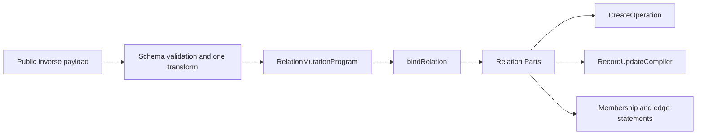

# Polymorphic Relations in VibORM

> **Revision 11 — 2026-08-22**
>
> This document describes the current implementation. There is no polymorphic
> factory: a variant target domain is what the ordinary `s.toOne` / `s.toMany`
> factories build when their argument is a MAP of named variants instead of one
> getter. Both cardinalities are shipped — a variant `s.toOne` is row-held and a
> variant `s.toMany` is junction-held — each with direct and inverse read and
> write surfaces. A variant inverse is a first-class `BoundRelation` in either
> shape: the row-held inverses use the same relation Parts and record compilers
> as their ordinary child-held counterparts, and the collection inverses use the
> ordinary junction owners in reverse orientation.
>
> **Implementation contracts:**
> [`polymorphic-relations-implementation-plan.md`](./polymorphic-relations-implementation-plan.md)
> for the row-held feature;
> [`../docs/architecture/polymorphic-cardinality-plan.md`](../docs/architecture/polymorphic-cardinality-plan.md)
> for the cardinality program (Packages A–F) that added the collection.

## 1. Verdict

VibORM models polymorphism as a typed polymorphic association, not as table
inheritance. Every target keeps its own independent table. There is no shared
base row or subtype hierarchy as there would be in multi-table inheritance (MTI).

Polymorphism here is a property of the TARGETS, never of the arity. How many
memberships a slot holds is a second, orthogonal choice, made by which factory
declares it — and it decides where the membership lives:

| Declaration | Slot | Membership storage |
|---|---|---|
| `s.toOne(map, options?)` | at most one membership | private `(type, identity)` pair on the owner row |
| `s.toMany(map, options?)` | a collection, variants freely mixed | one fixed-target member junction per variant |

Sections 2–16 describe the row-held shape; §17 describes the collection.

For example, a comment can point to either a post or a video without merging
post and video columns into one single-table-inheritance table:

```text
comments.commentable_type = "post"
comments.commentable_id   = "post_42"
```

The pair is one physical membership. Neither value is meaningful alone.

The query engine represents the feature with six distinct facts:

1. `VariantToOneRelation` / `VariantToManyRelation` are the public terminals a
   variant target domain reaches, through `s.toOne` / `s.toMany`.
2. The resolved carrier edge is the validated storage descriptor, a `kind`-tagged
   arm of `ResolvedRelationEdge`: `variantRowCarrier` owns the private
   `(type, identity)` columns, and `variantJunctionCarrier` owns one resolved
   member per variant, each carrying a complete `ResolvedJunctionTopology` and
   its own `inverseCardinality`.
3. A parsed `polymorphicTarget` / `polymorphicDisconnect` arm describes a direct
   payload that selected one target, or an optional direct disconnect.
4. `SelectedVariantRow` is the concrete direct target selected for one
   compilation.
5. `PolymorphicChildHeldRelation` is the bound topology of an inverse relation
   whose child owns the private pair.
6. `JunctionBoundRelation` with `membership.polymorphicMember` is the bound
   topology of a member junction, in either orientation and either arity —
   direct collection leaf, plural inverse view, or singular inverse slot.

The fifth fact is the important compression. Inverse reads, OwnWrite analysis,
and inverse mutation emitters no longer rediscover a special inverse binding.
They consume one bound relation and one exact membership rule.

## 2. Public schema model

### 2.1 Direct relation

```ts
const comment = s.model({
  id: s.string().id().ulid(),
  body: s.string(),
  commentable: s
    .toOne({
      post: () => post,
      video: () => video,
    })
    .name("commentableTarget"),
});
```

The factory you call IS the cardinality; the map argument is what makes the
target domain variant. A map needs literal keys and at least one entry — an empty
map, a string index signature, and a value that is neither a map nor a getter are
each refused at the type level and again at construction.

Both cardinalities are implemented end to end. A variant `s.toOne` stores its
membership as a private `(type, id)` pair on the owner row. A variant `s.toMany`
stores each variant's memberships in one member junction table (default name
`<owner_table>_<relation>_<variant>`, composite primary key over both sides,
reverse index, cascading foreign keys on both sides, and a unique target side for
any variant whose inverse is a singular slot), and builds all six
operation-schema families over it: filter, select/include, create, update,
orderBy and count. §17 below covers the collection surface.

The target-map key is the public discriminator used by query inputs and result
narrowing. Every target is a lazy getter so recursive model declarations remain
safe.

The second argument is optional. When omitted, each stored discriminator is its
public key:

```ts
s.toOne({ post: () => post, video: () => video });
// stored values: "post" and "video"
```

An explicit complete map is useful when storage values must survive public API
renames:

```ts
s.toOne(
  { post: () => post, video: () => video },
  {
    values: {
      post: "content.post.v1",
      video: "content.video.v1",
    },
  }
);
```

When `values` is present, it must contain every target key and no extra key.
Partial override plus implicit fallback is deliberately not supported.

An optional direct relation uses the normal immutable modifier, which only a
row-held variant carrier offers — it IS the nullability of the private pair, and
no other relation shape has one:

```ts
commentable: s
  .toOne({ post: () => post, video: () => video })
  .name("commentableTarget")
  .optional()
```

### 2.2 Inverse relation

An inverse is an ordinary declaration — the same two factories, one model target,
and NO `.fields(...)`, because the carrier already stores the membership. Which
storage it reads follows from the carrier it pairs with: a slot bound to a
row-held carrier reads the owner's private pair, and a slot bound to a
junction-held carrier reads that variant's member junction (§17.2). Cardinality
is the inverse slot's own: a collection is plural, a singular slot is singular.

The row-held inverse is declared as an ordinary `s.toMany` when a target owns
several children:

```ts
const post = s.model({
  id: s.string().id().ulid(),
  comments: s.toMany(() => comment).name("commentableTarget"),
});
```

`.name()` is a relation-pairing label, not the model field key. The direct and
inverse relations use the same label when the child has multiple candidate
polymorphic relations. With one unambiguous owner, VibORM can infer the pair.

An inverse is valid only when the source model identifies exactly one target
member of the selected polymorphic relation. Two public discriminator keys may
target the same model for direct-only use, but that shape cannot provide an
unambiguous inverse.

A storage-less `s.toOne` declares a singular inverse:

```ts
const post = s.model({
  id: s.string().id().ulid(),
  featuredComment: s
    .toOne(() => comment)
    .name("commentableTarget"),
});
```

Because this side stores no membership columns, it is DERIVED zero-or-one — there
is nothing to declare and nothing that can disagree. That is slot cardinality,
not permission to clear required child storage.

Inverse cardinality belongs to the complete private storage pair. All declared
inverses must agree; mixing singular and plural inverses over one carrier fails
schema validation with `P012`, because one composite index serves the whole
carrier. Missing inverses for some variants are allowed, but the resolved
cardinality still applies to those discriminators. A `toOne` that DOES declare
`.fields(...)` is an ordinary FK relation.

### 2.3 Model-field taxonomy

A model field is a scalar or a relation. There is no third category:

```ts
type AnyModelField = Scalar | AnyRelation;
```

A variant target is one arm of the ONE relation-state union, and a model stores
ONE canonical relation map. What separates a variant slot from a model-target one
is its `target.kind`, read where a consumer actually needs the distinction —
select, filter, mutation and result builders each split on the target domain at
the one point their own shape depends on it, and nowhere else.

## 3. Public reads

### 3.1 Result shape

A direct result is a discriminated union:

```ts
type Commentable =
  | { type: "post"; data: Post }
  | { type: "video"; data: Video };
```

An optional relation returns `Commentable | null`. A required relation remains
non-null in the public type. Missing required targets and corrupt private pairs
are integrity errors.

### 3.2 Include and selection

```ts
await orm.comment.findMany({
  include: {
    commentable: {
      post: { select: { id: true, title: true } },
      video: { include: { channel: true } },
    },
  },
});
```

The object configures each variant's projection; it does not filter variants.
An omitted configured variant uses its normal default scalar projection.

Inverse include, relation filters, and relation count follow the inverse slot's
own declared cardinality, except that their membership predicate also fixes the
stored discriminator.

### 3.3 Direct filters

Target-specific direct filters select the target schema with `type` before
parsing `is` or `isNot`:

```ts
where: {
  commentable: {
    type: "post",
    is: { title: { contains: "TypeScript" } },
  },
}
```

Supported forms are:

```ts
commentable: null
commentable: { is: null }
commentable: { isNot: null }
commentable: { type: "post" }
commentable: { type: "post", is: { ...postWhere } }
commentable: { type: "post", isNot: { ...postWhere } }
```

The three null-presence forms are available only for optional storage. They
inspect whether both private columns are null or non-null; they do not join a
target table. `is` and `isNot` are mutually exclusive. Apart from presence,
VibORM does not provide an untyped search across every target schema.

## 4. Direct writes

A row-held direct relation stores one membership on its owner. With a plural
inverse, it is the variant equivalent of an ordinary parent-held singular slot:
many owners may select the same target, while each owner stores at most one
`(type, identity)` pair. With a singular inverse, the direct API is unchanged but
the composite pair is unique, so at most one owner may select an exact target.

### Create

```ts
commentable: {
  connect: { type: "post", where: { id: "post_42" } },
}
```

or:

```ts
commentable: {
  create: { type: "post", data: { title: "New post" } },
}
```

Create also supports `connectOrCreate`:

```ts
commentable: {
  connectOrCreate: {
    type: "post",
    where: { slug: "hello" },
    create: { slug: "hello", title: "Hello" },
  },
}
```

The payload is an exact one-intent union. It cannot select two targets or mix
`connect` and `create`.

### Update

```ts
commentable: {
  connect: { type: "video", where: { id: "video_7" } },
}
```

Optional storage also supports:

```ts
commentable: { disconnect: true }
```

A selected-owner update supports `connect`, `create`, `connectOrCreate`,
correlated `update`, and `upsert`. Optional storage also supports `disconnect`
and typed target `delete`. `update` and `delete` require the owner's current
stored discriminator to match the requested type. `upsert` updates an existing
same-type target; an empty, missing, or different-type membership creates and
binds the requested target. The direct edge is to-one, so collection-style
`set` does not apply.

## 5. Inverse write surface

A plural inverse now has the safe ordinary child-held mutation family.

### 5.1 Create-family payload

The relation payload supports:

- `create`
- nested `createMany` (scalar-only rows keep the grouped fast path;
  relation-bearing rows compose as an ordered record series)
- `connect`
- `connectOrCreate`
- `upsert`

### 5.2 Update-family payload

The relation payload supports:

- `create`
- nested `createMany` (scalar-only rows keep the grouped fast path;
  relation-bearing rows compose as an ordered record series)
- `connect`
- `connectOrCreate`
- `update`
- `updateMany`
- `delete`
- `deleteMany`
- `upsert`
- `disconnect` when the owning direct polymorphic relation is optional
- `set` for optional and required membership alike; required membership uses the
  departing-member guard, so `set: []` succeeds only when already empty

The nested create and update records omit the direct polymorphic relation key
that owns this inverse. The enclosing inverse relation already supplies that
edge, so a child cannot specify the same membership twice.

### 5.3 Operation semantics

The inverse semantics match an ordinary child-held collection, with one extra
discriminator condition:

- `create` creates a child and writes both private columns atomically.
- `createMany` applies one shared `(type, identity)` assignment to every scalar
  row while preserving row order, grouping, destination casts, and
  `skipDuplicates` behavior.
- `connect` globally locates the target and adopts it into this membership.
- `connectOrCreate` globally locates and adopts, or creates. Duplicate inputs
  keep first-create-wins behavior.
- `upsert` under a fresh parent uses global-adopt semantics because no child can
  already belong to a parent that did not exist.
- `upsert` under a selected parent is correlated. A found target must already
  carry this exact membership; a foreign member produces the existing V7001
  failure and no effects.
- `update` and `delete` require both the selector and exact membership.
- `updateMany` and `deleteMany` add exact membership to every affected-row
  predicate, including capped primary-key subqueries.
- `disconnect` clears both private columns in one assignment.
- `set` adopts selected rows and clears both columns on departing rows when the
  membership is optional. Required membership rejects clearing but permits a
  retaining `set`; `set: []` on required membership succeeds only when the
  collection is already empty.

Found selected updates address the captured primary key, not the original
selector. Relation-bearing updates recurse through `RecordUpdateCompiler`.
Untaken upsert arms do not bind topology, analyze OwnWrite, compile SQL, or emit
effects.

### 5.4 Nested `createMany`

Nested inverse `createMany` rows use the same projected create schema as
`create`: the query engine keeps scalar-only rows on its grouped fast path and
composes relation-bearing rows as an ordered record series. It is possible
because the enclosing inverse supplies exactly one required polymorphic
relation.

It remains unavailable when the child has another unsatisfied required
polymorphic relation. VibORM rejects that shape at the operation-schema
boundary instead of deferring a private-column `NOT NULL` error to the
database.

Root `createMany` rows accept the ordinary create data shape; the direct
polymorphic membership itself stays connect-only. Each membership supplies a
complete target selector. VibORM groups target lookups by relation and
discriminator; scalar-only rows keep the existing grouped bulk INSERT plan
while relation-bearing rows route through the ordered record-series owner. It
does not run one target query per row. A driver without
`RETURNING` refuses the combination of `select`, `skipDuplicates`, and a
polymorphic membership because it cannot observe which attempted rows were
inserted after the target-resolution reads.

### 5.5 Singular inverse surface

A singular inverse returns one target or `null`. Its create payload supports
`create`, `connect`, and `connectOrCreate`. Its update payload additionally
supports correlated `update` and `upsert`. `delete` is always available because
the inverse slot is optional; `disconnect` requires optional direct storage so
the child membership can be cleared. Plural operations are not exposed.

The singular path reuses ordinary child-held-to-one selection and record
compilation. Exact polymorphic membership still owns the discriminator and
identity predicate. A relation-wide unique composite storage index prevents a
second owner from occupying the same exact target slot.

## 6. Bound inverse topology

The inverse relation is bound once at the first topology decision:

```ts
interface BoundPolymorphicChildHeldRelation extends BoundForeignKeyRelation {
  readonly foreignFields: readonly [string];
  readonly referencedFields: readonly [string];
  readonly storage: ResolvedVariantRowStorage;
  readonly storedType: string;
}

interface PolymorphicChildHeldToOne
  extends BoundPolymorphicChildHeldRelation {
  readonly kind: "polymorphicChildHeldToOne";
}

interface PolymorphicChildHeldToMany
  extends BoundPolymorphicChildHeldRelation {
  readonly kind: "polymorphicChildHeldToMany";
}
```

For both variants:

```text
foreignFields     = [storage.idColumn.name]
referencedFields  = [sourceReferencedField]
onUpdate          = undefined
```

The fixed discriminator is topology metadata because an inverse field always
means one selected member of the direct polymorphic relation. Runtime parent
identities, planning references, SQL aliases, branch state, and transition
values remain outside `BoundRelation`.

`bindRelation()` classifies relations in this order:

1. junction;
2. direct parent-held ordinary FK;
3. resolved polymorphic inverse;
4. ordinary child-held to-one;
5. ordinary child-held to-many.

Direct polymorphic payloads remain separate. Their discriminator is chosen by
each payload, not fixed by an inverse field.

## 7. Exact physical membership

An inverse membership is not identity alone. It is:

```text
child.identity_column = parent.referenced_value
AND child.type_column = fixed_stored_discriminator
```

The query engine has one analytical membership scope for this fact:

```ts
{
  kind: "polymorphicForeignKey";
  holder: Model<any>;
  referenced: Model<any>;
  typeField: string;
  storedType: string;
  identityField: string;
  referencedField: string;
}
```

Scope equality includes the type field and stored value. A post membership with
identity `42` and a video membership with identity `42` are different facts.
OwnWrite dependency analysis therefore cannot confuse them.

One predicate builder owns the SQL correlation:

```ts
buildPolymorphicMembershipPredicate(
  ctx,
  relation,
  childQualifier,
  parentIdentity
)
```

It emits the identity conjunct first and the discriminator conjunct second.
Read correlation, membership probes, guarded writes, bulk rewrites, and set
departing-row reads all consume that same predicate. Individual mutation verbs
do not rebuild it.

The SQL qualifier and the parent-identity source are independent facts. Reads
may use a child alias while a mutation predicate uses the physical table name;
both still resolve the parent value from the correct planning or final source.

## 8. Compiler ownership

The mutation flow is:



Ownership is precise:

- `RelationMutationProgram` describes what the user requested.
- The bound polymorphic child-held variant describes where membership is stored
  and whether the public inverse is singular or plural.
- Relation Parts own probes, membership, found/missing decisions, guards, race
  pins, and standalone edge writes.
- `CreateOperation` owns fresh child subtrees and receives one
  `incomingPolymorphicStorage` assignment.
- `RecordUpdateCompiler` owns selected child updates and receives the captured
  target identity.
- neutral statement builders accept internal prebuilt predicates or
  polymorphic storage values; private fields never enter public `where` or
  `data` objects.

There is no polymorphic mutation Part, runtime branch step, adapter protocol,
strategy object, or extra round trip.

## 9. Private storage contract

For a required relation, the logical storage is:

```sql
commentable_type <portable text> NOT NULL
commentable_id   <compatible target-id type> NOT NULL
```

For an optional relation both columns are nullable. VibORM always writes or
clears them together.

Generated names are:

```text
type column: <relationField>_type
id column:   <relationField>_id
index:       <mappedOwnerTable>_<relationField>_poly_idx
```

Every relation receives a composite `(type, id)` index. The columns remain
private relation storage: they are absent from public create/update data,
default selects, scalar filters, ordering, and model result types.

There is no database foreign key across the possible target tables. The
database cannot express “this identity references one of these tables selected
by this discriminator” as one portable FK.

## 10. Identity transitions and referential actions

Polymorphic storage has no database FK, so `onUpdate` and `onDelete` are not
emulated by this implementation.

When a parent referenced value changes inside one mutation tree:

- membership and removal reads use the pre-transition value;
- create and adoption writes use the transitioned value and occur after the
  parent update when required;
- `set` reads departing members with the old value and adopts selected members
  with the new value;
- untouched existing memberships are not rewritten.

The last rule is deliberate. Without referential-action emulation, changing a
referenced parent value can leave untouched existing children pointing at the
old value. Applications that need cascade semantics must update those
memberships explicitly.

## 11. Strict result and integrity behavior

The result parser reads the stored discriminator, selects the exact target
shape, and validates that target result. It does not parse a polymorphic result
through an ordinary one-target relation shape.

The implemented orphan contract is:

- optional empty storage → `null`;
- optional or required known type with a missing target → query-engine
  integrity error;
- unknown stored type → integrity error;
- half-null `(type, identity)` storage → integrity error.

Externally written corrupt pairs are therefore visible failures, not plausible
empty objects.

## 12. Validation and migration contract

Definition validation owns:

- non-empty target maps;
- exact and unique stored values;
- lazy target resolution;
- compatible single-column target identities on a `toOne` group, and complete
  owner/target row keys on a `toMany` group (`P018`, `P009` — no
  portable-representation check applies to a collection);
- inverse ambiguity (`R009`), an unanswered name claim (`R010`), and mixed
  inverse cardinalities over one carrier (`P012`);
- private-column and index naming/collisions, and member-junction physical
  names (`P019`);
- portable discriminator length and characters.

A `toOne` migration snapshot stores the public discriminator, stable stored
value, target table, and referenced column; a `toMany` snapshot stores the public
discriminator, stable stored value, target table, member junction table, and that
member's inverse cardinality. Structural DDL owns the private columns and index
on one side and the member junction tables on the other. Member-history
comparison owns data-bearing stored-value changes,
removals, retargeting, junction moves and cardinality flips. VibORM does not
invent data movement: those transitions are refused outright, and the only way
past a refusal is `GenerateOptions.manualMigration` — a complete caller-owned
`up` artifact plus an honest rollback policy (`{ kind: "manual", sql }` or
`{ kind: "irreversible", reason }`). Supplying it puts the whole migration in
manual mode: only those statements are emitted, and the policy is persisted on
the journal entry so rollback honours it.

## 13. Performance contract

Polymorphic reads preserve one-statement include behavior. Inverse writes add no
statement or round trip beyond the corresponding ordinary child-held operation.
In particular:

- nested `createMany` stays grouped rather than becoming N record compilers;
- update/delete bulk limits keep the membership predicate inside their PK
  subquery;
- direct `RETURNING`, `ON CONFLICT`, CTE, planning-batch, and atomic-batch folds
  remain available;
- no metadata is resolved per returned row;
- no adapter-specific SQL is generated by the query engine.

## 14. Implemented inverse operation surface

The first implementation exposed inverse nested `create` only. That boundary
is gone. A bound plural inverse now uses the ordinary child-held relation
owners for create, grouped createMany, adoption, targeted and bulk updates and
deletes, connectOrCreate, and upsert. Optional storage also supports disconnect
and set. Every one of these paths treats `(type, identity)` as one exact
membership.

A bound singular inverse uses the same exact membership owner and the ordinary
child-held-to-one relation Parts. Its relation-wide unique index supplies the
occupied-slot guarantee without adding an execution branch or database round
trip.

## 15. Constraints

The following remain outside the implemented surface. Every one of them is a
property of the ROW-HELD storage — one shared `_id` column, and no database
foreign key that can leave it — so §17's collection is not subject to them:

- a to-one slot's target identities must be one scalar field, share one portable
  `string`, `int`, or `bigint` representation, and use no native type override;
- inverse binding when one target map names the same model more than once;
- the direct row-held membership in root `createMany` rows stays connect-only,
  while the rest of each row accepts the ordinary create data shape;
- database FK constraints across target tables and ORM-emulated referential
  actions for row-held storage;
- untyped filters across all targets, and order-by through a direct polymorphic
  target of either cardinality (the target model is chosen per row, so there is
  no single column to sort by);
- explicit `_count` through a row-held to-one target, which has no list to count.

These are separate product or storage decisions, not gaps in membership
modeling.

## 16. Ownership map

| Fact | Owner |
|---|---|
| Public targets and stored discriminator values | `src/schema/relation/polymorphic.ts` |
| Private `(type, identity)` storage | the `variantRowCarrier` edge in `schema/validation/relation-resolution.ts` |
| Direct payload-selected target | the parsed `polymorphicTarget` arm / `SelectedVariantRow` |
| Inverse fixed topology | `PolymorphicChildHeldRelation` in `relation-data-builder.ts` |
| Exact membership scope | `RelationMembership.ts` |
| Exact SQL membership predicate | `builders/correlation-utils.ts` |
| User mutation meaning | `RelationMutationProgram` |
| Fresh child subtree | `CreateOperation` |
| Selected child update | `RecordUpdateCompiler` |
| Probes, guards, pins, adoption, and standalone edge writes | Existing relation Parts |
| Private-value SQL lowering | `PolymorphicStorageValue` and neutral statement builders |
| Strict target-specific result parsing | Existing result-shape parser boundary |
| Snapshot member history | Polymorphic migration-history owner |
| Member-junction topology resolution | `src/schema/relation/junction-topology.ts` |
| Direct collection read composition | `builders/polymorphic-read-builder.ts` |
| Collection quantifier lowering | `builders/polymorphic-collection-filter-builder.ts` |
| Direct collection write coordination | `write-engine/PolymorphicCollectionPart.ts` |
| Singular collection inverse lowering | `write-engine/RelationJunctionToOnePart.ts` |
| Singular member slot replacement | `write-engine/junction-singular-transfer.ts` |
| Junction SQL for every orientation and arity | `JunctionStatements.ts` |

## 17. Polymorphic collections

A variant `s.toMany` slot holds several memberships that may mix variants. The
design rule for the whole feature is that it adds **coordination**, never a
second junction DML owner, never a new relation-kind cross-product, and never a
polymorphic scheduler.

### 17.1 Storage

One fixed-target junction per variant, resolved once by the schema-wide topology
owner and stored on the `variantJunctionCarrier` edge. Each member table carries a composite
primary key over both complete sides, one index over the second side, two
cascading foreign keys, and — for a variant whose inverse is singular — a
`UNIQUE` over the complete TARGET side.

The single heterogeneous junction was rejected deliberately: it could not carry
real foreign keys, which is what makes the database rather than the ORM the
enforcer of membership here.

`.through()` is an exact map keyed by public variant, `{ table, source, target }`
per entry, exact at the type level and again at construction — an extra key, a
missing variant, or an extra entry key is refused at the call that wrote it.

### 17.2 Inverse cardinality is per member

Unlike a row-held carrier's relation-wide inverse cardinality, each collection
member carries its own: `"one"` for a bound singular slot, `"many"` for a bound
collection, `"many"` when unbound. Two slots on one target claiming the same
variant are ambiguous (`R009`). The half-pair a member view could otherwise leave
behind is unconstructible rather than refused: one resolved slot carries exactly
one edge, so a slot bound to a carrier member is not also an ordinary junction
endpoint.

A singular inverse needs no extra declaration to be emptiable. Its membership is
one member-junction row and deleting that row clears it, so `disconnect` is
unconditional — there is no shape here that can be filled and never emptied.

### 17.3 Public surface

Reads are an envelope of exactly two keys — `only` (deduped and canonicalized
into declaration order at parse) and `variants` (one ordinary to-many node per
discriminator) — or bare `true` / `false`. The result is always an array, never
nullable; `only: []` yields `readonly never[]` and a fresh empty array.

Filters are `{ some | every | none }` over the same tagged predicate the to-one
filter uses, with no null-presence arm. `_count` accepts `true` or a filtered
form taking that same predicate, and `orderBy: { rel: { _count } }` sorts on the
same summed expression.

Writes are a keyed bag, every verb accepting one tagged item or an array. A fresh
owner names four supply verbs; a located owner names all eleven. `upsert` is
absent from the create bag because its found arm is scoped to this owner's
membership and a fresh owner has none.

### 17.4 Execution

`PolymorphicCollectionPart` returns exactly one `Part` so the `set` clear-all
barrier can be expressed at all, and owns only four relation-wide facts: the
barrier, cross-verb/cross-variant ordering, the single owner-row publication, and
an empty cache footprint. `set` is lowered into a connect-shaped insert run plus
the coordinator's own barrier, leaving ordinary junction `set` byte-identical.
The one shape a batch could split between clear and refill is refused at
construction, before any effect.

A membership-adding write on a singular member is a slot REPLACEMENT, executed by
`transferSingularJunctionMembership`: one capture read, then one write sequence
identical on both substrates — `forUpdate` plus the row lock as premise inside a
transaction, an in-batch CAS with no unenforceable postcondition in a native
atomic batch. A freshly created target is proven empty structurally, so its
capture is elided.

Root `createMany` dispatches on cardinality in `routing.ts`: a row-held `connect`
stays on the pinned grouped INSERT, a collection key routes the whole call to the
ordered record series. A skipped root contributes neither a key nor nested
effects.

### 17.5 Migration

Member tables are emitted from the same descriptor the engine binds. History is
compared per variant, keyed by the stable stored value. A public rename with
stable stored value and target is metadata-only; a stored-value change, member
removal, retarget, junction move, or cardinality flip is data-bearing and refused
outright (`V11010`) unless a complete caller-owned `manualMigration` artifact
with an honest rollback policy is supplied.

## 18. References

- [Implementation contract](./polymorphic-relations-implementation-plan.md)
- [Query-engine compression audit](../docs/architecture/engine-compression-audit.md)
- [Query performance plan](../docs/architecture/query-performance-plan.md)
- [Public polymorphic relation guide](../docs/content/docs/schema/relations/polymorphic.mdx)
