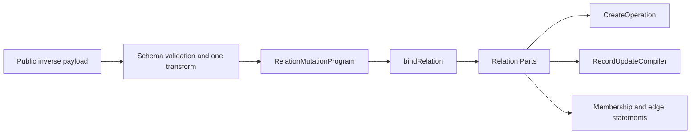

# Polymorphic Relations in VibORM

> **Revision 6 — 2026-08-08**
>
> This document describes the current implementation. A polymorphic inverse is
> now a first-class `BoundRelation`, and inverse `oneToMany` writes use the same
> relation Parts and record compilers as ordinary child-held relations.
>
> **Implementation contract:**
> [`polymorphic-relations-implementation-plan.md`](./polymorphic-relations-implementation-plan.md)

## 1. Verdict

VibORM models polymorphism as a typed polymorphic association, not as table
inheritance. Every target keeps its own independent table, while the record
that owns the polymorphic relation stores a discriminator and one compatible
target identity. There is no shared base row or subtype hierarchy as there
would be in multi-table inheritance (MTI).

For example, a comment can point to either a post or a video without merging
post and video columns into one single-table-inheritance table:

```text
comments.commentable_type = "post"
comments.commentable_id   = "post_42"
```

The pair is one physical membership. Neither value is meaningful alone.

The query engine represents the feature with five distinct facts:

1. `PolymorphicRelation` is the public multi-target schema relation.
2. `PolymorphicStorage` owns the private `(type, identity)` columns.
3. `ResolvedPolymorphicMutation` describes a direct payload that selected one
   target, or an optional direct disconnect.
4. `ResolvedPolymorphicEdge` is the concrete direct target selected for one
   compilation.
5. `PolymorphicChildHeldToMany` is the bound topology of an inverse relation
   whose child owns the private pair.

The fifth fact is the important compression. Inverse reads, OwnWrite analysis,
and inverse mutation emitters no longer rediscover a special inverse binding.
They consume one bound relation and one exact membership rule.

## 2. Public schema model

### 2.1 Direct relation

```ts
const comment = s.model({
  id: s.string().id().ulid(),
  body: s.string(),
  commentable: s
    .polymorphic({
      post: () => post,
      video: () => video,
    })
    .name("commentableTarget"),
});
```

The target-map key is the public discriminator used by query inputs and result
narrowing. Every target is a lazy getter so recursive model declarations remain
safe.

The second argument is optional. When omitted, each stored discriminator is its
public key:

```ts
s.polymorphic({ post: () => post, video: () => video });
// stored values: "post" and "video"
```

An explicit complete map is useful when storage values must survive public API
renames:

```ts
s.polymorphic(
  { post: () => post, video: () => video },
  {
    values: {
      post: "content.post.v1",
      video: "content.video.v1",
    },
  }
);
```

When `values` is present, it must contain every target key and no extra key.
Partial override plus implicit fallback is deliberately not supported.

An optional direct relation uses the normal immutable modifier:

```ts
commentable: s
  .polymorphic({ post: () => post, video: () => video })
  .name("commentableTarget")
  .optional()
```

### 2.2 Inverse relation

The inverse is declared as an ordinary `oneToMany` relation:

```ts
const post = s.model({
  id: s.string().id().ulid(),
  comments: s.oneToMany(() => comment).name("commentableTarget"),
});
```

`.name()` is a relation-pairing label, not the model field key. The direct and
inverse relations use the same label when the child has multiple candidate
polymorphic relations. With one unambiguous owner, VibORM can infer the pair.

An inverse is valid only when the source model identifies exactly one target
member of the selected polymorphic relation. Two public discriminator keys may
target the same model for direct-only use, but that shape cannot provide an
unambiguous inverse.

Inverse `oneToOne` is not supported. Portable uniqueness across a discriminator
and several target tables needs a separate design.

### 2.3 Model-field taxonomy

Polymorphic relations are a third model-field category. They are not ordinary
relations with a disguised getter:

```ts
type AnyModelField = Scalar | AnyRelation | AnyPolymorphicRelation;
```

They stay outside `AnyRelation` and ordinary `RelationType` because those types
promise exactly one target model and one ordinary FK topology. Public select,
filter, mutation, and result builders compose the ordinary and polymorphic maps
only at boundaries that support both.

## 3. Public reads

### 3.1 Result shape

A direct result is a discriminated union:

```ts
type Commentable =
  | { type: "post"; data: Post }
  | { type: "video"; data: Video };
```

An optional relation returns `Commentable | null`. A required relation remains
non-null in the public type. Missing required targets and corrupt private pairs
are integrity errors.

### 3.2 Include and selection

```ts
await orm.comment.findMany({
  include: {
    commentable: {
      post: { select: { id: true, title: true } },
      video: { include: { channel: true } },
    },
  },
});
```

The object configures each variant's projection; it does not filter variants.
An omitted configured variant uses its normal default scalar projection.

Inverse include, relation filters, and relation count behave like ordinary
`oneToMany` reads, except that their membership predicate also fixes the stored
discriminator.

### 3.3 Direct filters

Direct filters select the target schema with `type` before parsing `is` or
`isNot`:

```ts
where: {
  commentable: {
    type: "post",
    is: { title: { contains: "TypeScript" } },
  },
}
```

Supported forms are:

```ts
commentable: null
commentable: { type: "post" }
commentable: { type: "post", is: { ...postWhere } }
commentable: { type: "post", isNot: { ...postWhere } }
```

The bare `null` form is available only for optional storage. `is` and `isNot`
are mutually exclusive. VibORM does not provide an untyped search across every
target schema.

## 4. Direct writes

The direct relation stores one membership on its owner. With an inverse
`oneToMany`, it is the polymorphic equivalent of an ordinary parent-held
`manyToOne`: many owners may select the same target, while each owner stores at
most one `(type, identity)` pair.

### Create

```ts
commentable: {
  connect: { type: "post", where: { id: "post_42" } },
}
```

or:

```ts
commentable: {
  create: { type: "post", data: { title: "New post" } },
}
```

Create also supports `connectOrCreate`:

```ts
commentable: {
  connectOrCreate: {
    type: "post",
    where: { slug: "hello" },
    create: { slug: "hello", title: "Hello" },
  },
}
```

The payload is an exact one-intent union. It cannot select two targets or mix
`connect` and `create`.

### Update

```ts
commentable: {
  connect: { type: "video", where: { id: "video_7" } },
}
```

Optional storage also supports:

```ts
commentable: { disconnect: true }
```

A selected-owner update supports `connect`, `create`, `connectOrCreate`,
correlated `update`, and `upsert`. Optional storage also supports `disconnect`
and typed target `delete`. `update` and `delete` require the owner's current
stored discriminator to match the requested type. `upsert` updates an existing
same-type target; an empty, missing, or different-type membership creates and
binds the requested target. The direct edge is to-one, so collection-style
`set` does not apply.

## 5. Inverse write surface

An inverse `oneToMany` relation now has the safe ordinary child-held mutation
family.

### 5.1 Create-family payload

The relation payload supports:

- `create`
- scalar-only nested `createMany`
- `connect`
- `connectOrCreate`
- `upsert`

### 5.2 Update-family payload

The relation payload supports:

- `create`
- scalar-only nested `createMany`
- `connect`
- `connectOrCreate`
- `update`
- `updateMany`
- `delete`
- `deleteMany`
- `upsert`
- `disconnect` when the owning direct polymorphic relation is optional
- `set` when the owning direct polymorphic relation is optional

The nested create and update records omit the direct polymorphic relation key
that owns this inverse. The enclosing inverse relation already supplies that
edge, so a child cannot specify the same membership twice.

### 5.3 Operation semantics

The inverse semantics match ordinary child-held `oneToMany` relations, with one
extra discriminator condition:

- `create` creates a child and writes both private columns atomically.
- `createMany` applies one shared `(type, identity)` assignment to every scalar
  row while preserving row order, grouping, destination casts, and
  `skipDuplicates` behavior.
- `connect` globally locates the target and adopts it into this membership.
- `connectOrCreate` globally locates and adopts, or creates. Duplicate inputs
  keep first-create-wins behavior.
- `upsert` under a fresh parent uses global-adopt semantics because no child can
  already belong to a parent that did not exist.
- `upsert` under a selected parent is correlated. A found target must already
  carry this exact membership; a foreign member produces the existing V7001
  failure and no effects.
- `update` and `delete` require both the selector and exact membership.
- `updateMany` and `deleteMany` add exact membership to every affected-row
  predicate, including capped primary-key subqueries.
- `disconnect` clears both private columns in one assignment.
- `set` adopts selected rows and clears both columns on departing rows.
  `set: []` disconnects every current member.

Found selected updates address the captured primary key, not the original
selector. Relation-bearing updates recurse through `RecordUpdateCompiler`.
Untaken upsert arms do not bind topology, analyze OwnWrite, compile SQL, or emit
effects.

### 5.4 Nested `createMany`

Nested inverse `createMany` remains scalar-only. It is possible because the
enclosing inverse supplies exactly one required polymorphic relation.

It remains unavailable when the child has another unsatisfied required
polymorphic relation. VibORM rejects that shape at the operation-schema
boundary instead of deferring a private-column `NOT NULL` error to the
database.

Root `createMany` accepts scalar row data plus connect-only direct polymorphic
memberships. Each row supplies a complete target selector. VibORM groups target
lookups by relation and discriminator, then keeps the existing grouped bulk
INSERT plan. It does not run one target query per row. Nested create and the
other mutation verbs remain unavailable in root bulk rows. A driver without
`RETURNING` refuses the combination of `select`, `skipDuplicates`, and a
polymorphic membership because it cannot observe which attempted rows were
inserted after the target-resolution reads.

## 6. Bound inverse topology

The inverse relation is bound once at the first topology decision:

```ts
interface PolymorphicChildHeldToMany extends BoundForeignKeyRelation {
  readonly kind: "polymorphicChildHeldToMany";
  readonly foreignFields: readonly [string];
  readonly referencedFields: readonly [string];
  readonly storage: PolymorphicStorage;
  readonly storedType: string;
}
```

For this variant:

```text
foreignFields     = [storage.idColumn.name]
referencedFields  = [sourceReferencedField]
onUpdate          = undefined
```

The fixed discriminator is topology metadata because an inverse field always
means one selected member of the direct polymorphic relation. Runtime parent
identities, planning references, SQL aliases, branch state, and transition
values remain outside `BoundRelation`.

`bindRelation()` classifies relations in this order:

1. junction;
2. direct parent-held ordinary FK;
3. resolved polymorphic inverse;
4. ordinary child-held to-one;
5. ordinary child-held to-many.

Direct polymorphic payloads remain separate. Their discriminator is chosen by
each payload, not fixed by an inverse field.

## 7. Exact physical membership

An inverse membership is not identity alone. It is:

```text
child.identity_column = parent.referenced_value
AND child.type_column = fixed_stored_discriminator
```

The query engine has one analytical membership scope for this fact:

```ts
{
  kind: "polymorphicForeignKey";
  holder: Model<any>;
  referenced: Model<any>;
  typeField: string;
  storedType: string;
  identityField: string;
  referencedField: string;
}
```

Scope equality includes the type field and stored value. A post membership with
identity `42` and a video membership with identity `42` are different facts.
OwnWrite dependency analysis therefore cannot confuse them.

One predicate builder owns the SQL correlation:

```ts
buildPolymorphicMembershipPredicate(
  ctx,
  relation,
  childQualifier,
  parentIdentity
)
```

It emits the identity conjunct first and the discriminator conjunct second.
Read correlation, membership probes, guarded writes, bulk rewrites, and set
departing-row reads all consume that same predicate. Individual mutation verbs
do not rebuild it.

The SQL qualifier and the parent-identity source are independent facts. Reads
may use a child alias while a mutation predicate uses the physical table name;
both still resolve the parent value from the correct planning or final source.

## 8. Compiler ownership

The mutation flow is:



Ownership is precise:

- `RelationMutationProgram` describes what the user requested.
- `PolymorphicChildHeldToMany` describes where and how membership is stored.
- Relation Parts own probes, membership, found/missing decisions, guards, race
  pins, and standalone edge writes.
- `CreateOperation` owns fresh child subtrees and receives one
  `incomingPolymorphicStorage` assignment.
- `RecordUpdateCompiler` owns selected child updates and receives the captured
  target identity.
- neutral statement builders accept internal prebuilt predicates or
  polymorphic storage values; private fields never enter public `where` or
  `data` objects.

There is no polymorphic mutation Part, runtime branch step, adapter protocol,
strategy object, or extra round trip.

## 9. Private storage contract

For a required relation, the logical storage is:

```sql
commentable_type <portable text> NOT NULL
commentable_id   <compatible target-id type> NOT NULL
```

For an optional relation both columns are nullable. VibORM always writes or
clears them together.

Generated names are:

```text
type column: <relationField>_type
id column:   <relationField>_id
index:       <mappedOwnerTable>_<relationField>_poly_idx
```

Every relation receives a composite `(type, id)` index. The columns remain
private relation storage: they are absent from public create/update data,
default selects, scalar filters, ordering, and model result types.

There is no database foreign key across the possible target tables. The
database cannot express “this identity references one of these tables selected
by this discriminator” as one portable FK.

## 10. Identity transitions and referential actions

Polymorphic storage has no database FK, so `onUpdate` and `onDelete` are not
emulated by this implementation.

When a parent referenced value changes inside one mutation tree:

- membership and removal reads use the pre-transition value;
- create and adoption writes use the transitioned value and occur after the
  parent update when required;
- `set` reads departing members with the old value and adopts selected members
  with the new value;
- untouched existing memberships are not rewritten.

The last rule is deliberate. Without referential-action emulation, changing a
referenced parent value can leave untouched existing children pointing at the
old value. Applications that need cascade semantics must update those
memberships explicitly.

## 11. Strict result and integrity behavior

The result parser reads the stored discriminator, selects the exact target
shape, and validates that target result. It does not parse a polymorphic result
through an ordinary one-target relation shape.

The implemented orphan contract is:

- optional empty storage → `null`;
- optional known type with a missing target → `null`;
- required missing target → query-engine integrity error;
- unknown stored type → integrity error;
- half-null `(type, identity)` storage → integrity error.

Externally written corrupt pairs are therefore visible failures, not plausible
empty objects.

## 12. Validation and migration contract

Definition validation owns:

- non-empty target maps;
- exact and unique stored values;
- lazy target resolution;
- compatible single-column target identities;
- inverse ambiguity;
- private-column and index naming/collisions;
- portable discriminator length and characters.

Migration snapshots store the public discriminator, stable stored value,
target table, and referenced column. Structural DDL owns the private columns and
index. Member-history comparison owns destructive stored-value changes,
removals, and retargeting. Those history changes require explicit acknowledgement
after the application has migrated affected data; VibORM does not invent data
movement.

## 13. Performance contract

Polymorphic reads preserve one-statement include behavior. Inverse writes add no
statement or round trip beyond the corresponding ordinary child-held operation.
In particular:

- nested `createMany` stays grouped rather than becoming N record compilers;
- update/delete bulk limits keep the membership predicate inside their PK
  subquery;
- direct `RETURNING`, `ON CONFLICT`, CTE, planning-batch, and atomic-batch folds
  remain available;
- no metadata is resolved per returned row;
- no adapter-specific SQL is generated by the query engine.

## 14. Limits removed by inverse membership

The first implementation exposed inverse nested `create` only. That boundary
is gone. A bound inverse `oneToMany` now uses the ordinary child-held relation
owners for create, grouped createMany, adoption, targeted and bulk updates and
deletes, connectOrCreate, and upsert. Optional storage also supports disconnect
and set. Every one of these paths treats `(type, identity)` as one exact
membership.

## 15. Remaining limits

The following remain outside the implemented surface:

- target identities must be one scalar field, share one portable `string`,
  `int`, or `bigint` representation, and use no native type override;
- polymorphic many-to-many and inverse one-to-one;
- inverse binding when one target map names the same model more than once;
- root `createMany` supports connect-only memberships, not nested creates or
  other relation verbs;
- database FK constraints across target tables and ORM-emulated referential
  actions;
- untyped filters across all targets and order-by through a direct polymorphic
  target.

These are separate product or storage decisions, not gaps in inverse
`oneToMany` membership modeling.

A polymorphic one-to-one is physically possible: the owner keeps the same
single `(type, identity)` pair, and a uniqueness rule on that pair prevents a
second owner from selecting the target. The remaining work is schema syntax,
inverse cardinality, validation, and portable uniqueness behavior; the current
runtime intentionally exposes only the one-to-many inverse.

## 16. Ownership map

| Fact | Owner |
|---|---|
| Public targets and stored discriminator values | `src/schema/relation/polymorphic.ts` |
| Private `(type, identity)` storage | `PolymorphicStorage` |
| Direct payload-selected target | `ResolvedPolymorphicMutation` / `ResolvedPolymorphicEdge` |
| Inverse fixed topology | `PolymorphicChildHeldToMany` in `relation-data-builder.ts` |
| Exact membership scope | `RelationMembership.ts` |
| Exact SQL membership predicate | `builders/correlation-utils.ts` |
| User mutation meaning | `RelationMutationProgram` |
| Fresh child subtree | `CreateOperation` |
| Selected child update | `RecordUpdateCompiler` |
| Probes, guards, pins, adoption, and standalone edge writes | Existing relation Parts |
| Private-value SQL lowering | `PolymorphicStorageValue` and neutral statement builders |
| Strict target-specific result parsing | Existing result-shape parser boundary |
| Snapshot member history | Polymorphic migration-history owner |

## 17. References

- [Implementation contract](./polymorphic-relations-implementation-plan.md)
- [Query-engine compression audit](../docs/architecture/engine-compression-audit.md)
- [Query performance plan](../docs/architecture/query-performance-plan.md)
- [Public polymorphic relation guide](../docs/content/docs/schema/relations/polymorphic.mdx)
