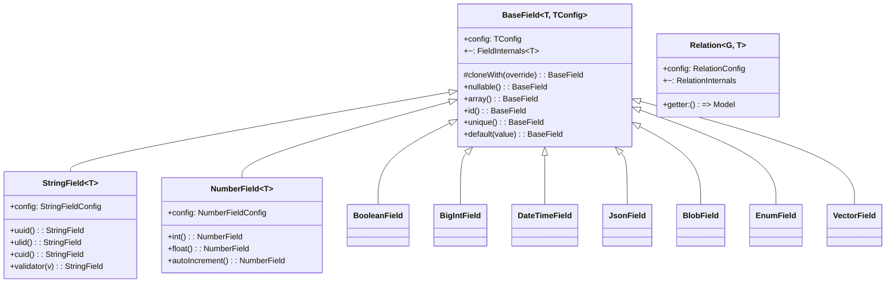
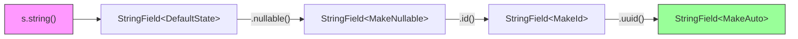
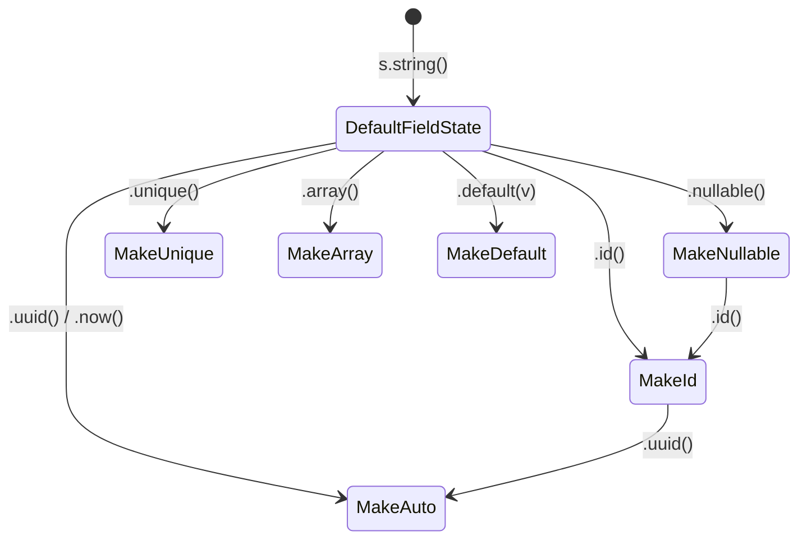
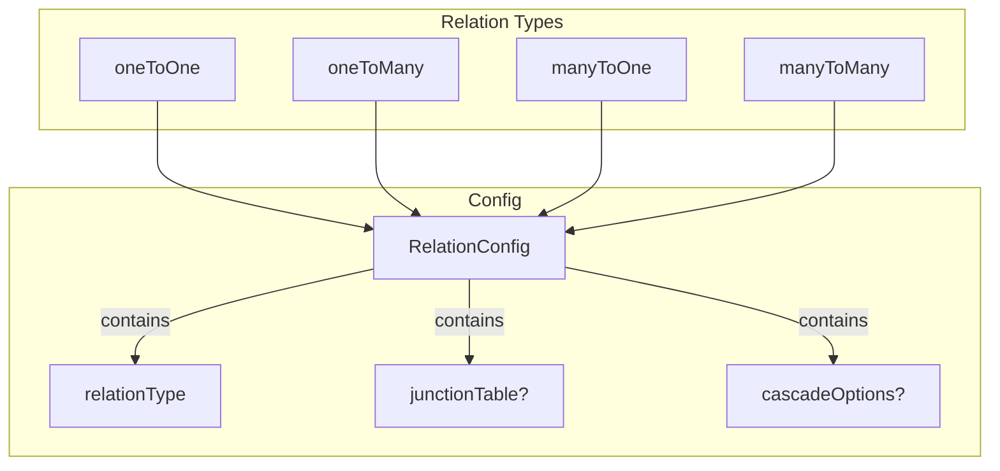
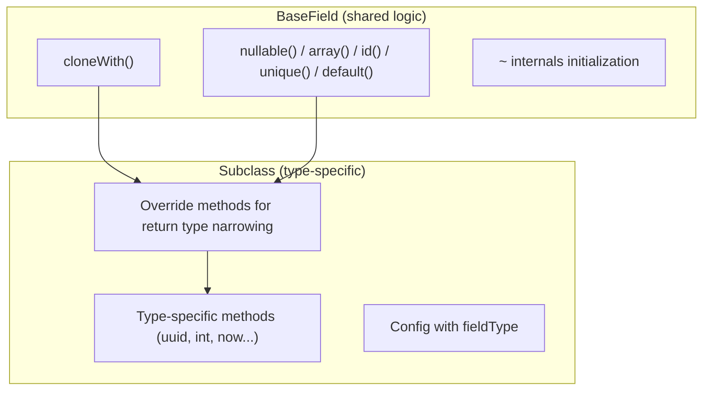

# Schema Architecture

VibORM uses a **config-based, type-safe schema system** where field definitions are immutable and chainable.

## Validation Library

VibORM includes a custom StandardSchema-compliant validation library. We built it because:

1. **Schema types = client types** - No separate generic type system to maintain
2. **Dynamic schema creation** - Validation schemas are built at runtime for each query based on the model definition and constraints. This requires **microsecond-level instantiation**, not milliseconds.

| Library | Issue |
|---------|-------|
| **ArkType** | Great recursive types, but heavy type system (slow IDE), eager thunk evaluation, 65-100x slower instantiation |
| **Valibot** | Has `lazy()` for deferred evaluation, but type inference breaks for circular refs |
| **Zod** | Extremely heavy: 85-795x slower instantiation, heavy compile-time types, poor recursive handling |

Our solution:
- **Microsecond instantiation** - 85-795x faster than Zod, 65-100x faster than ArkType
- **Lightweight type system** - Fast TypeScript compilation and IDE responsiveness
- **Thunks with lazy evaluation** - Like Valibot's `lazy()`, but with correct type preservation
- **Fail-fast validation** - 114x faster error paths than Zod

See [Validation Library docs](/docs/internals/validation) for implementation details.

## Core Concepts



## Two Namespaces: `config` vs `~`

Each field has two property namespaces:

| Namespace | Purpose | Example |
|-----------|---------|---------|
| `config` | Runtime configuration (serializable) | `field.config.isOptional`, `field.config.fieldType` |
| `~` | Type inference & validators (lazy) | `field["~"].infer`, `field["~"].createValidator` |

```typescript
const email = s.string().nullable();

// Config (runtime values)
email.config.fieldType   // "string"
email.config.isOptional  // true

// Internals (type-level + validators)
email["~"].infer         // string | null (TypeScript type)
email["~"].schemas.base["~standard"].validate("test@example.com")  // Validation
```

## Chainable API Flow



Each method returns a **new instance** with updated config and transformed generic type `T`:

```typescript
// Each call creates a new instance via cloneWith()
const field = s.string()      // StringField<DefaultFieldState<string>>
  .nullable()                  // StringField<MakeNullable<...>>
  .id()                        // StringField<MakeId<...>>
  .uuid();                     // StringField<MakeAuto<..., "uuid">>
```

## Type State Machine

The generic `T` tracks field state through type transformations:



```typescript
// FieldState tracks 6 dimensions:
interface FieldState<
  BaseType,      // string, number, Date, etc.
  IsNullable,    // true | false
  IsArray,       // true | false  
  IsId,          // true | false
  IsUnique,      // true | false
  HasDefault     // true | false
> { ... }
```

## Relations



```typescript
const user = s.model("user", {
  id: s.string().id().uuid(),
  posts: s.relation.oneToMany(() => post),
  profile: s.relation.oneToOne(() => profile),
});

const post = s.model("post", {
  id: s.string().id().uuid(),
  author: s.relation.manyToOne(() => user),
  tags: s.relation.manyToMany(() => tag),
});
```

## Inheritance Pattern



**Key pattern:** Subclasses override common methods with one-liner casts for return type narrowing:

```typescript
// In StringField
override nullable(): StringField<MakeNullable<T>> {
  return super.nullable() as StringField<MakeNullable<T>>;
}
```

## Quick Reference

```typescript
import { s } from "viborm";

// Scalar fields
s.string()           // StringField
s.number() / s.int() / s.float() / s.decimal()
s.boolean()
s.bigint()
s.datetime()
s.json(zodSchema?)   // JsonField with optional validation
s.blob()
s.enumField(["A", "B", "C"])
s.vector(dimensions?)

// Modifiers (chainable)
.nullable()          // Allow null
.array()             // Make array type
.id()                // Primary key
.unique()            // Unique constraint
.default(value)      // Default value

// Auto-generation
.uuid() / .ulid() / .nanoid() / .cuid()  // String IDs
.autoIncrement()     // Number/BigInt IDs
.now() / .updatedAt() // DateTime

// Relations
s.relation.oneToOne(() => Model)
s.relation.oneToMany(() => Model)
s.relation.manyToOne(() => Model)
s.relation.manyToMany(() => Model)

// With options
s.relation({ onDelete: "CASCADE", junctionTable: "custom_name" })
  .manyToMany(() => Model)
```


