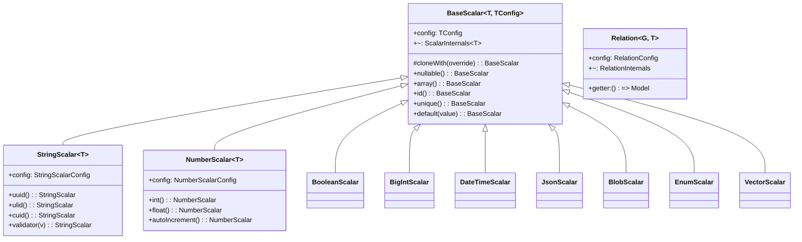
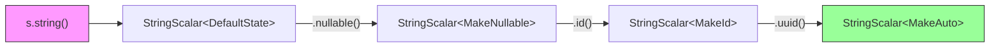
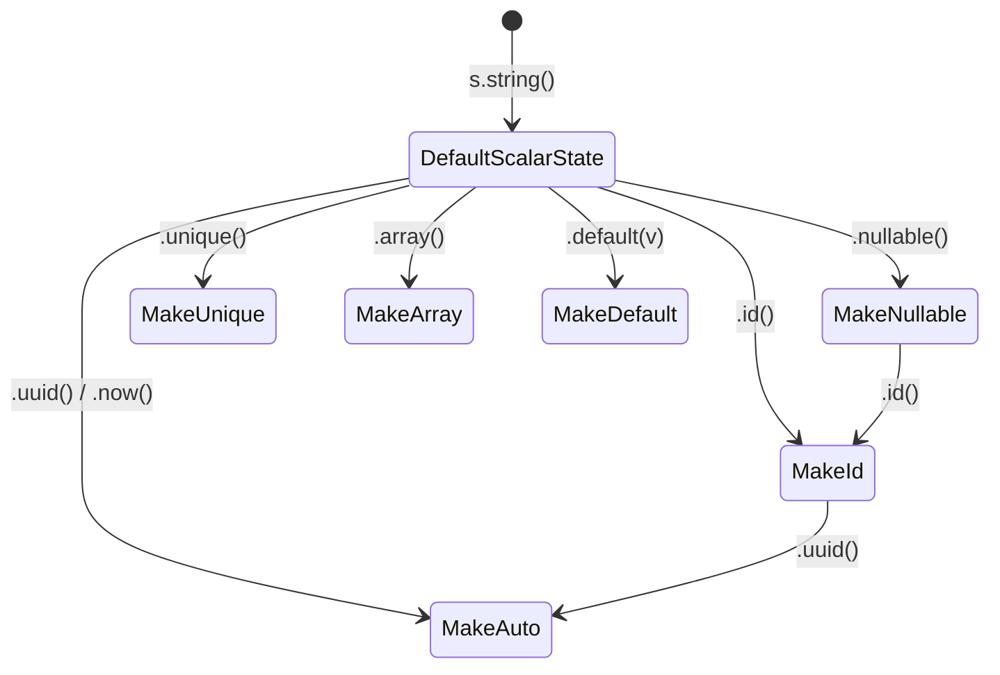
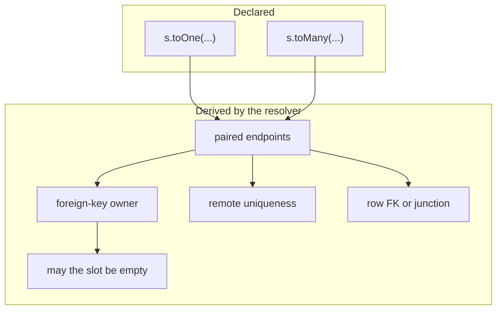
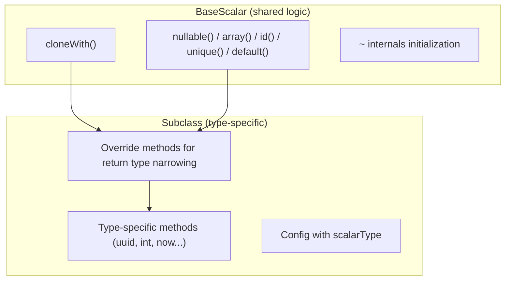

# Schema Architecture

VibORM uses a **config-based, type-safe schema system** where scalar definitions are immutable and chainable.

## Validation Library

VibORM includes a custom StandardSchema-compliant validation library. We built it because:

1. **Schema types = client types** - No separate generic type system to maintain
2. **Dynamic schema creation** - Validation schemas are built at runtime for each query based on the model definition and constraints. This requires **microsecond-level instantiation**, not milliseconds.

| Library | Issue |
|---------|-------|
| **ArkType** | Great recursive types, but heavy type system (slow IDE), eager thunk evaluation, 65-100x slower instantiation |
| **Valibot** | Has `lazy()` for deferred evaluation, but type inference breaks for circular refs |
| **Zod** | Extremely heavy: 85-795x slower instantiation, heavy compile-time types, poor recursive handling |

Our solution:
- **Microsecond instantiation** - 85-795x faster than Zod, 65-100x faster than ArkType
- **Lightweight type system** - Fast TypeScript compilation and IDE responsiveness
- **Thunks with lazy evaluation** - Like Valibot's `lazy()`, but with correct type preservation
- **Fail-fast validation** - 114x faster error paths than Zod

See [Validation Library docs](/docs/internals/validation) for implementation details.

## Core Concepts


```mermaid
classDiagram
    class BaseScalar~T, TConfig~ {
        +config: TConfig
        +~: ScalarInternals~T~
        #cloneWith(override): BaseScalar
        +nullable(): BaseScalar
        +array(): BaseScalar
        +id(): BaseScalar
        +unique(): BaseScalar
        +default(value): BaseScalar
    }
    
    class StringScalar~T~ {
        +config: StringScalarConfig
        +uuid(): StringScalar
        +ulid(): StringScalar
        +cuid(): StringScalar
        +validator(v): StringScalar
    }
    
    class NumberScalar~T~ {
        +config: NumberScalarConfig
        +int(): NumberScalar
        +float(): NumberScalar
        +autoIncrement(): NumberScalar
    }
    
    class Relation~G, T~ {
        +config: RelationConfig
        +~: RelationInternals
        +getter: () => Model
    }
    
    BaseScalar <|-- StringScalar
    BaseScalar <|-- NumberScalar
    BaseScalar <|-- BooleanScalar
    BaseScalar <|-- BigIntScalar
    BaseScalar <|-- DateTimeScalar
    BaseScalar <|-- JsonScalar
    BaseScalar <|-- BlobScalar
    BaseScalar <|-- EnumScalar
    BaseScalar <|-- VectorScalar
```

## Two Namespaces: `config` vs `~`

Each scalar has two property namespaces:

| Namespace | Purpose | Example |
|-----------|---------|---------|
| `config` | Runtime configuration (serializable) | `scalar.config.isOptional`, `scalar.config.scalarType` |
| `~` | Type inference & validators (lazy) | `scalar["~"].infer`, `scalar["~"].createValidator` |

```typescript
const email = s.string().nullable();

// Config (runtime values)
email.config.scalarType   // "string"
email.config.isOptional  // true

// Internals (type-level + base validator)
email["~"].infer         // string | null (TypeScript type)
email["~"].state.base["~standard"].validate("test@example.com")  // Base validation
```

## Chainable API Flow


```mermaid
flowchart LR
    A["s.string()"] --> B["StringScalar&lt;DefaultState&gt;"]
    B -->|".nullable()"| C["StringScalar&lt;MakeNullable&gt;"]
    C -->|".id()"| D["StringScalar&lt;MakeId&gt;"]
    D -->|".uuid()"| E["StringScalar&lt;MakeAuto&gt;"]
    
    style A fill:#f9f,stroke:#333
    style E fill:#9f9,stroke:#333
```

Each method returns a **new instance** with updated config and transformed generic type `T`:

```typescript
// Each call creates a new instance via cloneWith()
const scalar = s.string()     // StringScalar<DefaultScalarState<string>>
  .nullable()                  // StringScalar<MakeNullable<...>>
  .id()                        // StringScalar<MakeId<...>>
  .uuid();                     // StringScalar<MakeAuto<..., "uuid">>
```

## Type State Machine

The generic `T` tracks scalar state through type transformations:


```mermaid
stateDiagram-v2
    [*] --> DefaultScalarState: s.string()
    DefaultScalarState --> MakeNullable: .nullable()
    DefaultScalarState --> MakeId: .id()
    DefaultScalarState --> MakeUnique: .unique()
    DefaultScalarState --> MakeArray: .array()
    DefaultScalarState --> MakeDefault: .default(v)
    DefaultScalarState --> MakeAuto: .uuid() / .now()
    
    MakeNullable --> MakeId: .id()
    MakeId --> MakeAuto: .uuid()
```

```typescript
// ScalarState tracks 6 dimensions:
interface ScalarState<
  BaseType,      // string, number, Date, etc.
  IsNullable,    // true | false
  IsArray,       // true | false  
  IsId,          // true | false
  IsUnique,      // true | false
  HasDefault     // true | false
> { ... }
```

## Relations


```mermaid
flowchart TB
    subgraph "Declared"
        T1["s.toOne(...)"]
        TM["s.toMany(...)"]
    end

    subgraph "Derived by the resolver"
        PAIR["paired endpoints"]
        OWN["foreign-key owner"]
        UNI["remote uniqueness"]
        STO["row FK or junction"]
        EMP["may the slot be empty"]
    end

    T1 --> PAIR
    TM --> PAIR
    PAIR --> OWN
    PAIR --> UNI
    PAIR --> STO
    OWN --> EMP
```

```typescript
const user = s.model({
  id: s.string().id().uuid(),
  posts: s.toMany(() => post),
  profile: s.toOne(() => profile)
    .fields("profileId")
    .references("id"),
  profileId: s.string().nullable(),
});

const post = s.model({
  id: s.string().id().uuid(),
  authorId: s.string(),
  author: s.toOne(() => user)
    .fields("authorId")
    .references("id"),
  tags: s.toMany(() => tag)
    .through("post_tags")
    .source("postId")
    .target("tagId"),
});
```

## Inheritance Pattern


```mermaid
flowchart TB
    subgraph "BaseScalar (shared logic)"
        CW["cloneWith()"]
        CM["nullable() / array() / id() / unique() / default()"]
        INT["~ internals initialization"]
    end
    
    subgraph "Subclass (type-specific)"
        OV["Override methods for return type narrowing"]
        SP["Type-specific methods (uuid, int, now...)"]
        CF["Config with scalarType"]
    end
    
    CW --> OV
    CM --> OV
    OV --> SP
```

**Key pattern:** Subclasses override common methods with one-liner casts for return type narrowing:

```typescript
// In StringScalar
override nullable(): StringScalar<MakeNullable<T>> {
  return super.nullable() as StringScalar<MakeNullable<T>>;
}
```

## Quick Reference

```typescript
import { s } from "viborm";

// Scalars
s.string()           // StringScalar
s.number() / s.int() / s.float() / s.decimal()
s.boolean()
s.bigint()
s.datetime()
s.json(zodSchema?)   // JsonScalar with optional validation
s.blob()
s.enumScalar(["A", "B", "C"])
s.vector(dimensions?)

// Modifiers (chainable)
.nullable()          // Allow null
.array()             // Make array type
.id()                // Primary key
.unique()            // Unique constraint
.default(value)      // Default value

// Auto-generation
.uuid() / .ulid() / .nanoid() / .cuid()  // String IDs
.autoIncrement()     // Number/BigInt IDs
.now() / .updatedAt() // DateTime

// Relations — the FK-owning half of any singular slot
s.toOne(() => Model)
  .fields("foreignKeyField")
  .references("targetField")
  .onDelete("cascade")

// A non-owning slot of either cardinality needs no configuration
s.toOne(() => Model).name("customName")
s.toMany(() => Model).name("customName")

// A junction, configured on ONE of the two collection endpoints
s.toMany(() => Model)
  .through("junction_table")
  .source("sourceFkField")
  .target("targetFkField")
  .onDelete("cascade")
```
